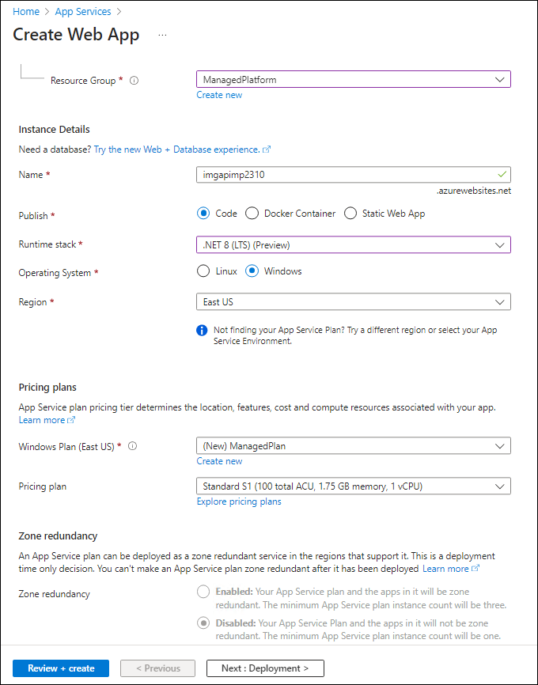

---
lab:
  az204Title: 'Lab 01: Build a web application on Azure platform as a service offerings'
  az204Module: 'Learning Path 01: Implement Azure App Service Web Apps'
---

# Labo 01 : Créer une application web sur une offre de plateforme en tant que service Azure

## interface utilisateur Microsoft Azure

Étant donné la nature dynamique des outils cloud Microsoft, il se peut que vous constatiez des modifications de l’interface utilisateur Azure après le développement du contenu de cette formation. Il se peut donc que certaines instructions et étapes du labo ne s’alignent pas correctement.

Microsoft met ce cours à jour quand la communauté l’alerte sur la nécessité d’y apporter des modifications. Toutefois, compte tenu de la fréquence des mises à jour cloud, il se peut que vous rencontriez des modifications de l’interface utilisateur avant les mises à jour du contenu de cette formation. **Si cela se produit, adaptez-vous aux changements, puis appliquez-les dans les laboratoires si nécessaire.**

## Instructions

### Avant de commencer

#### Se connecter à l’environnement de labo

Connectez-vous à votre machine virtuelle (VM) Windows 11 en utilisant les informations d’identification suivantes :

- Nom d’utilisateur : `Admin`
- Mot de passe : `Pa55w.rd`

> **Remarque** : Votre instructeur vous fournira des instructions pour la connexion à l’environnement de laboratoire virtuel.

#### Passer en revue les applications installées

Recherchez la barre des tâches sur votre bureau Windows 11. La barre des tâches contient les icônes des applications que vous allez utiliser dans ce labo, à savoir :

- Microsoft Edge
- Explorateur de fichiers
- Terminal
- Visual Studio Code

## Scénario de laboratoire

Dans ce labo, vous allez découvrir comment créer une application web sur Azure à l’aide du modèle PaaS. Après avoir créé l’application, vous apprendrez à charger des fichiers d’application web existants à l’aide de l’option de déploiement zip d’Apache Kudu. Ensuite, vous examinerez et testerez l’application web nouvellement déployée.

<em>Visionnez cette vidéo en cliquant avec le bouton droit sur ce **[lien de vidéo](https://youtu.be/EiSEcU9qjfo)** , puis sélectionnez « Ouvrir le lien dans un nouvel onglet / une nouvelle fenêtre ».</em>


## Diagramme de l'architecture


### Exercice 1 : Créer une API back-end en utilisant le service Stockage Azure et la fonctionnalité Web Apps d’Azure App Service.

#### Tâche 1 : Ouvrir le portail Azure

1. Dans la barre des tâches, sélectionnez l’icône **Microsoft Edge**.

1. Dans la fenêtre du navigateur, accédez au portail Azure à l’adresse `https://portal.azure.com`, puis connectez-vous avec le compte que vous allez utiliser pour ce labo.

   > **Remarque** : Si vous vous connectez au portail Azure la première fois, une visite guidée du portail vous sera proposée. Si vous préférez faire l’impasse sur la visite, sélectionnez **Peut-être plus tard** pour commencer à utiliser le portail.

#### Tâche 2 : Créer un compte de stockage

1. Dans le portail Azure, utilisez la zone de texte **Rechercher des ressources, des services et des documents** pour rechercher **Comptes de stockage**, puis, dans la liste des résultats, sélectionnez **Comptes de stockage**.

1. Dans le volet **Comptes de stockage**, sélectionnez **+ Créer**.

1. Dans le volet **Créer un compte de stockage**, sous l’onglet **Informations de base**, effectuez les actions suivantes, puis sélectionnez **Vérifier** :

    | Paramètre | Action |
    |--|--|
    | Liste déroulante  **Abonnement** | Conservez les valeurs par défaut. |
    | Section **Groupe de ressources** | Sélectionnez **Créer**, entrez **ManagedPlatform**, puis sélectionnez **OK** |
    | Zone de texte **Nom de compte de stockage** | Entrez **imgstor** _[votrenom]_ |
    | Liste déroulante **Région** | Sélectionnez **(États-Unis) USA Est** |
    | **Service principal** | Pas de changements |
    | Section **Performance** | Sélectionnez l’option **Standard**. |
    | Liste déroulante **Redondance** | Sélectionner **Stockage localement redondant (LRS)** |

   La capture d’écran suivante affiche les paramètres configurés sous l’onglet **Options de base** du volet **Créer un compte de stockage**.

   

1. Sous l’onglet **Vérifier**, passez en revue les options que vous avez sélectionnées dans les étapes précédentes.

1. Sélectionnez **Créer** pour créer le compte de stockage à l’aide de votre configuration spécifiée.

   > **Remarque** : attendez que la tâche soit créée avant de poursuivre ce labo.

1. Dans le volet **Vue d’ensemble**, sélectionnez le bouton **Accéder à la ressource** pour accéder au volet du compte de stockage nouvellement créé.

1. Dans le volet **Compte de stockage**, dans la section **Sécurité + réseau**, sélectionnez **Clés d’accès**.

1. Sur le panneau  **Clés d’accès** , passez en revue toute **Chaîne de connexion** (en utilisant le bouton **Afficher**), puis enregistrez la valeur des cases **Chaîne de connexion**  dans le Bloc-notes. Le terme **Clé** correspond aux clés de chiffrement gérées par la plateforme et elles ne sont **pas** utilisées pour ce labo.

   > **Remarque** : peu importe la chaîne de connexion que vous choisissez. Ils sont interchangeables.

1. Ouvrez Bloc-notes et collez-y la valeur de chaîne de connexion copiée. Vous allez utiliser cette valeur plus loin dans ce labo.

#### Tâche 3: Charger un exemple de blob

1. Dans le volet **Compte de stockage**, dans la section **Stockage des données**, sélectionnez le lien **Conteneurs**.

1. Dans le volet **Conteneurs**, sélectionnez **+ Conteneur**.

1. Dans la fenêtre **Nouveau conteneur**, effectuez les actions suivantes, puis sélectionnez **Créer**.

   | Setting | Action |
   | --- | --- |
   | Zone de texte **Nom** | Entrez **images** |

1. Dans le panneau **Conteneurs**, accédez au conteneur **images** nouvellement créé.

1. Dans le volet **Images**, sélectionnez **Charger**.

1. Dans la fenêtre **Charger l’objet blob**, effectuez les actions suivantes:

    | Paramètre | Action |
    |--|--|
    | Section **Fichiers** | Sélectionnez **Parcourir les fichiers** ou utilisez la fonctionnalité glisser-déplacer. |
    | Fenêtre **Explorateur de fichiers** | Accédez à **Allfiles (F):\\Allfiles\\Labs\\01\\Starter\\Images**, sélectionnez le fichier **grilledcheese.jpg**, puis **Ouvrir** |
    | Case à cocher **Remplacer si les fichiers existent déjà** | Vérifiez que la case est cochée, puis sélectionnez **Charger** |

    > **Remarque** : attendez que l’objet blob soit chargé avant de poursuivre ce labo.

#### Tâche 4: Créer une application web

1. Dans le volet de navigation du portail Azure, sélectionnez **Créer une ressource**.

1. Dans le volet **Créer une ressource**, dans la zone de texte **Rechercher dans les services et la Place de marché**, entrez **Application web**, puis sélectionnez Entrée.

1. Dans le volet des résultats de la recherche dans la **Place de marché**, sélectionnez le résultat **Application web**.

1. Dans le panneau **application web**, sélectionnez **Créer**.

1. Dans le volet **Créer une application web**, sous l’onglet **Informations de base**, effectuez les actions suivantes et sélectionnez l’onglet **Surveiller et sécuriser** :

   | Setting                            | Action                                                                                                  |
   | ---------------------------------- | ------------------------------------------------------------------------------------------------------- |
   | Liste déroulante  **Abonnement**    | Conservez les valeurs par défaut.                                                                                |
   | Section **Groupe de ressources**         | Sélectionnez **ManagedPlatform**                                                                              |
   | Zone de texte **Nom**                  | Entrez **imgapi** _[votrenom]_                                                                            |
   | Section **Publier**                | Sélectionner **Code**                                                                                         |
   | Liste déroulante **Pile d’exécution**   | Sélectionner **.NET 8 (LTS)**                                                                                 |
   | Section **Système d’exploitation**       | Sélectionnez **Windows**                                                                                      |
   | Liste déroulante **Région**          | Sélectionnez la région **USA Est**                                                                           |
   | Section **Plan Windows (USA Est)** | Sélectionnez **Créer**, entrez la valeur **ManagedPlan** dans la zone de texte **Nom**, puis sélectionnez **OK** |
   | Section **Plan tarifaire**           | Sélectionnez **Standard S1**.                                                                                  |

   La capture d’écran suivante affiche les paramètres configurés dans le volet **Créer une application web**.

   

1. Dans l’onglet **Surveiller et sécuriser**, dans la section **Activer Application Insights**, sélectionnez **Non**, puis **Examiner et créer**.

1. Sous l’onglet **Vérifier + créer**, passez en revue les options que vous avez sélectionnées lors des étapes précédentes.

1. Sélectionnez **Créer** pour créer l’application web à l’aide de votre configuration spécifiée.

   > **Remarque** : attendez que l’application web soit créée avant de poursuivre ce labo.

1. Sous le volet **Vue d’ensemble**, sélectionnez le bouton **Accéder à la ressource** pour accéder au volet de l’application web nouvellement créée.

#### Tâche 5: Configurer l’application web

1. Dans le panneau **App Service**, dans la section **Paramètres**, sélectionnez le lien **Variables d’environnement**.

1. Sous l’onglet **Paramètres de l’application**, sélectionnez **+ Ajouter**. Entrez les informations suivantes dans la boîte de dialogue contextuelle **Ajouter/modifier le paramètre d’application** :

    | Setting | Action |
    |--|--|
    | Zone de texte **Nom** | Entrez **StorageConnectionString** |
    | Zone de texte **Valeur** | Collez la chaîne de connexion de stockage que vous avez copiée précédemment dans le Bloc-notes |
    | Case à cocher **Paramètre d’emplacement de déploiement** | Conservez les valeurs par défaut. |

1. Sélectionnez **Appliquer** pour fermer la boîte de dialogue contextuelle et retourner à la section **Paramètres de l’application**.

1. Au bas de la section **Paramètres de l’application**, sélectionnez **Appliquer**.

   >**Remarque :** Vous recevrez peut-être un avertissement indiquant que votre application peut redémarrer au moment de la mise à jour de ses paramètres. Cliquez sur **Confirmer**. Attendez que les paramètres de votre application soient enregistrés avant de poursuivre le labo.

1. Pour obtenir l’URL d’App Service, accédez au lien **Vue d’ensemble**, copiez la valeur dans la section **Domaine par défaut**, puis collez-la dans le Bloc-notes. Faites précéder le nom de domaine de `https://` dans le Bloc-notes. Vous utiliserez par la suite cette valeur dans le labo.

   > **Remarque** : à ce stade, le serveur web à cette URL retourne une page web d’espace réservé. Vous n’avez pas encore déployé de code dans l’application web. Vous allez déployer du code dans l’application web plus tard dans ce labo.

#### Tâche 6 : Déployer une application web `ASP.NET` sur Web Apps

1. Dans la barre des tâches, sélectionnez l’icône **Visual Studio Code**.

1. Dans le menu **Fichier**, sélectionnez **Ouvrir le dossier**.

1. Dans la fenêtre **Explorateur de fichiers**, accédez à **Allfiles (F):\\Allfiles\\Labs\\01\\Starter\\API**, puis choisissez **Sélectionner un dossier**.

   > **Remarque** : Ignorez toutes les invites demandant d’ajouter les ressources nécessaires pour générer et déboguer, et d’exécuter la commande restore afin de résoudre les dépendances non résolues.

1. Dans le volet **Explorateur** de la fenêtre **Visual Studio Code**, développez le dossier  **Controllers**, puis sélectionnez le fichier **ImagesController.cs** pour l’ouvrir dans l’éditeur.

1. Dans l’éditeur, dans la classe **ImagesController** à la ligne 26, observez la méthode **GetCloudBlobContainer** et le code utilisé pour récupérer un conteneur.

1. Dans la classe **ImagesController** à la ligne 36, observez la méthode **Get** et le code utilisé pour récupérer tous les objets blob de façon asynchrone à partir du conteneur **images**.

1. Dans la classe **ImagesController** à la ligne 68, observez la méthode **Post** et le code utilisé pour conserver une image chargée dans Stockage.

1. Dans la barre des tâches, sélectionnez l’icône **Terminal**.

1. À l’ouverture du terminal, entrez la commande suivante, puis sélectionnez Entrée pour vous connecter à l’interface de ligne de commande Azure (CLI) :

   ```
   az login
   ```

1. Dans la fenêtre du navigateur **Microsoft Edge**, entrez l’adresse e-mail et le mot de passe de votre compte Microsoft, puis sélectionnez **Se connecter**.

1. Revenez à la fenêtre **Terminal** actuellement ouverte. Attendez la fin du processus de connexion.

1. Dans le terminal, entrez la commande suivante, puis sélectionnez Entrée pour répertorier toutes les applications dans votre groupe de ressources **ManagedPlatform** :

   ```
   az webapp list --resource-group ManagedPlatform
   ```

1. Entrez la commande suivante, puis sélectionnez Entrée pour rechercher les applications qui ont le préfixe **imgapi\***:

   ```
   az webapp list --resource-group ManagedPlatform --query "[?starts_with(name, 'imgapi')]"
   ```

1. Entrez la commande suivante, puis sélectionnez Entrée pour afficher uniquement le nom de l’application qui a le préfixe **imgapi\***:

   ```
   az webapp list --resource-group ManagedPlatform --query "[?starts_with(name, 'imgapi')].{Name:name}" --output tsv
   ```

1. Entrez la commande suivante, puis sélectionnez Entrée pour remplacer le répertoire actif par le répertoire **Allfiles (F):\\Allfiles\\Labs\\01\\Starter\\API** qui contient les fichiers du labo:

   ```
   cd F:\Allfiles\Labs\01\Starter\API\
   ```

1. Entrez la commande suivante, puis sélectionnez Entrée pour déployer le fichier **api.zip** dans l’application web que vous avez créée précédemment dans ce labo:

   ```
   az webapp deployment source config-zip --resource-group ManagedPlatform --src api.zip --name <name-of-your-api-app>
   ```

   > **Remarque** : remplacez l’espace réservé *\<name-of-your-api-app\>* par le nom de l’application web que vous avez créée précédemment dans ce labo. Vous avez récemment interrogé le nom de cette application dans les étapes précédentes.

   Attendez que le déploiement soit terminé avant de poursuivre ce labo.

1. Dans le volet **Navigation** du portail Azure, sélectionnez le lien **Groupes de ressources**.

1. Dans le volet **Groupes de ressources** , sélectionnez le groupe de ressources **ManagedPlatform** que vous avez créé précédemment dans ce labo.

1. Dans le volet **ManagedPlatform**, sélectionnez l’application web **imgapi** _[votrenom]_ que vous avez créée précédemment dans ce labo.

1. Dans le volet **App Service**, sélectionnez **Parcourir**.

   > **Remarque** : la commande **Parcourir** effectuera une requête GET sur la racine du site web, qui retourne un tableau JSON (JavaScript Object Notation). Ce tableau devrait contenir l’URL de l’unique image chargée dans votre compte de stockage.

1. Revenez à la fenêtre de votre navigateur qui contient le portail Azure.

1. Fermez les applications Visual Studio Code et Terminal en cours d’exécution.

#### Révision

Dans cet exercice, vous avez créé une application web dans Azure, puis avez déployé votre application web `ASP.NET` sur Web Apps à l’aide d’Azure CLI et de l’utilitaire de déploiement de fichier Zip Apache Kudu.

### Exercice 2 : Créer une application web frontale à l’aide d’Azure Web Apps

#### Tâche 1 : Créer une application web

1. Dans le volet de **navigation** du portail Azure, sélectionnez **Créer une ressource**.

1. Dans le volet **Créer une ressource**, dans la zone de texte **Rechercher dans les services et la Place de marché**, entrez **Application web**, puis sélectionnez Entrée.

1. Dans le volet des résultats de la recherche dans la **Place de marché**, sélectionnez **Application web**.

1. Dans le panneau **application web**, sélectionnez **Créer**.

1. Dans le volet **Créer une application web**, sous l’onglet **Informations de base**, effectuez les actions suivantes et sélectionnez l’onglet **Surveiller et sécuriser** :

   | Setting                            | Action                        |
   | ---------------------------------- | ----------------------------- |
   | Liste déroulante  **Abonnement**    | Conservez les valeurs par défaut.      |
   | Section **Groupe de ressources**         | Sélectionnez **ManagedPlatform**    |
   | Zone de texte **Nom**                  | Entrez **imgweb** _[votrenom]_  |
   | Section **Publier**                | Sélectionner **Code**               |
   | Liste déroulante **Pile d’exécution**   | Sélectionner **.NET 8 (LTS)**       |
   | Section **Système d’exploitation**       | Sélectionnez **Windows**            |
   | Liste déroulante **Région**          | Sélectionnez la région **USA Est** |
   | Section **Plan Windows (USA Est)** | Sélectionnez **ManagedPlan (S1)**   |

La capture d’écran suivante affiche les paramètres configurés dans le volet **Créer une application web**.


1. Dans l’onglet **Surveiller et sécuriser**, dans la section **Activer Application Insights**, sélectionnez **Non**, puis **Examiner et créer**.

1. Sous l’onglet **Vérifier + créer**, passez en revue les options que vous avez sélectionnées lors des étapes précédentes.

1. Sélectionnez **Créer** pour créer l’application web à l’aide de votre configuration spécifiée.

   > **Remarque** : attendez que la tâche de création soit terminée avant de poursuivre ce labo.

1. Sous le volet **Vue d’ensemble**, sélectionnez le bouton **Accéder à la ressource** pour accéder au volet de l’application web nouvellement créée.

#### Tâche 2 : Configurer une application web

1. Dans le panneau **App Service**, dans la section **Paramètres**, sélectionnez le lien **Variables d’environnement**.

1. Dans la section **Variables d’environnement**, effectuez les actions suivantes, sélectionnez **Enregistrer**, puis **Continuer** :

    | Setting | Action |
    |--|--|
    | Onglet **Paramètres d’applications** | Sélectionnez **Nouveau paramètre d’application**. |
    | Boîte de dialogue contextuelle **Ajouter/modifier un paramètre d’application** | Dans la zone de texte **Nom**, entrez **ApiUrl** |
    | Zone de texte **Valeur** | Entrez l’URL de l’application web que vous avez copiée précédemment dans ce labo. **Remarque** : Veillez à ajouter le protocole **https://** dans l’URL que vous copiez dans la zone de texte **Valeur** de ce paramètre d’application |
    | Case à cocher **Paramètre d’emplacement de déploiement** | Conservez la valeur par défaut, puis sélectionnez **OK** |
    | Cliquez sur **Enregistrer** dans le menu supérieur | Cela permet d’enregistrer la valeur de configuration que vous venez d’entrer |

   > **Remarque** : attendez que les paramètres de l’application soient enregistrés avant de poursuivre ce labo.

#### Tâche 3: Déployer une application web `ASP.NET` sur Web Apps

1. Dans la barre des tâches, sélectionnez l’icône **Visual Studio Code**.

1. Dans le menu **Fichier**, sélectionnez **Ouvrir le dossier**.

1. Dans la fenêtre **Explorateur de fichiers**, accédez à **Allfiles (F):\\Allfiles\\Labs\\01\\Starter\\Web**, puis choisissez **Sélectionner un dossier**.

   > **Remarque** : Ignorez toutes les invites demandant d’ajouter les ressources nécessaires pour générer et déboguer, et d’exécuter la commande restore afin de résoudre les dépendances non résolues.

1. Dans le volet **Explorateur** de la fenêtre **Visual Studio Code**, développez le dossier  **Pages**, puis sélectionnez le fichier **Index.cshtml.cs** pour l’ouvrir dans l’éditeur.

1. Dans l’éditeur, dans la classe **IndexModel** sur la ligne 30, observez la méthode **OnGetAsync** et le code utilisé pour récupérer la liste d’images de l’API.

1. Dans la classe **IndexModel** sur la ligne 41, observez la méthode **OnPostAsync** et le code utilisé pour diffuser une image chargée vers l’API back-end.

1. Dans la barre des tâches, sélectionnez l’icône **Terminal**.

1. À l’ouverture du terminal, entrez la commande suivante, puis sélectionnez Entrée pour vous connecter à l’interface Azure CLI :

   ```
   az login
   ```

1. Dans la fenêtre du navigateur **Microsoft Edge**, entrez l’adresse e-mail et le mot de passe de votre compte Microsoft, puis sélectionnez **Se connecter**.

1. Revenez à la fenêtre **Terminal** actuellement ouverte. Attendez la fin du processus de connexion.

1. Entrez la commande suivante, puis sélectionnez Entrée pour répertorier toutes les applications dans votre groupe de ressources **ManagedPlatform**:

   ```
   az webapp list --resource-group ManagedPlatform
   ```

1. Entrez la commande suivante, puis sélectionnez Entrée pour rechercher les applications qui ont le préfixe **imgapi\***:

   ```
   az webapp list --resource-group ManagedPlatform --query "[?starts_with(name, 'imgweb')]"
   ```

1. Entrez la commande suivante, puis sélectionnez Entrée pour afficher uniquement le nom de l’application qui a le préfixe **imgweb\***:

   ```
   az webapp list --resource-group ManagedPlatform --query "[?starts_with(name, 'imgweb')].{Name:name}" --output tsv
   ```

1. Entrez la commande suivante, puis sélectionnez Entrée pour remplacer le répertoire actif par le répertoire **Allfiles (F):\\Allfiles\\Labs\\01\\Starter\\Web** qui contient les fichiers du labo:

   ```
   cd F:\Allfiles\Labs\01\Starter\Web\
   ```

1. Entrez la commande suivante, puis sélectionnez Entrée pour déployer le fichier **web.zip** dans l’application web que vous avez créée précédemment dans ce labo:

   ```
   az webapp deployment source config-zip --resource-group ManagedPlatform --src web.zip --name <name-of-your-web-app>
   ```

   > **Remarque** : remplacez l’espace réservé *\<name-of-your-web-app\>* par le nom de l’application web que vous avez créée précédemment dans ce labo. Vous avez récemment interrogé le nom de cette application dans les étapes précédentes.

   Attendez que le déploiement soit terminé avant de poursuivre ce labo.

1. Dans le volet **Navigation** du portail Azure, sélectionnez **Groupes de ressources**.

1. Dans le volet **Groupes de ressources** , sélectionnez le groupe de ressources **ManagedPlatform** que vous avez créé précédemment dans ce labo.

1. Dans le volet **ManagedPlatform**, sélectionnez l’application web **imgweb** _[votrenom]_ que vous avez créée précédemment dans ce labo.

1. Dans le volet **App Service**, sélectionnez **Parcourir**.

1. Observez la liste d’images dans la galerie. La galerie doit répertorier une seule image chargée dans Stockage précédemment dans le laboratoire.

1. Dans la page web **Galerie de photos Contoso**, dans la section **Charger une nouvelle image**, effectuez les actions suivantes:

   a. Sélectionnez **Parcourir**.

   b. Dans la fenêtre **Explorateur de fichiers**, accédez à **Allfiles (F):\\Allfiles\\Labs\\01\\Starter\\Images**, sélectionnez le fichier **banhmi.jpg**, puis **Ouvrir**.

   c. Sélectionnez **Télécharger**.

1. Notez que la liste des images de la galerie a été mise à jour avec votre nouvelle image.

   > **Remarque** : dans certains cas rares, il se pourrait que vous deviez actualiser votre fenêtre de navigateur pour récupérer la nouvelle image.

1. Revenez à la fenêtre du navigateur contenant le portail Azure.

1. Fermez les applications Visual Studio Code et Terminal en cours d’exécution.

#### Révision

Dans cet exercice, vous avez créé une application web Azure, et déployé le code d’une application web existante dans la ressource dans le cloud.
