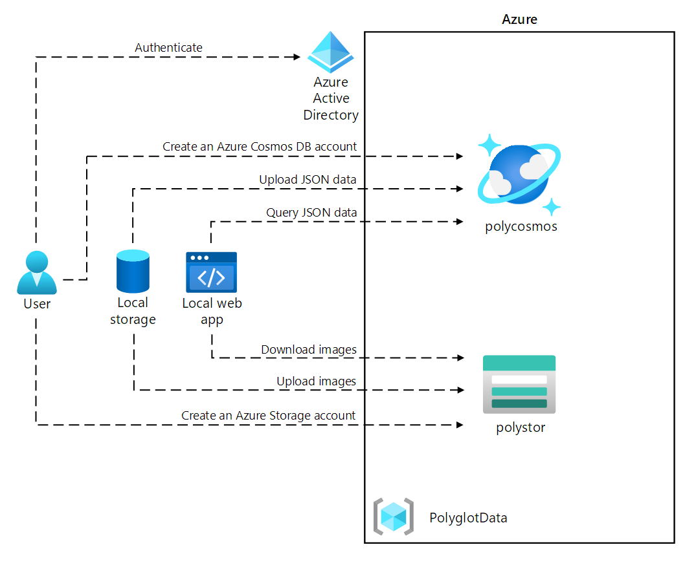
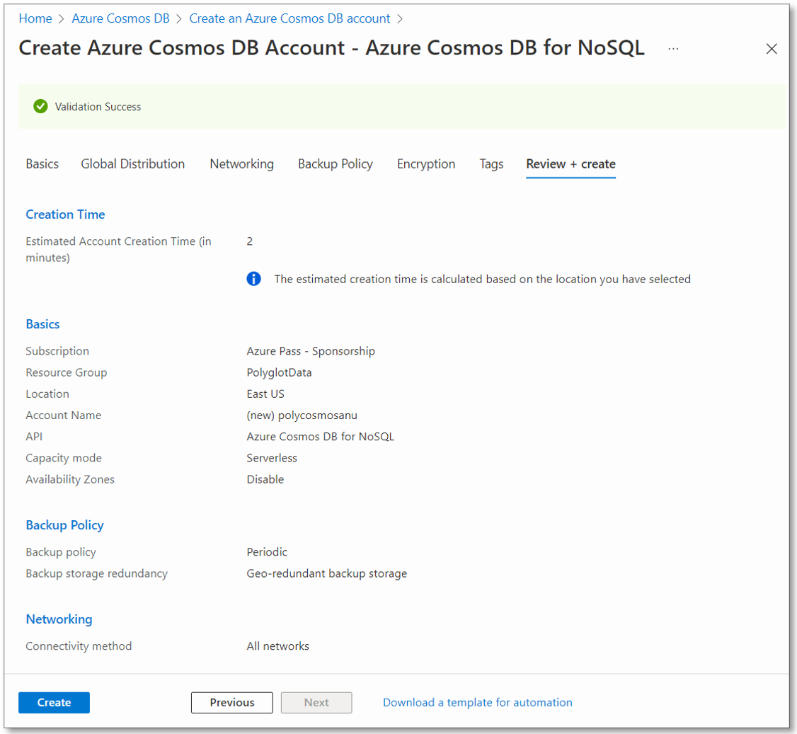

---
lab:
  az204Title: 'Lab 04: Construct a polyglot data solution'
  az204Module: 'Learning Path 04: Develop solutions that use Cosmos DB storage'
---

# Lab 04: Créer une solution de données polyglotte

## interface utilisateur Microsoft Azure

Étant donné la nature dynamique des outils cloud Microsoft, il se peut que vous constatiez des modifications de l’interface utilisateur Azure après le développement du contenu de cette formation. Il se peut donc que certaines instructions et étapes du labo ne s’alignent pas correctement.

Microsoft met ce cours à jour quand la communauté l’alerte sur la nécessité d’y apporter des modifications. Toutefois, compte tenu de la fréquence des mises à jour cloud, il se peut que vous rencontriez des modifications de l’interface utilisateur avant les mises à jour du contenu de cette formation. **Si cela se produit, adaptez-vous aux changements, puis appliquez-les dans les laboratoires si nécessaire.**

## Instructions

### Avant de commencer

#### Se connecter à l’environnement de labo

Connectez-vous à votre machine virtuelle Windows 10 en utilisant les informations d’identification suivantes:

- Nom d’utilisateur : `Admin`
- Mot de passe : `Pa55w.rd`

> **Remarque** : Votre instructeur vous fournira des instructions pour la connexion à l’environnement de laboratoire virtuel.

#### Passer en revue les applications installées

Localisez la barre des tâches sur votre bureau Windows 10. La barre des tâches contient les icônes des applications que vous allez utiliser dans ce labo, à savoir :

- Microsoft Edge
- Explorateur de fichiers
- Visual Studio Code

## Scénario de laboratoire

Dans ce labo, vous allez créer une ressource Azure Cosmos DB et une ressource de compte de stockage. En utilisant C# et .NET, vous accéderez à la ressource Cosmos DB et y chargerez des données.

Par ailleurs, sachant que Contoso risque de vouloir accéder aux données dans Cosmos DB via une interface conviviale, vous allez implémenter une solution .NET qui accède aux données de Cosmos DB et les affiche dans un navigateur web.

Enfin, vous allez définir le niveau de cohérence de votre instance Cosmos DB et implémenter une fonction Azure pour les notifications de flux de modifications.

## Diagramme de l'architecture



### Exercice 1 : Créer des ressources de magasin de données dans Azure

#### Tâche 1 : Ouvrez le portail Azure

1. Dans la barre des tâches, sélectionnez l’icône **Microsoft Edge**.

1. Dans la fenêtre de navigateur ouverte, accédez au portail Azure à l’adresse `https://portal.azure.com`, puis connectez-vous avec le compte que vous allez utiliser pour ce labo.

   > **Remarque** : Si vous vous connectez au portail Azure la première fois, une visite guidée du portail vous sera proposée. Sélectionnez **Prise en main** pour faire l’impasse sur la visite guidée et commencer à utiliser le portail.

#### Tâche 2 : Créer un ressource de compte Azure Cosmos DB

1. Dans le portail Azure, utilisez la zone de texte **Rechercher des ressources, des services et des documents** pour rechercher **Azure Cosmos DB**, puis, dans la liste des résultats, sélectionnez **Azure Cosmos DB**.

1. Dans le panneau **Azure Cosmos DB**, sélectionnez **+ Créer**.

1. Dans le volet **Sélectionner l’option d’API**, sélectionnez **Créer** dans la zone **Azure Cosmos DB for NoSQL**.

1. Sous l’onglet **Informations de base** de la page **Créer un compte Azure Cosmos DB - Azure Cosmos DB for NoSQL**, effectuez les actions suivantes, puis sélectionnez **Vérifier + créer** :

   | Paramètre                     | Action                                                                                                                   |
   | --------------------------- | ------------------------------------------------------------------------------------------------------------------------ |
   | Liste **Abonnement**       | Conservez les valeurs par défaut.                                                                                                          |
   | Section **Groupe de ressources**  | Sélectionnez **Créer**                                                                                                    |
   | Zone de texte **Nom**           | Entrez **Polyglotdata** et sélectionnez **OK**                                                                                 |
   | Zone de texte **AccountName**    | Entrez **polycosmos** _[votrenom]_                                                                                         |
   | Liste déroulante **Emplacement** | Sélectionnez la région Azure la plus proche de la localisation de votre ordinateur lab, où vous pouvez créer un compte Azure Cosmos DB |
   | Section **Mode de capacité**   | Sélectionnez **Serverless**                                                                                                    |

   La capture d’écran suivante affiche les paramètres configurés dans la page **Créer un compte Azure Cosmos DB - Azure Cosmos DB for NoSQL**.

   

1. Sous l’onglet **Vérifier + créer** de la page **Créer un compte Azure Cosmos DB - Azure Cosmos DB for NoSQL**, passez en revue les options que vous avez sélectionnées dans les étapes précédentes.

1. Sélectionnez **Créer** pour créer le compte Azure Cosmos DB à l’aide de votre configuration spécifiée.

   > **Remarque** : Attendez que la tâche de création soit terminée avant de poursuivre ce labo.

1. Sélectionnez **Accéder à la ressource**.

1. Dans le volet **compte Azure Cosmos DB**, recherchez la section **Paramètres**, puis sélectionnez le lien **Clés**.

1. Dans le volet **Clés**, sous l’onglet **Clés en lecture-écriture**, enregistrez les valeurs des zones de texte **URI**, **CLÉ PRIMAIRE** et **CHAÎNE DE CONNEXION PRINCIPALE**. Vous allez utiliser ces valeurs plus tard dans ce labo.

#### Tâche 3: Créer une ressource de compte de stockage Azure

1. Dans le portail Azure, utilisez la zone de texte **Rechercher des ressources, des services et des documents** pour rechercher **Comptes de stockage**, puis, dans la liste des résultats, sélectionnez **Comptes de stockage**.

1. Dans le volet **Comptes de stockage**, sélectionnez **+ Créer**.

1. Sous l’onglet **Informations de base** du panneau **Créer un compte de stockage**, effectuez les actions suivantes, puis sélectionnez **Vérifier** :

   | Paramètre                           | Action                                                                                  |
   | --------------------------------- | --------------------------------------------------------------------------------------- |
   | Liste **Abonnement**             | Conservez les valeurs par défaut.                                                                         |
   | Section **Groupe de ressources**        | Sélectionnez **PolyglotData**                                                                 |
   | Zone de texte **Nom de compte de stockage** | Entrez **polystor** _[votrenom]_                                                          |
   | Liste déroulante **Région**         | Sélectionnez la région dans laquelle vous avez créé le compte Cosmos DB précédemment dans cet exercice |
   | Section **Performance**           | sélectionnez **Standard**.                                                                     |
   | Liste déroulante **Redondance**     | Sélectionner **Stockage localement redondant (LRS)**                                              |

   La capture d’écran suivante affiche les paramètres configurés dans le volet **Créer un compte de stockage**.

   

1. Sous l’onglet **Vérifier** du volet **Créer un compte de stockage**, passez en revue les options que vous avez sélectionnées dans les étapes précédentes.

1. Sélectionnez **Créer** pour créer le compte de stockage à l’aide de votre configuration spécifiée.

   > **Remarque** : attendez que la tâche de création soit terminée avant de poursuivre ce labo.

#### Révision

Dans cet exercice, vous avez créé les ressources Azure dont vous aurez besoin pour la solution de données polyglotte que vous allez implémenter dans ce labo. Les ressources Azure que vous avez créées incluent un compte Azure Cosmos DB et un compte de stockage Azure.

### Exercice 2 : Examiner et charger les données

#### Tâche 1 : Charger des images dans Stockage Blob Azure

1. Dans le volet de navigation du Portail Azure, revenez au volet **Comptes de stockage**, puis sélectionnez le compte de stockage **polystor** _[votrenom]_ que vous avez créé dans l’exercice précédent de ce labo.

1. Dans le volet du compte de stockage **polystor** _[votrenom]_ , dans la section **Stockage de données**, sélectionnez le lien **Conteneurs**.

1. Dans la section **Conteneurs**, sélectionnez **+ Conteneur**.

1. Dans la fenêtre contextuelle **Nouveau conteneur**, effectuez les actions suivantes, puis sélectionnez **Créer**:

   | Paramètre                                | Action                                   |
   | -------------------------------------- | ---------------------------------------- |
   | Zone de texte **Nom**                      | Entrez **images**                         |
   | Liste déroulante **Niveau d’accès public** | Sélectionnez **Privé (aucun accès anonyme)** |

1. De retour dans la section **Conteneurs**, sélectionnez le conteneur **images** nouvellement créé.

1. Dans le volet **Conteneur**, recherchez la section **Paramètres**, puis sélectionnez le lien **Propriétés**.

1. Dans le volet **Propriétés**, notez et enregistrez la valeur de la zone de texte **URL**. Vous allez utiliser cette valeur plus loin dans ce labo.

1. Cliquez ensuite sur **Jetons d’accès partagé** et générez un jeton d’accès avec les paramètres par défaut en cliquant sur **Générer une URL et un jeton SAS**. Notez la valeur du **jeton SAS d’objet blob**, car vous en aurez besoin ultérieurement.

1. Dans le volet, recherchez et sélectionnez le lien **Vue d’ensemble**.
1. Dans le volet, sélectionnez **Charger**.

1. Dans la fenêtre contextuelle **Charger l’objet blob**, effectuez les actions suivantes:

   a. Dans la section **Fichier**, sélectionnez **Parcourir les fichiers** ou utilisez la fonctionnalité glisser-déplacer.

   b. Dans la fenêtre **Explorateur de fichiers**, accédez à **Allfiles (F):\\Allfiles\\Labs\\04\\Starter\\Images**, sélectionnez les 42 fichiers image **.jpg**, puis sélectionnez **Ouvrir**.

   c. Vérifiez que l’option **Remplacer si les fichiers existent déjà** est sélectionnée, puis choisissez **Charger**.

   > **Remarque** : attendez que le chargement de tous les blobs soit terminé avant de poursuivre ce labo.

#### Tâche 2 : Examiner les données JSON

1. Sur l’ordinateur de labo, démarrez Visual Studio Code.

1. Dans le menu **Fichier**, sélectionnez **Ouvrir un fichier**, accédez à **Allfiles (F):\\Allfiles\\Labs\\04\\Starter\\AdventureWorks\\AdventureWorks.Upload**, sélectionnez **models.json**, puis **Ouvrir**.

1. Examinez le fichier **models.json** et notez qu’il contient un tableau d’objets JSON, avec un tableau imbriqué d’objets qui font partie de la propriété **Products**.

   > **Remarque** : cela détermine les classes que vous allez définir pour désérialiser le contenu du fichier JSON avant de charger celui-ci dans une collection Cosmos DB.

1. Dans le fichier **models.json**, notez qu’une des propriétés est nommée **Category**.

   > **Remarque** : vous allez utiliser la propriété **Category** pour définir le partitionnement de la collection Cosmos DB cible.

1. Fermez Visual Studio Code.

#### Tâche 3: Créer une base de données et une collection Cosmos DB, puis effectuer un chargement de données JSON

1. Dans l’écran **Démarrage**, sélectionnez la vignette **Visual Studio Code**.

1. Dans le menu **Fichier**, sélectionnez **Ouvrir le dossier**.

1. Dans la fenêtre **Explorateur de fichiers** qui s’ouvre, accédez à **Allfiles (F):\\Allfiles\\Labs\\04\\Starter\\AdventureWorks**, puis choisissez **Sélectionner un dossier**.

1. Dans la fenêtre **Visual Studio Code**, dans la barre de menus, sélectionnez **Terminal**, puis **Nouveau terminal**.

1. Dans le terminal, vérifiez que le répertoire actuel est défini sur **AdventureWorks** (modifiez-le si ce n’est pas le cas), puis exécutez la commande suivante pour basculer le contexte de votre terminal vers le dossier **AdventureWorks.Upload**:

   ```
   cd .\AdventureWorks.Upload\
   ```

   > **Remarque** : avant de passer à l’étape suivante, ouvrez l’Explorateur Windows et supprimez l’attribut **Read-only** du fichier **Allfiles (F):\\Allfiles\\Labs\\04\\Starter\\AdventureWorks\\AdventureWorks.Upload\\AdventureWorks.Upload.csproj**.

1. À partir de l’invite du terminal, exécutez la commande suivante pour ajouter la bibliothèque de client Azure Cosmos DB .NET au projet actuellement ouvert :

   > **Remarque** : avant d’effectuer la commande suivante, assurez-vous que vous êtes positionné sur ce chemin : **(F):\\Allfiles\\Labs\\04\\Starter\\AdventureWorks\\AdventureWorks.Upload\\**

   ```
   dotnet add package Microsoft.Azure.Cosmos --version 3.28.0
   ```
   
   > **Remarque** : la commande **dotnet add package** ajoute le package **Microsoft.Azure.Cosmos** à partir de **NuGet**. Pour plus d’informations, consultez [Microsoft.Azure.Cosmos](https://www.nuget.org/packages/Microsoft.Azure.Cosmos).

1. Observez les résultats de la build affichés dans le terminal. La build devrait s’achever avec succès, sans erreurs ou messages d’avertissement.

1. Dans la fenêtre **Code Visual Studio**, dans le volet **Explorateur**, développez le projet **AdventureWorks.Upload**.

1. Ouvrez le fichier **Program.cs**.

1. Dans le fichier **Program.cs**, examinez les directives **using** et notez qu’elles incluent **Microsoft.Azure.Cosmos**, **System.IO;** , **System.Text.Json**, **System.Threading.Tasks** et **System.Collections.Generic**. Cela permet le chargement asynchrone d’éléments JSON à partir d’un fichier local sur votre ordinateur de labo vers une collection dans une base de données Cosmos DB.

1. Dans le fichier **Program.cs**, sur la ligne 14, définissez la valeur de **EndpointUrl** en remplaçant la chaîne vide par la propriété **URI** du compte Cosmos DB que vous avez enregistrée précédemment dans ce laboratoire. Assurez-vous que la valeur est entourée de guillemets doubles.

1. Sur la ligne 15, définissez la valeur de **AuthorizationKey** en remplaçant la chaîne vide par la propriété **CLÉ PRIMAIRE** du compte Cosmos DB que vous avez enregistrée précédemment dans ce laboratoire. Assurez-vous que la valeur est entourée de guillemets doubles.

1. Sur la ligne 18, définissez la valeur de **PartitionKey** en remplaçant la chaîne vide par **"/Category"**.

1. Sur la ligne 19, définissez la valeur de **JsonFilePath** en remplaçant la chaîne vide par **"F:\\\\Allfiles\\\\Labs\\\\04\\\\Starter\\\\AdventureWorks\\\\AdventureWorks.Upload\\\\models.json"**.

1. Dans le bloc try, notez l’appel de la méthode **CreateDatabaseIfNotExistsAsync** de la classe **CosmosClient**. Cela aura pour effet de créer une base de données s’il n’en existe pas.

1. Notez l’appel de la méthode **DefineContainer** de la classe **Database**. Cela aura pour effet de créer un conteneur pour héberge les éléments JSON s’il n’en existe pas.

   > **Remarque** : la méthode **DefineContainer** inclut une option de réduction des coûts qui vous permet de modifier la stratégie d’indexation par défaut (qui indexe automatiquement tous les attributs).

1. Notez l’instruction **using** qui s’appuie sur un objet **StreamReader** pour lire les éléments JSON d’un fichier texte et les désérialise en objets de la classe **Model** définie plus loin dans le fichier **Program.cs**.

1. Notez la boucle foreach qui itère sur la collection d’objets désérialisés et insère chacun d’eux de façon asynchrone dans la collection cible.

1. Examinez les classes **Model** et **Product** qui reflètent le format des objets stockés dans le fichier de format JSON que vous avez examiné précédemment dans ce laboratoire.

1. Enregistrez et fermez le fichier **Program.cs**.

   > **Remarque** : sélectionnez **Remplacer** si vous avez reçu une invite indiquant que le fichier est en lecture seule.

1. Dans le terminal, exécutez la commande suivante pour restaurer d’éventuels packages NuGet manquants, et générer le projet dans le dossier:

   ```
   dotnet build
   ```

   > **Remarque** : la commande **dotnet build** restaurera automatiquement les packages NuGet manquants avant de générer tous les projets dans le dossier.

1. À partir de l’invite du terminal, exécutez la commande suivante afin d’exécuter l’application console .NET Core :

   ```
   dotnet run
   ```

   > **Remarque** : la commande **dotnet run** générera automatiquement les modifications apportées au projet, puis démarrera l’application web sans débogueur attaché. La commande générera les messages indiquant la progression du chargement des données, y compris le nombre d’éléments insérés dans la collection cible et la durée de l’opération d’insertion.

1. Observez les résultats de l’exécution de la commande affichés dans le terminal. L’exécution devrait s’achever correctement, affichant le message indiquant l’insertion de 119 dans la collection Cosmos DB cible.

1. Sélectionnez **Tuer le terminal** (icône **Corbeille**) pour fermer le volet du terminal et tous les processus associés.

#### Tâche 4: Valider le chargement de données JSON

1. Sur votre ordinateur de labo, basculez vers la fenêtre du navigateur **Microsoft Edge** affichant le portail Azure.

1. Dans le Portail Azure, sélectionnez la zone de texte **Rechercher des ressources, des services et des documents**, puis, dans la liste **Ressources récentes**, sélectionnez le compte Azure Cosmos DB **polycosmos** _[votrenom]_ que vous avez créé précédemment dans ce labo.

1. Dans le volet **Compte Azure Cosmos DB**, recherchez et sélectionnez le lien **Data Explorer**.

1. Dans le volet **Data Explorer**, développez le nœud de base de données **Retail**.

1. Développez le nœud de conteneur **Online**, puis sélectionnez **Nouvelle requête SQL**.

   > **Remarque** : l’étiquette pour cette option pourrait être masquée. Vous pouvez afficher les étiquettes en positionnant le curseur sur les icônes du volet **Data Explorer**.

1. Sous l’onglet Requête, entrez le texte suivant:

   ```sql
   SELECT * FROM models
   ```

1. Sélectionnez **Exécuter la requête**, puis observez la liste des éléments JSON retournés par la requête.

1. De retour dans l’éditeur de requête, remplacez le texte existant par le texte suivant:

   ```sql
   SELECT VALUE COUNT(1) FROM models
   ```

1. Sélectionnez **Exécuter la requête**, puis observez le résultat de l’opération d’agrégation **COUNT**.

1. Revenez à la fenêtre **Visual Studio Code**.

#### Révision

Dans cet exercice, vous avez utilisé le Kit de développement logiciel (SDK) .NET pour Azure Cosmos DB pour insérer des données dans Azure Cosmos DB. L’application web que vous allez implémenter ensuite utilisera ces données.

### Exercice 3 : Configurer une application web .NET

#### Tâche 1 : Mettre à jour les références aux magasins de données et générer l’application web

1. Dans la fenêtre **Code Visual Studio**, dans le volet **Explorateur**, développez le projet **AdventureWorks.Web**.

1. Ouvrez le fichier **appsettings.json**.

1. Dans l’objet JSON, sur la ligne 3, recherchez le chemin d’accès **ConnectionStrings.AdventureWorksCosmosContext**. Notez que la valeur actuelle est vide:

   ```json
   "ConnectionStrings": {
       "AdventureWorksCosmosContext": "",
   },
   ```

1. Mettez à jour la propriété **AdventureWorksCosmosContext** en définissant sa valeur sur la **CHAÎNE DE CONNEXION PRINCIPALE** du compte Azure Cosmos DB que vous avez enregistrée précédemment dans ce labo.

1. Dans l’objet JSON, sur la ligne 6, recherchez le chemin d’accès **Settings.BlobContainerUrl**. Notez que la valeur actuelle est vide:

   ```json
   "Settings": {
       "BlobContainerUrl": "",
       "BlobSASToken": "",
       ...
   }
   ```

1. Mettez à jour les propriétés **BlobContainerUrl** et **BlobSASToken** en définissant leur valeur sur la propriété **URL** du conteneur d’objets blob Stockage Azure nommé **images** et la valeur du jeton SAS d’objet blob que vous avez enregistrée précédemment dans ce labo.

1. Enregistrez le fichier **appsettings.json**, puis fermez-le.

   > **Remarque** : sélectionnez **Remplacer** si vous avez reçu une invite indiquant que le fichier est en lecture seule.

1. Dans la fenêtre **Visual Studio Code**, dans le volet Explorateur, cliquez avec le bouton droit de la souris sur le dossier **AdventureWorks.Context**, puis sélectionnez **Ouvrir dans le terminal intégré**.

   

   > **Remarque** : avant de passer à l’étape suivante, ouvrez l’Explorateur Windows et supprimez l’attribut Read-only du fichier **Allfiles (F):\Allfiles\Labs\04\Starter\AdventureWorks\AdventureWorks.Context\AdventureWorks.Context.csproj**

1. À partir de l’invite du terminal, vérifiez que le répertoire actuel est défini sur **AdventureWorks.Context** (modifiez-le si ce n’est pas le cas), puis exécutez la commande suivante pour importer **Microsoft.Azure.Cosmos** à partir de NuGet :

   > **Remarque** : avant d’effectuer la commande suivante, assurez-vous que vous êtes positionné sur ce chemin : **(F):\\Allfiles\\Labs\\04\\Starter\\AdventureWorks\\AdventureWorks.Context\\**

   ```
   dotnet add package Microsoft.Azure.Cosmos --version 3.28.0
   ```

1. À partir de l’invite du terminal, exécutez la commande suivante pour créer le projet **AdventureWorks.Context** :

   ```
   dotnet build
   ```

1. Observez les résultats de la build affichés dans le terminal. La build devrait s’achever avec succès, sans erreurs ou messages d’avertissement.

#### Tâche 2 : Configurer la connectivité à Azure Cosmos DB

1. Dans la fenêtre **Code Visual Studio**, dans le volet **Explorateur**, développez le projet **AdventureWorks.Context**.

1. Dans le menu contextuel du nœud de dossier **AdventureWorks.Context**, sélectionnez **Nouveau fichier**.

1. À l’invite de nouveau fichier, entrez **AdventureWorksCosmosContext.cs**.

1. À partir de l’onglet de l’éditeur de code pour le fichier **AdventureWorksCosmosContext.cs**, ajoutez le code suivant :

   ```csharp
   using AdventureWorks.Models;
   using Microsoft.Azure.Cosmos;
   using Microsoft.Azure.Cosmos.Linq;
   using System;
   using System.Collections.Generic;
   using System.Linq;
   using System.Threading.Tasks;

   namespace AdventureWorks.Context
   {
       /* AdventureWorksCosmosContext class will implement the
       IAdventureWorksProductContext interface */
      public class AdventureWorksCosmosContext : IAdventureWorksProductContext
      {
           /* Create a new read-only Container variable named _container */
           private readonly Container _container;

         public AdventureWorksCosmosContext(string connectionString, string database = "Retail", string container = "Online")
         {
           /* Create a new instance of the CosmosClient class, and then obtain
             both a Database and Container instance from the client */
           _container = new CosmosClient(connectionString)
           .GetDatabase(database)
           .GetContainer(container);
         }

         public async Task<Model> FindModelAsync(Guid id)
         {
           /* Create a LINQ query, transform it into an iterator, iterate over the result set,
              and then return the single item in the result set */
           var iterator = _container.GetItemLinqQueryable<Model>()
           .Where(m => m.id == id).ToFeedIterator<Model>();
           List<Model> matches = new List<Model>();
           while (iterator.HasMoreResults)
           {
               var next = await iterator.ReadNextAsync();
               matches.AddRange(next);
           }

           return matches.SingleOrDefault();
         }

         public async Task<List<Model>> GetModelsAsync()
         {
           /* Run an SQL query, get the query result iterator, iterate over the result set,
               and then return the union of all results */
           string query = $@"SELECT * FROM items";
           var iterator = _container.GetItemQueryIterator<Model>(query);
           List<Model> matches = new List<Model>();
           while (iterator.HasMoreResults)
           {
               var next = await iterator.ReadNextAsync();
               matches.AddRange(next);
           }

           return matches;
         }

         public async Task<Product> FindProductAsync(Guid id)
         {
           /* Run an SQL query, get the query result iterator, iterate over the result set,
              and then return the single item in the result set */
           string query = $@"SELECT VALUE products
                       FROM models
                       JOIN products in models.Products
                       WHERE products.id = '{id}'";
           var iterator = _container.GetItemQueryIterator<Product>(query);
           List<Product> matches = new List<Product>();
           while (iterator.HasMoreResults)
           {
               var next = await iterator.ReadNextAsync();
               matches.AddRange(next);
           }

           return matches.SingleOrDefault();
         }

      }
   }
   ```

1. Enregistrez et fermez le fichier **AdventureWorksCosmosContext.cs**.
1. À partir de l’invite du terminal, avec le répertoire actif défini sur **AdventureWorks.Context**, exécutez la commande suivante pour générer l’application web .NET :

   ```
   dotnet build
   ```

   > **Remarque** : s’il existe des erreurs de build, examinez le fichier **AdventureWorksCosmosContext.cs** dans le dossier **Allfiles > (F):\\Allfiles\\Labs\\04\\Solution\\AdventureWorks\\AdventureWorks.Context**.

#### Tâche 3 : Examiner la logique de démarrage d’application .NET

1. Dans la fenêtre **Code Visual Studio**, dans le volet **Explorateur**, développez le projet **AdventureWorks.Web**.

1. Ouvrez le fichier **Startup.cs**.

1. Dans la classe **Startup**, notez la méthode **ConfigureProductService** existante:

   ```csharp
   public void ConfigureProductService(IServiceCollection services)
   {
       services.AddScoped<IAdventureWorksProductContext, AdventureWorksCosmosContext>(provider =>
           new AdventureWorksCosmosContext(
               _configuration.GetConnectionString(nameof(AdventureWorksCosmosContext))
           )
       );
   }
   ```

   > **Remarque** : le service produit utilise Cosmos DB comme base de données.

1. Fermez le fichier **Startup.cs** sans apporter de modifications.

#### Tâche 4 : Confirmer que l’application .NET se connecte correctement aux magasins de données

1. Dans Visual Studio Code, à partir de l’invite du terminal, exécutez la commande suivante pour basculer le contexte de votre terminal vers le dossier **AdventureWorks.Web** :

   ```
   cd ..\AdventureWorks.Web\
   ```

1. À partir de l’invite du terminal, exécutez la commande suivante afin d’exécuter l’application web.NET :

   > **Remarque** : avant d’effectuer la commande suivante, assurez-vous que vous êtes positionné sur ce chemin : **(F):\\Allfiles\\Labs\\04\\Starter\\AdventureWorks\\AdventureWorks.Web\\**

   ```
   dotnet run
   ```

   > **Remarque** : la commande **dotnet run** générera automatiquement les modifications apportées au projet, puis démarrera l’application web sans débogueur attaché. La commande générera l’URL de l’application en cours d’exécution et tous les ports attribués.

1. Dans la barre des tâches, sélectionnez l’icône **Microsoft Edge**.

1. Dans la fenêtre du navigateur ouverte, accédez à l’application web en cours d’exécution (<http://localhost:5000>).

1. Dans l’application web, observez la liste de modèles affichée à partir de la première page.

1. Recherchez le modèle **Touring-1000**, puis sélectionnez **Afficher les détails**.

1. Dans la page des détails du produit **Touring-1000**, examinez la liste des options.

1. Fermez la fenêtre du navigateur affichant votre application web.

1. Basculez vers la fenêtre **Visual Studio Code**, puis sélectionnez **Tuer le terminal** (icône **Corbeille**) pour fermer le terminal actuellement ouvert et tous les processus associés.

#### Révision

Dans cet exercice, vous avez écrit du code C# pour interroger une collection Azure Cosmos DB à l’aide du Kit de développement logiciel (SDK) .NET.
