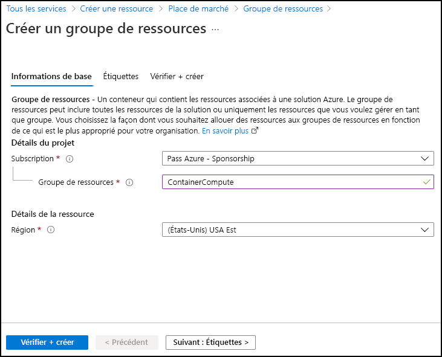
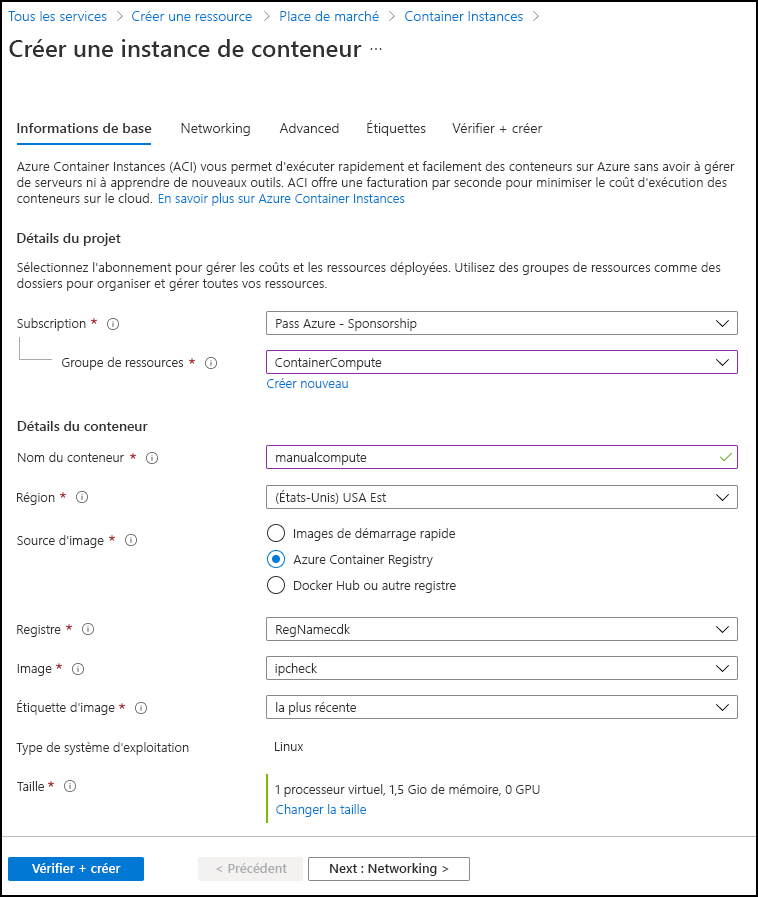

---
lab:
  az204Title: 'Lab 05: Deploy compute workloads by using images and containers'
  az204Module: 'Module 05: Implement IaaS solutions'
ms.openlocfilehash: 90e0c7d16ba6c3d49017e595bebf5afdce980ddb
ms.sourcegitcommit: f03e7b74dc287df4209dcac6a42bff3a876f9f09
ms.translationtype: HT
ms.contentlocale: fr-FR
ms.lasthandoff: 06/11/2022
ms.locfileid: "146271935"
---
# <a name="lab-05-deploy-compute-workloads-by-using-images-and-containers"></a>Labo 05 : Déployer des charges de travail de calcul à l’aide d’images et de conteneurs

## <a name="microsoft-azure-user-interface"></a>Interface utilisateur Microsoft Azure

Étant donné la nature dynamique des outils cloud Microsoft, il se peut que vous constatiez des modifications de l’interface utilisateur Azure après le développement du contenu de cette formation. Il se peut donc que certaines instructions et étapes du labo ne s’alignent pas correctement.

Microsoft met ce cours à jour quand la communauté l’alerte sur la nécessité d’y apporter des modifications. Toutefois, compte tenu de la fréquence des mises à jour cloud, il se peut que vous rencontriez des modifications de l’interface utilisateur avant les mises à jour du contenu de cette formation. **Si cela se produit, adaptez-vous aux changements, puis appliquez-les dans les laboratoires si nécessaire.**

## <a name="instructions"></a>Instructions

### <a name="before-you-start"></a>Avant de commencer

#### <a name="sign-in-to-the-lab-environment"></a>Se connecter à l’environnement de labo

Connectez-vous à votre machine virtuelle Windows 10 en utilisant les informations d’identification suivantes :

-   Nom d’utilisateur : **Administrateur**

-   Mot de passe : **Pa55w.rd**

> **Remarque** : votre instructeur vous fournira des instructions pour la connexion à l’environnement de laboratoire virtuel.

#### <a name="review-the-installed-applications"></a>Passer en revue les applications installées

Localisez la barre des tâches sur votre bureau Windows 10. La barre des tâches contient les icônes des applications que vous allez utiliser dans ce labo, à savoir :

-   Microsoft Edge

-   Explorateur de fichiers

## <a name="architecture-diagram"></a>Diagramme de l'architecture


### <a name="exercise-1-create-a-vm-by-using-the-azure-command-line-interface-cli"></a>Exercice 1 : Créer une machine virtuelle a l’aide de l’interface de ligne de commande Azure (CLI)

#### <a name="task-1-open-the-azure-portal"></a>Tâche 1 : Ouvrez le portail Azure

1.  Dans la barre des tâches, sélectionnez l’icône **Microsoft Edge**.

1. Dans la fenêtre de navigateur ouverte, accédez au portail Azure (<https://portal.azure.com>), puis connectez-vous au compte que vous allez utiliser pour ce laboratoire.

   > **Remarque** : Si vous vous connectez au portail Azure la première fois, une visite guidée du portail vous sera proposée. Si vous préférez faire l’impasse sur la visite, sélectionnez **Prise en main** pour commencer à utiliser le portail.

#### <a name="task-2-create-a-resource-group"></a>Tâche 2 : Créer un groupe de ressources

1.  Dans le volet de navigation du portail Azure, utilisez la zone de texte **Rechercher des ressources, des services et des documents** pour rechercher **Groupe de ressources**, puis, dans la liste des résultats, sélectionnez **Groupes de ressources**.

1.  Dans le volet **Groupes de ressources**, sélectionnez **Créer**.

1.  Dans le volet **Créer un groupe de ressources**, sous l’onglet **Options de base**, effectuez les actions suivantes, puis sélectionnez **Vérifier + créer** :

    | Paramètre                         | Action                      |
    | ------------------------------- | --------------------------- |
    | Liste déroulante  **Abonnement** | Conservez la valeur par défaut.   |
    | Zone de texte **Groupe de ressources**     | Entrez **ContainerCompute**. |
    | Liste déroulante **Région**       | Sélectionnez **(États-Unis) USA Est**    |

    La capture d’écran suivante affiche les paramètres configurés dans le volet **Créer un groupe de ressources**.

    

1.  Sous l’onglet **Vérifier + créer**, passez en revue les options que vous avez sélectionnées lors des étapes précédentes.

1.  Sélectionnez **Créer** pour créer le groupe de ressources à l’aide de votre configuration spécifiée.  

    > **Remarque** : Attendez que la tâche de création soit terminée avant de poursuivre ce labo.

#### <a name="task-3-open-azure-cloud-shell"></a>Tâche 3 : Ouvrir Azure Cloud Shell

1.  Dans le portail Azure, sélectionnez l’icône **Cloud Shell**  pour ouvrir une nouvelle session PowerShell. Si Cloud Shell est défini par défaut sur une session PowerShell, sélectionnez **PowerShell**, puis, dans le menu déroulant, sélectionnez **Bash**.

    > **Remarque** : l’icône **Cloud Shell** est représentée par un signe supérieur à (\>) et un caractère de soulignement (\_).

    > **Remarque** : Si vous démarrez **Cloud Shell** pour la première fois, lorsque vous êtes invité à sélectionner **Bash** ou **PowerShell**, sélectionnez **Bash**. Lorsque vous voyez le message **Vous n’avez aucun stockage monté**, sélectionnez l’abonnement que vous utilisez dans ce labo, puis choisissez **Créer un stockage**.

1.  À l’invite de commandes **Cloud Shell** dans le portail, exécutez la commande suivante pour obtenir la version de l’outil Azure CLI :

    ```
    az --version
    ```

#### <a name="task-4-use-the-azure-cli-commands"></a>Tâche 4 : Utiliser les commandes Azure CLI

1.  Exécutez la commande suivante pour répertorier les sous-groupes et commandes au niveau racine de l’interface de ligne de commande :

    ```
    az --help
    ```

1.  Exécutez la commande suivante pour répertorier les sous-groupes et commandes pour Machines Virtuelles Azure :

    ```
    az vm --help
    ```

1.  Exécutez la commande suivante pour répertorier les arguments et exemples pour la commande **Créer une machine virtuelle** :

    ```
    az vm create --help
    ```

1.  Exécutez la commande suivante pour créer une **machine virtuelle** avec les paramètres suivants. Veillez à enregistrer le mot de passe que vous êtes invité à créer ci-dessous, car vous en aurez besoin plus tard dans le labo pour accéder à votre machine virtuelle :

    -   Groupe de ressources : **ContainerCompute**

    -   Nom : **quickvm**

    -   Image : **Debian**

    -   Admin-Username : **student**

    -   Admin-Password : **\<CreateYourPassword\>**

    >Remarque : Remplacez **`<CreateYourPassword>`** dans la commande ci-dessous par votre propre mot de passe.

    ```
    az vm create --resource-group ContainerCompute --name quickvm --image Debian --admin-username student --admin-password <CreateYourPassword>
    ```

    > **Remarque** : Attendez que la machine virtuelle soit créée. Une fois le processus terminé, la commande retourne un fichier JSON (JavaScript Object Notation) contenant des détails sur la machine.

1.  Exécutez la commande suivante pour obtenir un fichier JSON plus détaillé contenant diverses métadonnées sur la machine virtuelle nouvellement créée :

    ```
    az vm show --resource-group ContainerCompute --name quickvm
    ```

1.  Exécutez la commande suivante pour répertorier toutes les adresses IP associées à la machine virtuelle :

    ```
    az vm list-ip-addresses --resource-group ContainerCompute --name quickvm
    ```

1.  Exécutez la commande suivante pour filtrer la sortie afin de retourner uniquement la première valeur d’adresse IP :

    ```
    az vm list-ip-addresses --resource-group ContainerCompute --name quickvm --query '[].{ip:virtualMachine.network.publicIpAddresses[0].ipAddress}' --output tsv
    ```

1.  Exécutez la commande suivante pour stocker les résultats de la commande précédente dans une nouvelle variable d’interpréteur de commandes Bash nommée *ipAddress* :

    ```
    ipAddress=$(az vm list-ip-addresses --resource-group ContainerCompute --name quickvm --query '[].{ip:virtualMachine.network.publicIpAddresses[0].ipAddress}' --output tsv)
    ```

1.  Exécutez la commande suivante pour afficher la valeur de la variable d’interpréteur de commandes Bash *ipAddress* :

    ```
    echo $ipAddress
    ```

1.  Exécutez la commande suivante pour vous connecter à la machine virtuelle que vous avez créée précédemment dans ce labo, à l’aide de l’outil Secure Shell (SSH) et de l’adresse IP stockée dans la variable d’interpréteur de commandes Bash *ipAddress* :

    ```
    ssh student@$ipAddress
    ```

1.  L’outil SSH vous informe que l’authenticité de l’hôte ne peut pas être établie, puis vous demande si vous souhaitez continuer à vous connecter. Entrez **oui**, puis sélectionnez Entrée pour continuer à vous connecter à la machine virtuelle.

1.  L’outil SSH demande ensuite un mot de passe. Entrez le mot de passe que vous avez créé précédemment, puis sélectionnez Entrée pour vous authentifier auprès de la machine virtuelle.

1.  Après vous être connecté à la machine virtuelle en utilisant le protocole SSH, exécutez la commande suivante pour obtenir des métadonnées décrivant la machine virtuelle Linux :

    ```
    uname -a
    ```

1.  Utilisez la commande **exit** pour mettre fin à votre session SSH :

    ```
    exit
    ```

1.  Fermez le volet **Cloud Shell** dans le portail.

#### <a name="review"></a>Révision

Dans cet exercice, vous avez utilisé Cloud Shell pour créer une machine virtuelle dans le cadre d’un script automatisé.

### <a name="exercise-2-create-a-docker-container-image-and-deploy-it-to-azure-container-registry"></a>Exercice 2 : Créer une image conteneur Docker et la déployer dans Azure Container Registry

#### <a name="task-1-open-the-cloud-shell-and-editor"></a>Tâche 1 : Ouvrir le Cloud Shell et l’éditeur.

1.  Dans le volet de navigation du portail Azure, sélectionnez l’icône **Cloud Shell** pour ouvrir une nouvelle instance d’interpréteur de commandes.  

    > **Remarque** : attendez que Cloud Shell ait fini de se connecter à une instance avant de poursuivre le labo.

1.  À l’invite de commandes de **Cloud Shell** dans le portail, exécutez la commande suivante pour passer du répertoire racine au répertoire **\~/clouddrive** :

    ```
    cd ~/clouddrive
    ```

1.  Exécutez la commande suivante pour créer un répertoire nommé **ipcheck** dans le répertoire **\~/clouddrive** :

    ```
    mkdir ipcheck
    ```

1.  Exécutez la commande suivante pour modifier le répertoire actif de **\~/clouddrive** en **\~clouddrive/ipcheck** :

    ```
    cd ~/clouddrive/ipcheck
    ```

1.  Exécutez la commande suivante pour créer une application console .NET :

    ```
    dotnet new console --output . --name ipcheck
    ```

1.  Exécutez la commande suivante pour créer dans le répertoire **\~/clouddrive/ipcheck** un fichier nommé **Dockerfile** :

    ```
    touch Dockerfile
    ```

1.  Exécutez la commande suivante pour ouvrir l’éditeur graphique incorporé dans le contexte du répertoire actif :

    ```
    code .
    ```

#### <a name="task-2-create-and-test-a-net-application"></a>Tâche 2 : Créer et tester une application .NET

1.  Dans l’éditeur graphique, dans le volet **FILES**, sélectionnez le fichier **Program.cs** pour l’ouvrir dans l’éditeur.

1.  Supprimez tout le contenu du fichier **Program.cs**.

1.  Copiez et collez le code suivant dans le fichier **Program.cs** :

    ```csharp
    public class Program
    {
        public static void Main(string[] args)
        {        
            // Check if network is available
            if (System.Net.NetworkInformation.NetworkInterface.GetIsNetworkAvailable())
            {
                System.Console.WriteLine("Current IP Addresses:");
                // Get host entry for current hostname
                string hostname = System.Net.Dns.GetHostName();
                System.Net.IPHostEntry host = System.Net.Dns.GetHostEntry(hostname);
                // Iterate over each IP address and render their values
                foreach(System.Net.IPAddress address in host.AddressList)
                {
                    System.Console.WriteLine($"\t{address}");
                }
            }
            else
            {
                System.Console.WriteLine("No Network Connection");
            }
        }
    }
    ```

1.  Enregistrez le fichier **Program.cs** à l’aide du menu de l’éditeur graphique ou du raccourci clavier Ctrl+S.  Ne fermez pas l’éditeur graphique.

1.  De retour à l’invite de commandes, exécutez la commande suivante pour exécuter l’application :

    ```
    dotnet run
    ```

1.  Examinez les résultats de l’exécution. Au moins une adresse IP devrait être répertoriée pour l’instance Cloud Shell.

1.  Dans l’éditeur graphique, dans le volet **FILES**, sélectionnez le fichier **Dockerfile** pour l’ouvrir dans l’éditeur.

1.  Copiez et collez le code suivant dans le fichier **Dockerfile** :

    ```
    # Start using the .NET Core 3.1 SDK container image
    FROM mcr.microsoft.com/dotnet/sdk:6.0 AS build

    # Change current working directory
    WORKDIR /app

    # Copy existing files from host machine
    COPY . ./

    # Publish application to the "out" folder
    RUN dotnet publish --configuration Release --output out

    # Start container by running application DLL
    ENTRYPOINT ["dotnet", "out/ipcheck.dll"]
    ```

1.  Enregistrez le fichier **Dockerfile** à l’aide du menu de l’éditeur graphique ou du raccourci clavier Ctrl+S.

1. Laissez Cloud Shell ouvert pour la nouvelle tâche.

#### <a name="task-3-create-a-container-registry-resource"></a>Tâche 3 : Créer une ressource Container Registry.

1. À l’invite de commandes de **Cloud Shell** dans le portail, exécutez la commande suivante pour créer une variable avec une valeur unique pour la ressource Container Registry : 

    ```bash
    registryName=conregistry$RANDOM
    ```

1. À l’invite de commandes de **Cloud Shell** dans le portail, exécutez la commande suivante pour vérifier que le nom créé à l’étape précédente est disponible : 

    ```bash
    az acr check-name --name $registryName
    ```

    Si les résultats indiquent que le nom est disponible, passez à l’étape suivante. Si le nom n’est pas disponible, réexécutez la commande à l’étape précédente et vérifiez à nouveau la disponibilité.

1. À l’invite de commandes de **Cloud Shell** dans le portail, exécutez la commande suivante pour créer une ressource Container Registry : 

    ```bash
    az acr create --resource-group ContainerCompute --name $registryName --sku Basic
    ```

    > **Remarque** : Attendez que la tâche de création soit terminée avant de poursuivre ce labo.

#### <a name="task-4-store-container-registry-metadata"></a>Tâche 4 : Stocker les métadonnées de Container Registry

1.  À l’invite de commandes de **Cloud Shell** dans le portail, exécutez la commande suivante pour obtenir la liste de tous les registres de conteneurs dans votre abonnement :

    ```
    az acr list
    ```

1.  Exécutez la commande suivante, en vous assurant que vous voyez le nom de votre registre en sortie. Si vous ne voyez pas de sortie autre que « [] », attendez une minute, puis réessayez d’exécuter la commande.

    ```
    az acr list --query "max_by([], &creationDate).name" --output tsv
    ```

1.  Exécutez la commande suivante :

    ```
    acrName=$(az acr list --query "max_by([], &creationDate).name" --output tsv)
    ```

1.  Exécutez la commande suivante :

    ```
    echo $acrName
    ```

#### <a name="task-5-deploy-a-docker-container-image-to-container-registry"></a>Tâche 5 : Déployer une image conteneur Docker dans Container Registry

1.  Exécutez la commande suivante pour modifier le répertoire actif de **\~/** en **\~/clouddrive/ipcheck** :

    ```
    cd ~/clouddrive/ipcheck
    ```

1.  Exécutez la commande suivante pour obtenir le contenu du répertoire actif :

    ```
    dir
    ```

1.  Exécutez la commande suivante pour charger le code source dans votre registre de conteneurs et générer l’image conteneur en tant que tâche Container Registry :

    ```
    az acr build --registry $acrName --image ipcheck:latest .
    ```

    > **Remarque** : Attendez que la tâche de génération soit terminée avant de poursuivre ce labo.

1.  Fermez le volet **Cloud Shell** dans le portail.

#### <a name="task-6-validate-your-container-image-in-container-registry"></a>Tâche 6 : Verrouiller une image conteneur dans Container Registry

1.  Dans le volet de **navigation** du portail Azure, sélectionnez le lien **Groupes de ressources**.

1.  Dans le volet **Groupes de ressources**, sélectionnez le groupe de ressources **ContainerCompute** que vous avez créé précédemment dans ce labo.

1.  Dans le volet **ContainerCompute**, sélectionnez le registre de conteneurs que vous avez créé précédemment dans ce labo.

1.  Dans le volet **Container Registry**, dans la section **Services**, sélectionnez le lien **Dépôts**.

1.  Dans la section **Dépôts**, sélectionnez le dépôt d’images conteneurs **ipcheck**, puis la **dernière** étiquette.

1.  Examinez les métadonnées de la version de votre image conteneur avec la **dernière** étiquette.

    > **Remarque** : vous pouvez également sélectionner le lien **ID d’exécution** pour trouver des métadonnées relatives à la tâche de génération.

#### <a name="review"></a>Révision

Dans cet exercice, vous avez créé une application console .NET pour afficher l’adresse IP actuelle d’une machine. Vous avez ensuite ajouté le fichier **Dockerfile** à l’application afin qu’il puisse être converti en image conteneur Docker. Enfin, vous avez déployé l’image conteneur dans Container Registry.

### <a name="exercise-3-deploy-an-azure-container-instance"></a>Exercice 3 : Déployer une instance de conteneur Azure

#### <a name="task-1-enable-the-admin-user-in-container-registry"></a>Tâche 1 : Activer l’utilisateur administrateur dans Container Registry

1.  Dans le volet de **navigation** du portail Azure, sélectionnez le lien **Groupes de ressources**.

1.  Dans le volet **Groupes de ressources**, sélectionnez le groupe de ressources **ContainerCompute** que vous avez créé précédemment dans ce labo.

1.  Dans le volet **ContainerCompute**, sélectionnez le registre de conteneurs que vous avez créé précédemment dans ce labo, puis sélectionnez **Mettre à jour**.

1.  Dans le volet **Mettre à jour le registre de conteneurs**, dans la section **Utilisateur administrateur**, sélectionnez **Activer**.

1.  Sélectionnez **Enregistrer**, puis fermez le volet **Mettre à jour le registre de conteneurs**.

#### <a name="task-2-automatically-deploy-a-container-image-to-an-azure-container-instance"></a>Tâche 2 : Déployer automatiquement une image conteneur dans une instance de conteneur Azure

1.  Dans le volet **Container Registry**, dans la section **Services**, sélectionnez le lien **Dépôts**.

1.  Dans la section **Dépôts**, sélectionnez le dépôt d’images conteneur **ipcheck**.

1.  Dans le volet **Dépôt**, sélectionnez le menu points de suspension associé à la **dernière** entrée d’étiquette, puis sélectionnez **Exécuter l’instance**.

1.  Dans le volet **Créer une instance de conteneur**, effectuez les actions suivantes, puis sélectionnez **OK** :

    | Paramètre                            | Action                       |
    | ---------------------------------- | ---------------------------- |
    | Zone de texte **Nom du conteneur**        | Entrez **managedcompute**.    |
    | Zone de texte **Image conteneur**       | Conservez la valeur par défaut.    |
    | Section **Type de système d’exploitation**                | Sélectionnez **Linux**            |
    | Zone de texte **Abonnement**          | Conservez la valeur par défaut.    |
    | Liste déroulante **Groupe de ressources**  | Sélectionnez **ContainerCompute**. |
    | Liste déroulante **Emplacement**        | Sélectionnez **USA Est**.          |
    | Liste déroulante **Nombre de cœurs** | Sélectionnez **2**.                |
    | Zone de texte **Mémoire (Go)**           | Entrez **4**.                 |
    | Section **Adresse IP publique**      | Sélectionnez **Non**               |

    La capture d’écran suivante affiche les paramètres configurés dans le volet **Créer une instance de conteneur**.

    

    > **Remarque** : attendez que l’instance de conteneur soit créée avant de poursuivre ce labo.

#### <a name="task-3-manually-deploy-a-container-image-to-container-instances"></a>Tâche 3 : Déployer manuellement une image conteneur dans Container Instances

1.  Dans le volet de **navigation** du portail Azure, sélectionnez le lien **Créer une ressource**.

1.  Dans le volet **Créer une ressource**, dans la zone de texte **Rechercher dans les services et la Place de marché**, entrez **Container Instances**, puis sélectionnez Entrée.

1.  Dans le volet des résultats de la recherche dans la **Place de marché**, sélectionnez le résultat **Container Instances**.

1.  Dans le volet **Container Instances**, sélectionnez **Créer**.

1.  Dans le volet **Créer une instance de conteneur**, sous l’onglet **Options de base**, effectuez les actions suivantes, puis sélectionnez **Vérifier + créer** :

    | Paramètre | Action |
    | --- | --- |
    | Liste déroulante  **Abonnement**   | Conservez les valeurs par défaut. |
    | Liste déroulante **Groupe de ressources** | Sélectionnez **ContainerCompute**. |
    | Zone de texte **Nom du conteneur** | Entrez **manualcompute**. |
    | Liste déroulante **Région** | Sélectionnez **(États-Unis) USA Est** |
    | Section **Source d’image** | Sélectionnez **Azure Container Registry**. |
    | Liste déroulante **Registre** | Sélectionnez la ressource **Azure Container Registry** que vous avez créée précédemment dans ce labo |
    | Liste déroulante **Image** | Sélectionnez **ipcheck**. |
    | Liste déroulante **Étiquette d’image**      | Sélectionnez **dernière**.  |

    La capture d’écran suivante affiche les paramètres configurés dans le volet **Créer une instance de conteneur**.

    

1.  Sous l’onglet **Vérifier + créer**, examinez les options sélectionnées.

1.  Sélectionnez **Créer** pour créer l’instance de conteneur en utilisant votre configuration spécifiée.  

    > **Remarque** : attendez que l’instance de conteneur soit créée avant de poursuivre ce labo.

#### <a name="task-4-validate-that-the-container-instance-ran-successfully"></a>Tâche 4 : Valider que l’instance de conteneur s’est correctement exécutée

1.  Dans le volet de navigation du portail Azure, sélectionnez le lien **Groupes de ressources**.

1.  Dans le volet **Groupes de ressources**, sélectionnez le groupe de ressources **ContainerCompute** que vous avez créé précédemment dans ce labo.

1.  Dans le volet **ContainerCompute**, sélectionnez l’instance de conteneur **manualcompute** que vous avez créée précédemment dans ce labo.

1.  Dans le volet **Container Instances**, dans la section **Paramètres**, sélectionnez le lien **Conteneurs**.

1.  Dans la section **Conteneurs**, examinez la liste des **Événements**.

1.  Sélectionnez l’onglet **Journaux**, puis examinez les journaux de texte de l’instance de conteneur.

> **Remarque** : vous pouvez également rechercher les **Événements** et les **Journaux** de l’instance de conteneur **managedcompute**.

> **Remarque** : une fois l’exécution de l’application terminée, le conteneur s’arrête parce qu’il a terminé son travail. Pour l’instance de conteneur créée manuellement, vous avez indiqué qu’une sortie réussie était acceptable, de sorte que le conteneur s’est exécuté une seule fois. L’instance créée automatiquement n’offrant pas cette option et partant du principe que le conteneur devrait toujours être en cours d’exécution, vous allez constater des redémarrages répétés du conteneur.

#### <a name="review"></a>Révision

Dans cet exercice, vous avez utilisé plusieurs méthodes pour déployer une image conteneur sur une instance de conteneur Azure. En utilisant la méthode manuelle, vous avez pu personnaliser davantage le déploiement et exécuter des applications basées sur une tâche dans le cadre d’une exécution de conteneur.

### <a name="exercise-4-clean-up-your-subscription"></a>Exercice 4 : Nettoyer votre abonnement

#### <a name="task-1-open-azure-cloud-shell-and-list-resource-groups"></a>Tâche 1 : Ouvrir Azure Cloud Shell et répertorier les groupes de ressources

1.  Dans le portail Azure, sélectionnez l’icône **Cloud Shell**  pour ouvrir une nouvelle session Bash. Si Cloud Shell est défini par défaut sur une session PowerShell, sélectionnez **PowerShell**, puis, dans le menu déroulant, sélectionnez **Bash**.

    > **Remarque** : Si vous démarrez **Cloud Shell** pour la première fois, lorsque vous êtes invité à sélectionner **Bash** ou **PowerShell**, sélectionnez **PowerShell**. Lorsque vous voyez le message **Vous n’avez aucun stockage monté**, sélectionnez l’abonnement que vous utilisez dans ce labo, puis choisissez **Créer un stockage**.

#### <a name="task-2-delete-resource-groups"></a>Tâche 2 : Supprimer des groupes de ressources

1.  Dans le volet **Cloud Shell**, exécutez la commande suivante pour supprimer le groupe de ressources **ContainerCompute** :

    ```
    az group delete --name ContainerCompute --no-wait --yes
    ```

   > **Remarque** : La commande s’exécute de façon asynchrone (comme déterminé par le paramètre *--no-wait*). Par conséquent, vous êtes en mesure d’exécuter une autre commande Azure CLI immédiatement après au cours de la même session Bash, mais la suppression réelle du groupe de ressources prendra quelques minutes.

1. Fermez le volet **Cloud Shell** dans le portail.

#### <a name="task-3-close-the-active-applications"></a>Tâche 3 : Fermer les applications actives

-   Fermez l’application Microsoft Edge en cours d’exécution.

#### <a name="review"></a>Révision

Dans cet exercice, vous avez nettoyé votre abonnement en supprimant les groupes de ressources utilisés dans ce labo.
