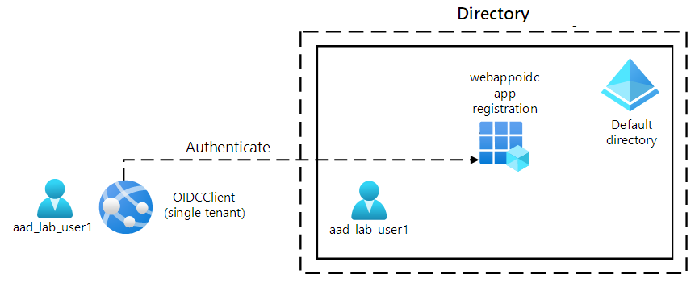
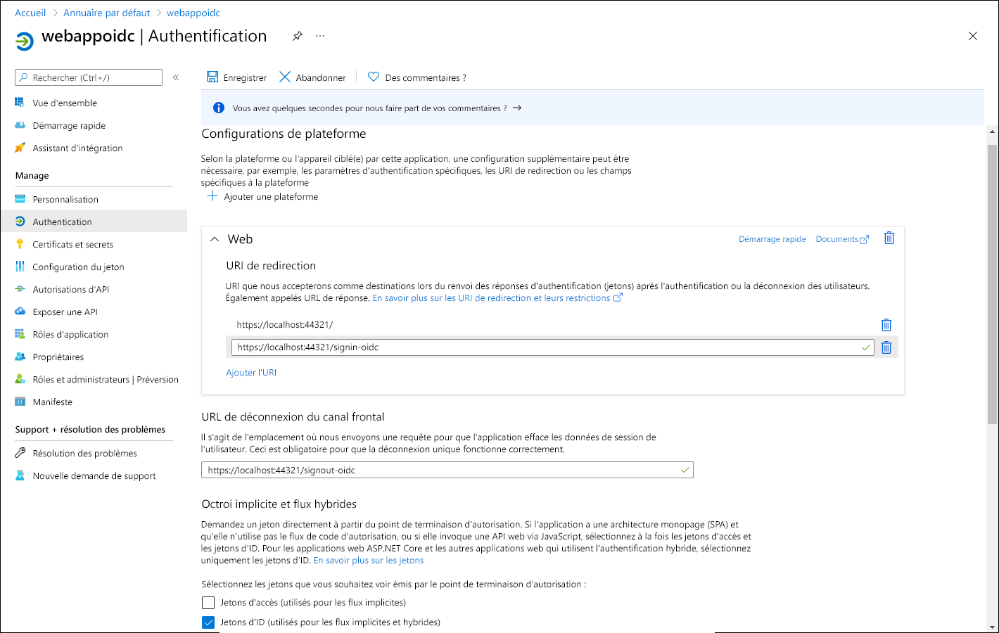

---
lab:
  az204Title: 'Lab 06: Authenticate by using OpenID Connect, MSAL, and .NET SDKs'
  az020Title: 'Lab 06: Authenticate by using OpenID Connect, MSAL, and .NET SDKs'
  az204Module: 'Module 06: Implement user authentication and authorization'
  az020Module: 'Module 06: Implement user authentication and authorization'
---

# <a name="lab-06-authenticate-by-using-openid-connect-msal-and-net-sdks"></a>Labo 06 : S’authentifier à l’aide de kits de développement logiciel (SDK) OpenID Connect, MSAL et .NET

## <a name="microsoft-azure-user-interface"></a>Interface utilisateur Microsoft Azure

Étant donné la nature dynamique des outils cloud Microsoft, il se peut que vous constatiez des modifications de l’interface utilisateur Azure après le développement du contenu de cette formation. Il se peut donc que certaines instructions et étapes du labo ne s’alignent pas correctement.

Microsoft met ce cours à jour quand la communauté l’alerte sur la nécessité d’y apporter des modifications. Toutefois, compte tenu de la fréquence des mises à jour cloud, il se peut que vous rencontriez des modifications de l’interface utilisateur avant les mises à jour du contenu de cette formation. **Si cela se produit, adaptez-vous aux changements, puis appliquez-les dans les laboratoires si nécessaire.**

## <a name="instructions"></a>Instructions

### <a name="before-you-start"></a>Avant de commencer

#### <a name="sign-in-to-the-lab-environment"></a>Se connecter à l’environnement de labo

Connectez-vous à votre machine virtuelle Windows 10 en utilisant les informations d’identification suivantes :
    
-   Nom d’utilisateur : **Administrateur**

-   Mot de passe : **Pa55w.rd**

> **Remarque** : Votre instructeur vous fournira des instructions pour la connexion à l’environnement de laboratoire virtuel.

#### <a name="review-the-installed-applications"></a>Passer en revue les applications installées

Localisez la barre des tâches sur votre bureau Windows 10. La barre des tâches contient les icônes des applications que vous allez utiliser dans ce labo, à savoir :
    
-   Microsoft Edge

-   Visual Studio Code

## <a name="ensure-that-your-local-lab-environment-has-its-time-set-properly-no-delay-according-to-your-timezone"></a>Assurez-vous que l’horloge de votre environnement de labo local est correctement réglée (sans retard par rapport à vote fuseau horaire)

> **Remarque :** Si vous remarquez que l’horloge de votre environnement de labo local (machine virtuelle du labo ou votre ordinateur local) retarde, réglez-la à l’aide de la commande PowerShell suivante pour l’avancer de 15 minutes. Vous devrez peut-être exécuter PowerShell en tant qu’administrateur.

```powershell
  Set-Date -Adjust (New-TimeSpan -Minutes 15)
```

## <a name="architecture-diagram"></a>Diagramme de l'architecture



### <a name="exercise-1-configure-a-single-tenant-azure-ad-environment"></a>Exercice 1 : Configurer un environnement Azure AD monolocataire

#### <a name="task-1-open-the-azure-portal"></a>Tâche 1 : Ouvrez le portail Azure

1.  Dans la barre des tâches, sélectionnez l’icône **Microsoft Edge**.

1.  Dans la fenêtre de navigateur ouverte, accédez au portail Azure ([portal.azure.com](https://portal.azure.com)), puis connectez-vous avec le compte que vous allez utiliser pour ce labo.

    > **Remarque** : si vous vous connectez au portail Azure pour la première fois, une visite guidée du portail vous sera proposée. Sélectionnez **Prise en main** pour faire l’impasse sur la visite guidée et commencer à utiliser le portail.

#### <a name="task-2-register-an-application-in-azure-ad"></a>Tâche 2 : Inscrire une application dans Azure AD

1.  Dans le portail Azure, utilisez la zone de texte **Rechercher des ressources, des services et des documents** pour rechercher **Azure Active Directory**. Dans la liste des résultats, choisissez **Azure Active Directory**.

    > **Remarque** : cela a pour effet de rediriger votre session de navigateur vers le volet du locataire Azure Active Directory (Azure AD) associé à votre abonnement Azure.

1.  Dans le volet **Azure Active Directory**, sélectionnez **Inscriptions d’applications** dans la section **Gérer**.

1.  Dans la section **Inscriptions d’applications**, sélectionnez **+ Nouvelle inscription**.

1.  Dans la section **Inscrire une application**, effectuez les actions suivantes, puis sélectionnez **Inscrire** :
    
    | Paramètre | Action |
    | -- | -- |
    | Zone de texte **Nom** | Entrez **webappoidc**. |
    | Liste **Types de comptes pris en charge** | Select **Comptes dans cet annuaire organisationnel uniquement (Annuaire par défaut uniquement – Locataire unique)** |

    > **Remarque** : Le nom du locataire peut différer en fonction de votre abonnement Azure.
   
    La capture d’écran suivante affiche les paramètres configurés dans la section **Inscrire une application**.
          
     
      
    
#### <a name="task-3-record-unique-identifiers"></a>Tâche 3 : Enregistrer des identificateurs uniques

1.  Dans le panneau d’inscription d’application **webappoidc**, sélectionnez **Vue d’ensemble**.

1.  Dans la section **Vue d’ensemble**, recherchez et enregistrez la valeur de la zone de texte **ID d’application (client)** . Vous allez utiliser cette valeur plus tard dans ce labo.

1.  Dans la section **Vue d’ensemble**, recherchez et enregistrez la valeur de la zone de texte **ID d’annuaire (client)** . Vous allez utiliser cette valeur plus tard dans ce labo.

#### <a name="task-4-configure-the-application-authentication-settings"></a>Tâche 4 : Configurer les paramètres d’authentification d’application

1.  Dans le volet d’inscription d’application **webappoidc**, dans la section **Gérer**, sélectionnez **Authentification**.

1.  Dans la section **Authentification**, effectuez les actions suivantes, puis sélectionnez **Configurer** :

    | Paramètre | Action |
    | -- | -- |
    | Section **Configurations de plateforme** | Sélectionnez **Ajouter une plateforme**. |
    | Volet **Configurer des plateformes** | Sélectionnez **Web**. |
    | Zone de texte **URI de redirection** | Entrez `https://localhost:5001/` |
    | Zone de texte **URL de déconnexion de canal frontal** | Entrez `https://localhost:5001/signout-oidc` |
        
1. De retour dans la section **Configurations de la plateforme**, sélectionnez **Ajouter un URI**, puis entrez `https://localhost:5001/signin-oidc`.

1. Dans la section **Flux d’octroi implicites et hybrides**, sélectionnez **Jetons d’ID (utilisés pour les flux implicites et hybrides)** . 

1. Sélectionnez **Enregistrer**.

    La capture d’écran suivante affiche les paramètres configurés dans le volet **Authentification**.
          
     
       

#### <a name="task-5-create-an-azure-ad-user"></a>Tâche 5 : Créer un utilisateur Azure AD.

1.  Dans le portail Azure, sélectionnez l’icône **Cloud Shell**  pour ouvrir une nouvelle session PowerShell. Si Cloud Shell est défini par défaut sur une session Bash, sélectionnez **Bash**, puis, dans le menu déroulant, sélectionnez **PowerShell**.

     > **Remarque** : si vous démarrez **Cloud Shell** pour la première fois, lorsque vous êtes invité à sélectionner **Bash** ou **PowerShell**, sélectionnez **PowerShell**. Lorsque vous voyez s’afficher le message **Vous n’avez aucun stockage monté**, sélectionnez l’abonnement que vous utilisez dans ce labo, puis choisissez **Créer un stockage**.

1.  Dans le volet **Cloud Shell**, exécutez la commande suivante pour vous connecter au locataire Azure AD associé à votre abonnement Azure :

      ```powershell
       Connect-AzureAD
      ```

1.  Exécutez la commande suivante pour récupérer et afficher le nom de domaine DNS (Domain Name System) principal du locataire Azure AD :

       ```powershell
       $aadDomainName = ((Get-AzureAdTenantDetail).VerifiedDomains)[0].Name
       $aadDomainName
       ```

    > **Remarque** : enregistrez la valeur du nom de domaine DNS. Vous allez utiliser cette valeur plus tard dans ce labo.

1.  Exécutez les commandes suivantes pour créer des utilisateurs Azure AD que vous allez utiliser pour tester l’authentification Azure AD :

       ```powershell
       $passwordProfile = New-Object -TypeName Microsoft.Open.AzureAD.Model.PasswordProfile
       $passwordProfile.Password = 'Pa55w.rd1234'
       $passwordProfile.ForceChangePasswordNextLogin = $false
       New-AzureADUser -AccountEnabled $true -DisplayName 'aad_lab_user1' -PasswordProfile $passwordProfile -MailNickName 'aad_lab_user1' -UserPrincipalName "aad_lab_user1@$aadDomainName" 
       ```

1.  Exécutez la commande suivante pour identifier le nom d’utilisateur principal (UPN) de l’utilisateur Azure AD nouvellement créé :

       ```powershell
       (Get-AzureADUser -Filter "MailNickName eq 'aad_lab_user1'").UserPrincipalName
       ```

    > **Remarque** : enregistrez l’UPN. Vous allez utiliser cette valeur plus tard dans ce labo.

1.  Fermez le volet Cloud Shell.

#### <a name="review"></a>Révision

Dans cet exercice, vous avez inscrit une application Azure AD monolocataire et créé un compte d’utilisateur Azure AD.

### <a name="exercise-2-create-a-single-tenant-aspnet-web-app"></a>Exercice 2 : Créer une application web ASP.NET monolocataire

#### <a name="task-1-create-an-aspnet-web-app-project"></a>Tâche 1 : Créer un projet d’application web ASP.NET

1.  Sur l’ordinateur lab, démarrez l’**invite de commandes**.

1.  À partir de l’invite de commandes, exécutez les commandes suivantes pour créer et définir le répertoire actuel sur **Allfiles (F):\\Allfiles\\Labs\\06\\Starter\\OIDCClient** :

    ```cmd
    F:
    cd F:\Allfiles\Labs\06\Starter\OIDCClient
    ```

1.  Exécutez les commandes suivantes pour créer une application web .NET Core basée sur le modèle MVC (Model View Controller) (remplacez les espaces réservés, `<application_ID>`, `<tenant_ID>` et `<domain_Name>` par les valeurs correspondantes que vous avez enregistrées précédemment dans ce labo) :

    ```cmd
    dotnet new mvc --auth SingleOrg --client-id <application_ID> --tenant-id <tenant_ID> --domain <domain_Name>
    rmdir .\obj /S /Q
    ```

1.  Exécutez la commande suivante pour démarrer Visual Studio Code. 

    ```cmd
    code .
    ```
    > Si vous avez la question **Faites-vous confiance aux auteurs de tous les fichiers de ce dossier ?** , sélectionnez **Oui, je fais confiance aux auteurs**.


1.  Dans le volet **Explorateur** de Visual Studio Code, examinez la structure de dossiers générée automatiquement qui représente une application web MVC.

1.  Accédez au dossier **Propriétés**, ouvrez le fichier **launchSettings.json**, puis appliquez les modifications suivantes :

    
    | Section | Propriété | Valeur |
    | -- | -- | -- |
    | **iisSettings** | **sslPort** | **44321** |
    | **OIDCClient**  | **applicationUrl** | `https://localhost:5001` |
    

    > **Remarque** : les numéros de port doivent correspondre à la valeur que vous avez spécifiée lors de la création de l’inscription d’application Azure AD.

1.  Enregistrez et fermez le fichier.

1.  Dans le volet Visual Studio **Explorateur** de Visual Studio Code, sélectionnez **OIDCClient.csproj**.

1.  Vérifiez que la valeur de l’élément `<TargetFramework>` est définie sur **net6.0**.

1.  Vérifiez que la version des packages NuGet `Microsoft.AspNetCore.Authentication.JwtBearer` et `Microsoft.AspNetCore.Authentication.OpenIdConnect` est définie sur **6.0.9**.

1.  Définissez la version des packages NuGet `Microsoft.Identity.Web` et `Microsoft.Identity.Web.UI` sur **1.25.3**.

1.  Vérifiez que le contenu du fichier **OIDCClient.csproj** ressemble à la liste suivante (la valeur de `UserSecretsId` sera différente) et enregistrez les modifications.

    ```csharp
    <Project Sdk="Microsoft.NET.Sdk.Web">
      <PropertyGroup>
        <TargetFramework>net6.0</TargetFramework>
        <UserSecretsId>aspnet-OIDCClient-737DEB13-25D4-4C52-93C5-F485367E3C8C</UserSecretsId>
      </PropertyGroup>

      <ItemGroup>
        <PackageReference Include="Microsoft.AspNetCore.Authentication.JwtBearer" Version="6.0.9" NoWarn="NU1605" />
        <PackageReference Include="Microsoft.AspNetCore.Authentication.OpenIdConnect" Version="6.0.9" NoWarn="NU1605" />
        <PackageReference Include="Microsoft.Identity.Web" Version="1.25.3" />
        <PackageReference Include="Microsoft.Identity.Web.UI" Version="1.25.3" />
      </ItemGroup>
    </Project>
    ```

1.  Fermez le fichier **OIDCClient.csproj**.

1.  Accédez au dossier **Views\Shared**, puis ouvrez le fichier **_LoginPartial.cshtml**.

1.  Vérifiez que l’attribut `asp-area` de chaque élément span référence `MicrosoftIdentity`, comme dans la ligne suivante :

    ```csharp
    <a class="nav-link text-dark" asp-area="MicrosoftIdentity" asp-controller="Account" asp-action="SignOut">Sign out</a>
    ```

1.  Fermez le fichier sans apporter de modifications.

1.  Ouvrez le fichier **appsettings.json** et examinez le contenu de l’objet **AzureAd**, y compris les éléments suivants :

    | Élément | Valeur |
    | -- | -- |
    | `Instance` | `https://login.microsoftonline.com/`|
    | `Domain` | Domaine DNS principal du locataire Azure AD associé à votre abonnement Azure |
    | `TenantId` | GUID du locataire Azure AD |
    | `ClientId` | ID d’application (client) de l’application inscrite dans le locataire Azure AD |
    | `CallbackPath` | `/signin-oidc` |

1.  Fermez le fichier sans apporter de modifications.

1.  Dans le volet **Explorateur** de Visual Studio Code, sélectionnez **Program.cs**.

1.  Vérifiez que le fichier contient les directives **using** suivantes :

    ```csharp
    using Microsoft.AspNetCore.Authentication.OpenIdConnect;
    using Microsoft.Identity.Web;
    using Microsoft.Identity.Web.UI;
    ```

1.  Vérifiez que le fichier contient les lignes suivantes qui ajoutent les services d’authentification appropriés au conteneur :

    ```csharp
    builder.services.AddAuthentication(OpenIdConnectDefaults.AuthenticationScheme)
      .AddMicrosoftIdentityWebApp(Configuration.GetSection("AzureAd"));
    ```

1.  Vérifiez que le fichier contient les lignes suivantes qui ajoutent un contrôleur et des pages Razor pour la gestion des comptes :

    ```csharp
    builder.services.AddRazorPages()
      .AddMicrosoftIdentityUI();
    ```

1.  Enregistrez et fermez le fichier.

### <a name="task-2-test-the-single-tenant-web-app-in-a-single-tenant-scenario"></a>Tâche 2 : Tester l’application web monolocataire dans un scénario monolocataire

1.  Dans la fenêtre **Visual Studio Code**, dans sa barre de menus supérieure, accédez au menu **Terminal** et sélectionnez **Nouveau terminal**.

1.  Dans le panneau **Terminal**, le chemin actuel du répertoire de travail actuel doit être **F:\Allfiles\Labs\06\Starter\OIDCClient**. Exécutez les commandes suivantes pour générer l’application web .NET :

    ```
    dotnet build
    ```

    > **Remarque** : s’il existe des erreurs de build, passez en revue les fichiers dans le dossier **Allfiles (F):\\Allfiles\\Labs\\06\\Solution\\OIDCClient**. Ignorez les éventuels messages d’avertissement.

1.  Exécutez la commande suivante pour générer un certificat auto-signé et configurer l’ordinateur local pour l’approuver :

    ```
    dotnet dev-certs https --trust
    ```

1.  Si vous êtes invité à installer le certificat généré automatiquement, sélectionnez **Oui**.

1.  À partir de l’invite de Terminal, exécutez la commande suivante pour exécuter l’application web .NET :

    ```
    dotnet run
    ```

1.  Démarrez le navigateur Microsoft Edge en mode **InPrivate**, puis accédez à l’URL `https://localhost:5001`.

1.  Si vous voyez s’afficher le message **Votre connexion n’est pas privée**, sélectionnez **Avancé**, puis le lien **Continuer sur localhost (non sécurisé)** .

1.  Dans la fenêtre de navigateur ouverte, lorsque vous y êtes invité, authentifiez-vous à l’aide de l’UPN du compte Azure AD **aad_lab_user1** que vous avez créé précédemment dans ce labo avec le mot de passe **Pa55w.rd1234**.

    > **Remarque** : si vous voyez s’afficher une fenêtre **Aidez-nous à protéger votre compte**, sélectionnez **Ignorer pour le moment**.

1.  La fenêtre du navigateur ouvrira automatiquement la page web **Autorisations demandées**.

1.  Examinez les autorisations requises, notamment **Afficher votre profil de base** et **Conserver l’accès aux données auxquelles vous lui avez donné accès**.

1.  Sélectionnez **Accepter**.

1.  Examinez la page d’accueil **Bienvenue** du site cible affichée dans le navigateur, et vérifiez que l’UPN du compte Azure AD **aad_user1** apparaît dans la fenêtre du navigateur.

1.  Dans la page **Bienvenue**, sélectionnez **Se déconnecter**.

1.  Lorsque vous êtes invité à sélectionner le compte à déconnecter, sélectionnez le compte Azure AD **aad_lab_user1**. Vous serez automatiquement redirigé vers la page **Déconnecté**.

1.  Fermez le navigateur Microsoft Edge.

#### <a name="review"></a>Révision 

Dans cet exercice, vous avez implémenté une application web monolocataire et l’avez testée dans un environnement Azure monolocataire.

### <a name="exercise-3-clean-up-your-lab-environment"></a>Exercice 3 : Nettoyer votre environnement lab

#### <a name="task-1-delete-the-application-registration-in-azure-ad"></a>Tâche 1 : Supprimer l’inscription d’applications dans Azure AD.

1.  Basculez vers le navigateur Microsoft Edge qui affiche le portail Azure.

1.  Dans le portail Azure, accédez au volet du locataire Azure AD associé à votre abonnement Azure.

1.  Dans le volet **Azure Active Directory**, sélectionnez **Inscriptions d’applications** dans la section **Gérer**.

1.  Dans la section **Inscriptions d’applications**, sélectionnez l’inscription d’application Azure AD **webappoidc** que vous avez créée précédemment dans ce labo.

1.  Dans la section **webappoidc**, effectuez les actions suivantes :

    a.   Sélectionnez **Supprimer**.

    b.   Dans le volet **Supprimer l’inscription d’application**, sélectionnez **Je comprends les implications de la suppression de cette inscription d’application**, puis **Supprimer**.

1.  Accédez au volet **Utilisateurs \| Tous les utilisateurs (Aperçu)** .

1.  Dans la liste des utilisateurs, sélectionnez **aad_lab_user1**.

1.  Dans le volet **aad_lab_user1 \| Profil**, sélectionnez **Supprimer**, puis, lorsque vous êtes invité à confirmer, sélectionnez **Oui**.

#### <a name="task-2-close-the-active-applications"></a>Tâche 2 : Fermer les applications actives

1.  Fermez les fenêtres Microsoft Edge ouvertes.

1.  Fermez Visual Studio Code.

#### <a name="review"></a>Révision

Dans cet exercice, vous avez nettoyé votre abonnement en supprimant l’inscription d’application utilisée dans ce labo.
