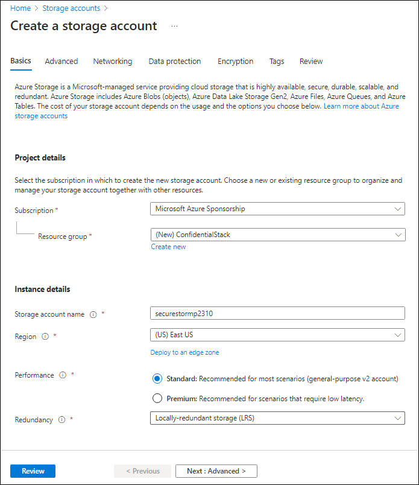
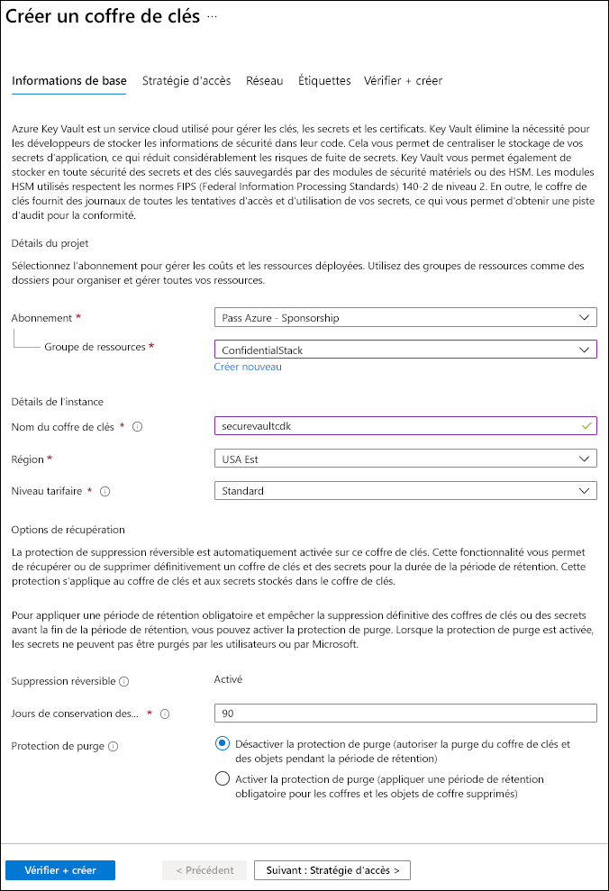
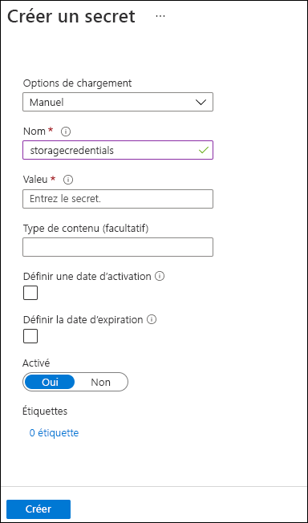

---
lab:
  az204Title: 'Lab 07: Access resource secrets more securely across services'
  az020Title: 'Lab 07: Access resource secrets more securely across services'
  az204Module: 'Module 07: Implement secure cloud solutions'
  az020Module: 'Module 07: Implement secure cloud solutions'
ms.openlocfilehash: 9638ad805940d8343646cd2790f2b6a06d9952df
ms.sourcegitcommit: 9abfe3b5a1c9ccd2f0610348052d04169573f81a
ms.translationtype: HT
ms.contentlocale: fr-FR
ms.lasthandoff: 06/01/2022
ms.locfileid: "145994987"
---
# <a name="lab-07-access-resource-secrets-more-securely-across-services"></a>Labo 07 : Accéder aux secrets des ressources de manière plus sécurisée dans différents services

## <a name="microsoft-azure-user-interface"></a>Interface utilisateur Microsoft Azure

Étant donné la nature dynamique des outils cloud Microsoft, il se peut que vous constatiez des modifications de l’interface utilisateur Azure après le développement du contenu de cette formation. Il se peut donc que certaines instructions et étapes du labo ne s’alignent pas correctement.

Microsoft met cette formation à jour quand la communauté l’alerte sur la nécessité d’y apporter des modifications. Toutefois, compte tenu de la fréquence des mises à jour cloud, il se peut que vous rencontriez des modifications de l’interface utilisateur avant les mises à jour du contenu de cette formation. **Si cela se produit, adaptez-vous aux changements, puis appliquez-les dans les laboratoires si nécessaire.**

## <a name="instructions"></a>Instructions

### <a name="before-you-start"></a>Avant de commencer

#### <a name="sign-in-to-the-lab-environment"></a>Se connecter à l’environnement de labo

Connectez-vous à votre machine virtuelle Windows 10 en utilisant les informations d’identification suivantes :

- Nom d’utilisateur : **Administrateur**
- Mot de passe : **Pa55w.rd**

> **Remarque** : votre instructeur vous fournira des instructions pour la connexion à l’environnement de laboratoire virtuel.

#### <a name="review-the-installed-applications"></a>Passer en revue les applications installées

Localisez la barre des tâches sur votre bureau Windows 10. La barre des tâches contient les icônes des applications que vous allez utiliser dans ce labo, à savoir :

- Microsoft Edge
- Explorateur de fichiers
- Terminal Windows
- Visual Studio Code

## <a name="architecture-diagram"></a>Diagramme de l'architecture


### <a name="exercise-1-create-azure-resources"></a>Exercice 1 : Créer des ressources Azure

#### <a name="task-1-open-the-azure-portal"></a>Tâche 1 : Ouvrir le portail Azure

1. Dans la barre des tâches, sélectionnez l’icône **Microsoft Edge**.

1. Dans la fenêtre de navigateur ouverte, accédez au portail Azure (<https://portal.azure.com>), puis connectez-vous au compte que vous allez utiliser pour ce laboratoire.

    > **Remarque** : si vous vous connectez au portail Azure pour la première fois, une visite guidée du portail vous sera proposée. Sélectionnez **Prise en main** pour faire l’impasse sur la visite guidée et commencer à utiliser le portail.

#### <a name="task-2-create-a-storage-account"></a>Tâche 2 : Créer un compte de stockage

1. Dans le portail Azure, utilisez la zone de texte **Rechercher des ressources, des services et des documents** pour rechercher **Comptes de stockage**, puis, dans la liste des résultats, sélectionnez **Comptes de stockage**.

1. Dans le volet **Comptes de stockage**, sélectionnez **+ Créer**.

1. Dans le volet **Créer un compte de stockage**, sous l’onglet **Options de base**, effectuez les actions suivantes, puis sélectionnez **Vérifier + créer**.

   | Paramètre | Action |
   | --- | --- |
   | Liste déroulante **Abonnement**   | Conservez les valeurs par défaut. |
   | Section **Groupe de ressources**        | Sélectionnez **Créer**, entrez **ConfidentialStack,** , puis sélectionnez **OK**. |
   | Zone de texte **Nom de compte de stockage** | Entrez **securestor** _[votrenom]_ . |
   | Liste déroulante **Région**         | Sélectionnez **(États-Unis) USA Est** |
   | Section **Performance**           | Sélectionnez l’option **Standard**. |
   | Liste déroulante **Redondance**     | Sélectionnez **Stockage localement redondant (LRS)** . |

   La capture d’écran suivante affiche les paramètres configurés dans le volet **Créer un compte de stockage**.

   

1. Sous l’onglet **Vérifier + créer**, passez en revue les options que vous avez sélectionnées lors des étapes précédentes.

1. Sélectionnez **Créer** pour créer le compte de stockage à l’aide de votre configuration spécifiée.

    > **Remarque** : attendez que la tâche de création soit terminée avant de poursuivre ce labo.

1. Dans la page **Vue d’ensemble du déploiement**, sélectionnez **Accéder à la ressource**.

1. Dans le volet **Compte de stockage**, dans la section **Sécurité et réseau**, sélectionnez le lien **Clés d’accès**.

1. Dans la section **Clés d’accès**, sélectionnez **Afficher les clés**.

1. Sélectionnez une clé et enregistrez la valeur figurant dans l’une des zones **Chaîne de connexion**. Vous allez utiliser cette valeur plus loin dans ce labo.

    > **Remarque** : peu importe la chaîne de connexion que vous choisissez. Elles sont interchangeables.

#### <a name="task-3-create-an-azure-key-vault"></a>Tâche 3 : Créer un Azure Key Vault

1. Dans le portail Azure, utilisez la zone de texte **Rechercher des ressources, des services et des documents** pour rechercher **Coffres de clés**, puis, dans la liste des résultats, sélectionnez **Coffres de clés**.

1. Dans le volet **Coffres de clés**, sélectionnez **Créer**.

1.  Dans le volet **Créer un coffre de clés**, sous l’onglet **Options de base**, effectuez les actions suivantes, puis sélectionnez **Vérifier + créer** :

    | Paramètre                           | Action                                    |
    | --------------------------------- | ----------------------------------------- |
    | Liste déroulante **Abonnement**   | Conservez la valeur par défaut.                 |
    | Liste déroulante **Groupe de ressources** | Sélectionnez **ConfidentialStack** dans la liste. |
    | Zone de texte **Nom du coffre de clés**       | Entrez **securevault** _[votrenom]_ .        |
    | Liste déroulante **Région**         | Sélectionnez **USA Est**.                       |
    | Liste déroulante **Niveau tarifaire**   | Sélectionnez **Standard**.                      |

    La capture d’écran suivante affiche les paramètres configurés dans le volet **Créer un coffre de clés**.

    

1. Sous l’onglet **Vérifier + créer**, passez en revue les options que vous avez sélectionnées lors des étapes précédentes.

1. Sélectionnez **Créer** pour créer le coffre de clés à l’aide de votre configuration spécifiée.

    > **Remarque** : attendez que la tâche de création soit terminée avant de poursuivre ce labo.

#### <a name="task-4-create-a-function-app"></a>Tâche 4 : Créer une application de fonction

1. Dans le portail Azure, utilisez la zone de texte **Rechercher des ressources, des services et des documents** pour rechercher **Application de fonction**, puis, dans la liste des résultats, sélectionnez **Application de fonction**.

1. Dans le volet **Application de fonction**, sélectionnez **+ Créer**.

1. Dans le volet **Créer une application de fonction**, sous l’onglet **Options de base**, effectuez les actions suivantes, puis sélectionnez **Suivant : Hébergement** :

    | Paramètre                           | Action                            |
    | --------------------------------- | --------------------------------- |
    | Liste déroulante **Abonnement**   | Conservez les valeurs par défaut.         |
    | Liste déroulante **Groupe de ressources** | Sélectionnez **ConfidentialStack**.     |
    | Zone de texte **Nom de l’application de fonction**    | Entrez **securefunc** _[votrenom]_ . |
    | Section **Publier**               | Sélectionner **Code** |
    | Liste déroulante **Pile d’exécution**  | Sélectionnez **.NET**. |
    | Liste déroulante **Version**        | Sélectionnez **3.1**. |
    | Liste déroulante **Région**         | Sélectionnez la région **USA Est**. |
    | Cases d’option **Système d’exploitation** | Sélectionnez **Linux**. |
    | Liste déroulante **Type de plan**      | Sélectionnez **Consommation (serverless)** . |


1. Sous l’onglet **Hébergement**, effectuez les actions suivantes, puis sélectionnez **Vérifier + créer** :

    | Paramètre | Action |
    | --- | --- |
    | Liste déroulante **Compte de stockage**. | Sélectionnez le compte de stockage **securestor** _[votrenom]_ . |

1. Sous l’onglet **Vérifier + créer**, passez en revue les options que vous avez sélectionnées lors des étapes précédentes.

1. Sélectionnez **Créer** pour créer l’application de fonction à l’aide de votre configuration spécifiée.

    > **Remarque** : attendez que la tâche de création soit terminée avant de poursuivre ce labo.

#### <a name="review"></a>Révision

Dans cet exercice, vous avez créé toutes les ressources que vous allez utiliser dans ce labo.

### <a name="exercise-2-configure-secrets-and-identities"></a>Exercice 2 : Configurer des secrets et identités

#### <a name="task-1-configure-a-system-assigned-managed-service-identity"></a>Tâche 1 : Configurer une identité de service managée affectée par le système

1. Dans le volet de navigation du portail Azure, sélectionnez le lien **Groupes de ressources**.

1. Dans le volet **Groupes de ressources**, sélectionnez le groupe de ressources **ConfidentialStack**.

1. Dans le volet **ConfidentialStack**, sélectionnez l’application de fonction **securefunc** _[votrenom]_ .

    > **Remarque** : il y aura deux ressources, une ressource application de fonction et une ressource Application Insights, portant le même nom. Veillez à sélectionner la ressource application de fonction.

1. Dans le volet **Application de fonction**, dans la section **Paramètres**, sélectionnez l’option **Identité**.

1. Dans le volet **Identité**, sous l’onglet **Affecté par le système**, définissez l’**État** sur **Activé**, puis sélectionnez **Enregistrer**.

1. Sélectionnez **Oui** pour confirmer le paramètre.

    > **Remarque** : attendez que l’identité managée affectée par le système soit créée avant de poursuivre ce labo.

#### <a name="task-2-create-a-key-vault-secret"></a>Tâche 2 : Créer un secret Key Vault

1. Dans le volet de **navigation** du portail Azure, sélectionnez le lien **Groupes de ressources**.

1. Dans le volet **Groupes de ressources**, sélectionnez le groupe de ressources **ConfidentialStack**.

1. Dans le volet **ConfidentialStack**, sélectionnez le coffre de clés **securevault** _[votrenom]_ .

1. Dans le volet **Coffre de clés**, dans la section **Paramètres**, sélectionnez le lien **Secrets**.

1. Dans le volet **Secrets**, sélectionnez **+ Générer/Importer**.

1. Dans le volet **Créer un secret**, effectuez les actions suivantes, puis sélectionnez **Créer** :

    | Paramètre | Action |
    | --- |  --- |
    | Liste déroulante **Options de chargement** | Sélectionnez **Manuel** |
    | Zone de texte **Nom**       | Entres **stockagecredentials**. |
    | Zone de texte **Valeur**       | Entrez la chaîne de connexion au compte de stockage que vous avez enregistrée précédemment dans ce labo.               |
    | Zone de texte **Type de contenu** | Laisser vide. |
    | Case à cocher **Définir la date d’activation** | non sélectionnée. |
    | Case à cocher **Définir la date d’expiration** | non sélectionnée. |
    | Option **Activé** | Sélectionnez **Oui**. |

    La capture d’écran suivante affiche les paramètres configurés dans le volet **Créer un secret**.

    

    > **Remarque** : attendez que le secret soit créé avant de poursuivre avec ce labo.

1. Revenez au volet **Secrets**, puis sélectionnez l’élément **storagecredentials** dans la liste.

1. Dans le volet **Versions**, sélectionnez la dernière version du secret **storagecredentials**.

1. Dans le volet **Version du secret**, effectuez les actions suivantes :

    1. Sélectionnez **Afficher la valeur du secret** pour trouver la valeur du secret.

    1. Enregistrez la valeur de la zone de texte **Identificateur de secret**, car vous l’utiliserez plus tard dans le labo.

    > **Remarque** : vous enregistrez la valeur de la zone de texte **Identificateur de secret**, non celle de la zone de texte **Valeur du secret**.

#### <a name="task-3-configure-a-key-vault-access-policy"></a>Tâche 3 : Configurer la stratégie d’accès au Coffre de clés

1. Dans le volet de navigation du portail Azure, sélectionnez le lien **Groupes de ressources**.

1. Dans le volet **Groupes de ressources**, sélectionnez le groupe de ressources **ConfidentialStack**.

1. Dans le volet **ConfidentialStack**, sélectionnez le coffre de clés **securevault[votrenom]** .

1. Dans le volet **Coffre de clés**, dans la section **Paramètres**, sélectionnez le lien **Stratégies d’accès**.

1. Sur le volet **Stratégies d’accès**, sélectionnez **Ajouter une stratégie d’accès**.

1. Dans le volet **Ajouter une stratégie d’accès**, effectuez les actions suivantes, puis sélectionnez **Ajouter** :

    | Paramètre | Action |
    | --- | --- |
    | Liste déroulante **Configurer à partir du modèle** | Laisser vide |
    | Liste déroulante **Autorisations de clé** | 0 sélectionné |
    | Liste déroulante **Autorisations du secret** | Sélectionnez l’autorisation **GET**. |
    | Liste déroulante **Autorisations de certificat** | 0 sélectionné |
    | Lien **Sélectionner le principal** | Recherchez et sélectionnez le principal de service nommé **securefunc** _[votrenom]_ . L’identité managée affectée par le système que vous avez créée précédemment dans ce labo portera le même nom que la ressource Fonction Azure. |
    | Lien **Application autorisée** | Aucune sélectionnée |

    La capture d’écran suivante affiche les paramètres configurés dans le volet **Ajouter une stratégie d’accès**.

    

1. Sur le volet **Stratégies d’accès**, sélectionnez **Enregistrer**.

    > **Remarque** : attendez que les modifications que vous avez apportées aux stratégies d’accès soient enregistrées avant de continuer ce labo.

#### <a name="task-4-create-a-key-vault-derived-application-setting"></a>Tâche 4 : Créer un paramètre d’application dérivé du Coffre de clés

1. Dans le volet de navigation du portail Azure, sélectionnez le lien **Groupes de ressources**.

1. Dans le volet **Groupes de ressources**, sélectionnez le groupe de ressources **ConfidentialStack**.

1. Dans le volet **ConfidentialStack**, sélectionnez l’application de fonction **securefunc[votrenom]** .

1. Dans le volet **Application de fonction**, dans la section **Paramètres**, sélectionnez l’option **Configuration**.

1. Dans le volet **Configuration**, sous l’onglet **Paramètres d’application**, sélectionnez **Nouveau paramètre d’application**.

1. Dans la fenêtre contextuelle **Ajouter/modifier le paramètre d’application**, dans la zone de texte **Nom**, entrez **StorageConnectionString**.

1. Dans la zone de texte **Valeur**, construisez une valeur à l’aide de la syntaxe suivante : ``@Microsoft.KeyVault(SecretUri=*Secret Identifier*)``

    > **Remarque** : vous allez devoir créer une référence à votre **_identificateur de secret_** à l’aide de la syntaxe ci-dessus. Par exemple, si votre identificateur de secret est `https://securevaultstudent.vault.azure.net/secrets/storagecredentials/17b41386df3e4191b92f089f5efb4cbf`, votre valeur sera `@Microsoft.KeyVault(SecretUri=https://securevaultstudent.vault.azure.net/secrets/storagecredentials/17b41386df3e4191b92f089f5efb4cbf)`.

1. Laissez la case à cocher du **Paramètre d’emplacement de déploiement** définie comme par défaut (non activée), puis sélectionnez **OK** pour fermer la fenêtre contextuelle et revenir à la section **Configuration**.

1. Sélectionnez **Enregistrer** pour enregistrer vos paramètres, puis, dans la boîte de dialogue de confirmation **Enregistrer les modifications**, sélectionnez **Continuer**.

    > **Remarque** : attendez que vos paramètres d’application soient enregistrés avant de poursuivre le labo.

#### <a name="review"></a>Révision

Dans cet exercice, vous avez créé une identité de service managée affectée par le système pour votre application de fonction, puis lui avez donné les autorisations appropriées pour obtenir la valeur d’un secret dans votre coffre de clés. Enfin, vous avez créé un secret que vous avez référencé dans les paramètres de configuration de votre application de fonction.

### <a name="exercise-3-build-an-azure-functions-app"></a>Exercice 3 : Générer une application Azure Functions

#### <a name="task-1-initialize-a-function-project"></a>Tâche 1 : Initialiser un projet de fonction

1. Dans la barre des tâches, sélectionnez l’icône **Terminal Windows**.

1. Exécutez la commande suivante pour modifier le répertoire actuel en le définissant sur le répertoire vide **Allfiles (F):\\Allfiles\\Labs\\07\\Starter\\func** :

    ```powershell
    cd F:\Allfiles\Labs\07\Starter\func
    ```

    > **Remarque** : dans l’Explorateur Windows, supprimez l’attribut en lecture seule du fichier F:\Allfiles\Labs\07\Starter\func\.gitignore.

1. Exécutez la commande suivante afin d’utiliser **Azure Functions Core Tools** pour créer un projet Functions local dans le répertoire actuel à l’aide du runtime **dotnet** :

    ```powershell
    func init --worker-runtime dotnet --force
    ```

    > **Remarque** : vous pouvez consultez la documentation pour [créer un projet][azure-functions-core-tools-new-project] à l’aide d’**Azure Functions Core Tools**.

1. Exécutez la commande suivante pour **générer** le projet .NET Core 3.1 :

    ```powershell
    dotnet build
    ```

#### <a name="task-2-create-an-http-triggered-function"></a>Tâche 2 : Créer une fonction déclenchée par HTTP

1. Exécutez la commande suivante afin d’utiliser **Azure Functions Core Tools** pour créer une fonction nommée **FileParser** à l’aide du modèle **Déclencheur HTTP** :

    ```powershell
    func new --template "HTTP trigger" --name "FileParser"
    ```

    > **Remarque** : vous pouvez consultez la documentation pour [créer une fonction][azure-functions-core-tools-new-function] à l’aide d’**Azure Functions Core Tools**.

1. Fermez l’application **Terminal Windows** actuellement en cours d’exécution.

#### <a name="task-3-configure-and-read-an-application-setting"></a>Tâche 3 : Configurer et lire un paramètre d’application

1. Dans l’écran **Démarrage**, sélectionnez la vignette **Visual Studio Code**.

1. Dans le menu **Fichier**, sélectionnez **Ouvrir le dossier**.

1. Dans la fenêtre **Explorateur de fichiers** qui s’ouvre, accédez à **Allfiles (F):\\Allfiles\\Labs\\07\\Starter\\func**, puis choisissez **Sélectionner un dossier**.

1. Dans le volet **Explorateur** de la fenêtre **Visual Studio Code**, ouvrez le fichier **local.settings.json**.

1. Observez la valeur actuelle de l’objet **Values** :

    ```json
    "Values": {
        "AzureWebJobsStorage": "UseDevelopmentStorage=true",
        "FUNCTIONS_WORKER_RUNTIME": "dotnet"
    }
    ```

1. Mettez à jour la valeur de l’objet **Values** en ajoutant un paramètre nommé **StorageConnectionString**, puis en lui affectant la valeur de chaîne **[TEST VALUE]** :

    ```json
    "Values": {
        "AzureWebJobsStorage": "UseDevelopmentStorage=true",
        "FUNCTIONS_WORKER_RUNTIME": "dotnet",
        "StorageConnectionString": "[TEST VALUE]"
    }
    ```

1. Le fichier **local.settings.json** devrait maintenant inclure :

    ```json
    {
        "IsEncrypted": false,
        "Values": {
            "AzureWebJobsStorage": "UseDevelopmentStorage=true",
            "FUNCTIONS_WORKER_RUNTIME": "dotnet",
            "StorageConnectionString": "[TEST VALUE]"
        }
    }
    ```

1. Sélectionnez **Enregistrer** pour enregistrer vos modifications dans le fichier **local.settings.json**.

1. Dans le volet **Explorateur** de la fenêtre **Visual Studio Code**, ouvrez le fichier **FileParser.cs**.

1. Dans l’éditeur de code, observez l’exemple d’implémentation :

    ```csharp
    using System;
    using System.IO;
    using System.Threading.Tasks;
    using Microsoft.AspNetCore.Mvc;
    using Microsoft.Azure.WebJobs;
    using Microsoft.Azure.WebJobs.Extensions.Http;
    using Microsoft.AspNetCore.Http;
    using Microsoft.Extensions.Logging;
    using Newtonsoft.Json;
    namespace func
    {
        public static class FileParser
        {
            [FunctionName("FileParser")]
            public static async Task<IActionResult> Run(
                [HttpTrigger(AuthorizationLevel.Function, "get", "post", Route = null)] HttpRequest req,
                ILogger log)
            {
                log.LogInformation("C# HTTP trigger function processed a request.");
                string name = req.Query["name"];
                string requestBody = await new StreamReader(req.Body).ReadToEndAsync();
                dynamic data = JsonConvert.DeserializeObject(requestBody);
                name = name ?? data?.name;
                string responseMessage = string.IsNullOrEmpty(name)
                    ? "This HTTP triggered function executed successfully. Pass a name in the query string or in the request body for a personalized response."
                    : $"Hello, {name}. This HTTP triggered function executed successfully.";
                return new OkObjectResult(responseMessage);
            }
        }
    }
    ```

1. Supprimez tout le contenu du fichier **FileParser.cs**.

1. Ajoutez les lignes de code suivantes afin d’ajouter des **directives using** pour les espaces de noms **Microsoft.AspNetCore.Mvc**, **Microsoft.Azure.WebJobs**, **Microsoft.AspNetCore.Http**, **System** et **System.Threading.Tasks** :

    ```csharp
    using Microsoft.AspNetCore.Mvc;
    using Microsoft.Azure.WebJobs;
    using Microsoft.AspNetCore.Http;
    using System;
    using System.Threading.Tasks;
    ```

1. Créez une classe **statique publique** nommée **FileParser** :

    ```csharp
    public static class FileParser
    { }
    ```

1. Observez à nouveau le fichier **FileParser.cs**, qui devrait maintenant inclure :

    ```csharp
    using Microsoft.AspNetCore.Mvc;
    using Microsoft.Azure.WebJobs;
    using Microsoft.AspNetCore.Http;
    using System;
    using System.Threading.Tasks;
    public static class FileParser
    { }
    ```

1. Dans la classe **FileParser**, ajoutez le bloc de code suivant pour créer une méthode *asynchrone* **publique statique** nommée **Run**. Cette méthode retourne une variable de type **Task\<IActionResult\>** et prend également une variable de type **HttpRequest** nommée *request* :

    ```csharp
    public static async Task<IActionResult> Run(
        HttpRequest request)
    { }
    ```

1. Ajoutez le code suivant pour ajouter un attribut à la méthode **Run** de type **FunctionNameAttribute** dont le paramètre **name** est défini sur la valeur **FileParser** :

    ```csharp
    [FunctionName("FileParser")]
    public static async Task<IActionResult> Run(
        HttpRequest request)
    { }
    ```

1. Ajoutez le code suivant pour ajouter un attribut au paramètre **request** de type **HttpTriggerAttribute** dont le tableau de paramètres **methods** est défini sur la valeur unique **GET** :

    ```csharp
    [FunctionName("FileParser")]
    public static async Task<IActionResult> Run(
        [HttpTrigger("GET")] HttpRequest request)
    { }
    ```

1. Observez à nouveau le fichier **FileParser.cs**, qui devrait maintenant inclure :

    ```csharp
    using Microsoft.AspNetCore.Mvc;
    using Microsoft.Azure.WebJobs;
    using Microsoft.AspNetCore.Http;
    using System;
    using System.Threading.Tasks;
    public static class FileParser
    {
        [FunctionName("FileParser")]
        public static async Task<IActionResult> Run(
            [HttpTrigger("GET")] HttpRequest request)
        { }
    }
    ```

1. Dans la méthode **Run**, entrez la ligne de code suivante pour récupérer la valeur du paramètre d’application **StorageConnectionString** en utilisant la méthode **Environment.GetEnvironmentVariable**, et stocker le résultat dans une variable de **chaîne** nommée **connectionString** :

    ```csharp
    string connectionString = Environment.GetEnvironmentVariable("StorageConnectionString");
    ```

1. Entrez la ligne de code suivante pour retourner la valeur de la variable **connectionString** comme réponse HTTP :

    ```csharp
    return new OkObjectResult(connectionString);
    ```

1. Observez à nouveau le fichier **FileParser.cs**, qui devrait maintenant inclure :

    ```csharp
    using Microsoft.AspNetCore.Mvc;
    using Microsoft.Azure.WebJobs;
    using Microsoft.AspNetCore.Http;
    using System;
    using System.Threading.Tasks;
    public static class FileParser
    {
        [FunctionName("FileParser")]
        public static async Task<IActionResult> Run(
            [HttpTrigger("GET")] HttpRequest request)
        {
            string connectionString = Environment.GetEnvironmentVariable("StorageConnectionString");
            return new OkObjectResult(connectionString);
        }
    }
    ```

1. Sélectionnez **Enregistrer** pour enregistrer vos modifications dans le fichier **FileParser.cs**.

#### <a name="task-4-validate-the-local-function"></a>Tâche 4 : Valider la fonction locale

1. Dans la barre des tâches, sélectionnez l’icône **Terminal Windows**.

1. Exécutez la commande suivante pour modifier le répertoire actuel en le définissant sur le répertoire vide **Allfiles (F):\\Allfiles\\Labs\\07\\Starter\\func** :

    ```powershell
    cd F:\Allfiles\Labs\07\Starter\func
    ```

1. Exécutez la commande suivante pour exécuter le projet d’application de fonction :

    ```powershell
    func start --build
    ```

    > **Remarque** : vous pouvez consultez la documentation pour [démarrer le projet d’application de fonction localement][azure-functions-core-tools-start-function] à l’aide d’**Azure Functions Core Tools**.

1. Dans la barre des tâches, sélectionnez à nouveau l’icône **Terminal Windows** pour ouvrir une nouvelle instance de l’application **Terminal Windows**. Exécutez la commande suivante pour modifier le répertoire actuel en le définissant sur le répertoire vide **Allfiles (F):\\Allfiles\\Labs\\07\\Starter\\func** :

    ```powershell
    cd F:\Allfiles\Labs\07\Starter\func
    ```
    
1. Lorsque vous recevez l’invite de commandes, exécutez la commande suivante pour démarrer l’outil **httprepl**, en définissant l’URI (Uniform Resource Identifier) de base sur ``http://localhost:7071`` :

    ```powershell
    httprepl http://localhost:7071
    ```

    > **Remarque** : l’outil **httprepl** affiche un message d’erreur. Ce message apparaît parce que l’outil est en train de rechercher un fichier de définition Swagger à utiliser pour parcourir l’API. Étant donné que votre projet de fonction ne produit pas de fichier de définition Swagger, vous devez parcourir l’API manuellement.
1. Lorsque vous recevez l’invite de l’outil, exécutez la commande suivante pour accéder au répertoire relatif **api** :

    ```powershell
    cd api
    ```

1. Exécutez la commande suivante pour accéder au répertoire relatif **fileparser** :

    ```powershell
    cd fileparser
    ```

1. Exécutez la commande suivante pour exécuter la commande **get**.

    ```powershell
    get
    ```

1. Observez la valeur **[TEST VALUE]** de la **StorageConnectionString** retournée par la requête HTTP :

    ```powershell
    HTTP/1.1 200 OK
    Content-Type: text/plain; charset=utf-8
    Date: Tue, 01 Sep 2020 23:35:39 GMT
    Server: Kestrel
    Transfer-Encoding: chunked
    [TEST VALUE]
    ```

1. Exécutez la commande suivante pour quitter l’outil **httprepl** :

    ```powershell
    exit
    ```

1. Fermez toutes les instances en cours d’exécution de l’application **Terminal Windows**.

#### <a name="task-5-deploy-the-function-using-the-azure-functions-core-tools"></a>Tâche 5 : Déployer la fonction à l’aide d’Azure Functions Core Tools

1. Dans la barre des tâches, sélectionnez l’icône **Terminal Windows**.

1. Exécutez la commande suivante pour modifier le répertoire actuel en le définissant sur le répertoire vide **Allfiles (F):\\Allfiles\\Labs\\07\\Starter\\func** :

    ```powershell
    cd F:\Allfiles\Labs\07\Starter\func
    ```

1. Utilisez la commande suivante pour vous connecter à l’interface de ligne de commande Azure (CLI) :

    ```powershell
    az login
    ```

1. Dans la fenêtre du navigateur **Microsoft Edge**, entrez l’adresse e-mail et le mot de passe de votre compte Microsoft, puis sélectionnez **Se connecter**.

1. Revenez à la fenêtre **Terminal Windows** actuellement ouverte. Attendez que le processus de connexion se termine.

1. Exécutez la commande suivante pour publier le projet d’application de fonction :

    ```powershell
    func azure functionapp publish <function-app-name>
    ```

    > **Remarque** : par exemple, si votre **Nom d’application de fonction** est **securefuncstudent**, votre commande sera ``func azure functionapp publish securefuncstudent``. Vous pouvez consulter la documentation pour [publier le projet d’application de fonction local][azure-functions-core-tools-publish-azure] à l’aide d’**Azure Functions Core Tools**.

1. Attendez que le déploiement soit finalisé avant de poursuivre le labo.

1. Fermez l’application **Terminal Windows** actuellement en cours d’exécution.

#### <a name="task-6-test-the-key-vault-derived-application-setting"></a>Tâche 6 : Tester le paramètre d’application dérivé du Coffre de clés

1. Dans la barre des tâches, sélectionnez l’icône **Microsoft Edge**, puis l’onglet contenant le portail Azure (<https://portal.azure.com>).

1. Dans le volet de navigation du portail Azure, sélectionnez le lien **Groupes de ressources**.

1. Dans le volet **Groupes de ressources**, sélectionnez le groupe de ressources **ConfidentialStack**.

1. Dans le volet **ConfidentialStack**, sélectionnez l’application de fonction **securefunc[votrenom]** .

1. Dans le volet **Application de fonction**, sélectionnez l’option **Fonctions** dans la section **Fonctions**.

1. Dans le volet **Fonctions**, sélectionnez la fonction **FileParser** existante.

1. Dans le volet **Fonction**, dans la section **Développeur**, sélectionnez l’option **Code + Test**.

1. Dans l’éditeur de fonction, sélectionnez **Tester/Exécuter**.

1. Dans la boîte de dialogue contextuelle qui s’affiche, dans la liste **Méthode HTTP**, sélectionnez **GET**.

1. Sélectionnez **Exécuter** pour tester la fonction.

1. Observez les résultats de l’exécution du test. Le résultat devrait être votre chaîne de connexion au Stockage Azure.

#### <a name="review"></a>Révision

Dans cet exercice, vous avez utilisé une identité de service pour lire la valeur d’un secret stocké dans Key Vault, et retourné cette valeur en tant que résultat d’une application de fonction.

### <a name="exercise-4-access-azure-blob-storage-data"></a>Exercice 4 : Accéder au données du Stockage Blob Azure

#### <a name="task-1-upload-a-sample-storage-blob"></a>Tâche 1 : Charger un exemple de blob de stockage

1. Dans le volet de navigation du portail Azure, sélectionnez le lien **Groupes de ressources**.

1. Dans le volet **Groupes de ressources**, sélectionnez le groupe de ressources **ConfidentialStack**.

1. Dans le volet **ConfidentialStack**, sélectionnez le compte de stockage **securestor** _[votrenom]_ .

1. Dans le volet **Compte de stockage**, dans la section **Conteneurs**, sélectionnez le lien **Stockage de données**.

1. Dans la section **Conteneurs**, sélectionnez **+ Conteneur**.

1. Dans la fenêtre contextuelle **Nouveau conteneur**, effectuez les actions suivantes, puis sélectionnez **Créer** :

    | Paramètre | Action |
    | --- | --- |
    | Zone de texte **Nom** | Entrez **drop**. |
    | Liste déroulante **Niveau d’accès public** | Sélectionnez **blob (accès en lecture anonyme pour les blobs uniquement)** . |

1. Revenez à la section **Conteneurs**, puis sélectionnez le conteneur **drop** nouvellement créé.

1. Dans le volet **Conteneur**, sélectionnez **Charger**.

1. Dans la fenêtre **Charger l’objet blob**, effectuez les actions suivantes, puis sélectionnez **Charger** :

    | Paramètre | Action |
    | --- | --- |
    | Section **Fichiers** | Sélectionnez l’icône **Dossier**. |
    | Fenêtre **Explorateur de fichiers** | Accédez à **Allfiles (F):\\Allfiles\\Labs\\07\\Starter**, sélectionnez le fichier **records.json**, puis **Ouvrir**. |
    | Case à cocher **Remplacer si les fichiers existent déjà** | Vérifiez que cette case à cocher est activée. |

    > **Remarque** : Attendez que le chargement du blob soit terminé avant de poursuivre ce labo.

1. Revenez au volet **Conteneur**, puis sélectionnez le blob **records.json** dans la liste de blobs.

1. Dans le volet **Blob**, recherchez les métadonnées du blob, puis copiez l’URL du blob.

1. Dans la barre des tâches, activez le menu contextuel pour l’icône **Microsoft Edge**, puis sélectionnez **Nouvelle fenêtre**.

1. Dans la nouvelle fenêtre du navigateur, faites référence à l’URL que vous avez copiée pour le blob.

1. Le contenu JSON (JavaScript Object Notation) du blob devrait maintenant s’afficher. Fermez la fenêtre du navigateur avec le contenu JSON.

1. Revenez à la fenêtre du navigateur avec le portail Azure, puis fermez le volet **Blob**.

1. Revenez au volet **Conteneur**, puis sélectionnez **Modifier le niveau d’accès**.

1. Dans la fenêtre contextuelle **Modifier le niveau d’accès**, effectuez les actions suivantes :

    1. Dans la liste déroulante **Niveau d’accès public**, sélectionnez **Privé (pas d’accès anonyme)** .

    1. Sélectionnez **OK**.

1. Dans la barre des tâches, activez le menu contextuel pour l’icône **Microsoft Edge**, puis sélectionnez **Nouvelle fenêtre**.

1. Dans la nouvelle fenêtre du navigateur, faites référence à l’URL que vous avez copiée pour le blob.

1. Un message d’erreur indiquant que la ressource est introuvable devrait maintenant s’afficher.

    > **Remarque** : si le message d’erreur ne s’affiche pas, votre navigateur a peut-être mis en cache le fichier. Sélectionnez Ctrl+F5 pour actualiser la page jusqu’à ce que le message d’erreur s’affiche.

#### <a name="task-2-pull-and-configure-the-azure-sdk-for-net"></a>Tâche 2 : Extraire et configurer le Kit de développement logiciel (SDK) Azure pour .NET

1. Dans la barre des tâches, sélectionnez l’icône **Terminal Windows**.

1. Exécutez la commande suivante pour modifier le répertoire actuel en le définissant sur le répertoire vide **Allfiles (F):\\Allfiles\\Labs\\07\\Starter\\func** :

    ```powershell
    cd F:\Allfiles\Labs\07\Starter\func
    ```

1. Exécutez la commande suivante pour ajouter la version **12.6.0** du package **Azure.Storage.Blobs** de NuGet :

    ```powershell
    dotnet add package Azure.Storage.Blobs --version 12.6.0
    ```

    > **Remarque** : le package NuGet [Azure.Stockage.Blobs](https://www.nuget.org/packages/Azure.Storage.Blobs/12.6.0) fait référence au sous-ensemble du Kit de développement logiciel (SDK) Azure pour .NET requis pour écrire du code pour Stockage Blob Azure.

1. Fermez l’application **Terminal Windows** actuellement en cours d’exécution.

1. Dans l’écran **Démarrage**, sélectionnez la vignette **Visual Studio Code**.

1. Dans le menu **Fichier**, sélectionnez **Ouvrir le dossier**.

1. Dans la fenêtre **Explorateur de fichiers** qui s’ouvre, accédez à **Allfiles (F):\\Allfiles\\Labs\\07\\Starter\\func**, puis choisissez **Sélectionner un dossier**.

1. Dans le volet **Explorateur** de la fenêtre **Visual Studio Code**, ouvrez le fichier **FileParser.cs**.

1. Ajoutez une **directive using** pour l’espace de noms **Azure.Storage.Blobs**.

    ```csharp
    using Azure.Storage.Blobs;
    ```

1. Observez le fichier **FileParser.cs**, qui devrait maintenant inclure :

    ```csharp
    using Azure.Storage.Blobs;
    using Microsoft.AspNetCore.Mvc;
    using Microsoft.Azure.WebJobs;
    using Microsoft.AspNetCore.Http;
    using System;
    using System.Threading.Tasks;
    public static class FileParser
    {
        [FunctionName("FileParser")]
        public static async Task<IActionResult> Run(
            [HttpTrigger("GET")] HttpRequest request)
        {
            string connectionString = Environment.GetEnvironmentVariable("StorageConnectionString");
            return new OkObjectResult(connectionString);
        }
    }
    ```

#### <a name="task-3-write-azure-blob-storage-code-using-the-azure-sdk-for-net"></a>Tâche 3 : Écrire du code de Stockage Blob Azure à l’aide du Kit de développement logiciel (SDK) Azure pour .NET

1. Dans la méthode **Run** de la classe **FileParser**, supprimez la ligne de code suivante :

    ```csharp
    return new OkObjectResult(connectionString);
    ```

1. Toujours dans la méthode **Run**, ajoutez le bloc de code suivant pour créer une instance de la classe **BlobClient** en transmettant votre variable *connectionString*, une valeur de chaîne ``"drop"`` et une valeur de chaîne ``"records.json"`` au constructeur :

    ```csharp
    BlobClient blob = new BlobClient(connectionString, "drop", "records.json");
    ```

1. Toujours dans la méthode **Run**, ajoutez le bloc de code suivant afin d’utiliser la méthode **BlobClient.DownloadAsync** pour télécharger le contenu du blob référencé de manière asynchrone, puis stocker le résultat dans une variable nommée *réponse* :

    ```csharp
    var response = await blob.DownloadAsync();
    ```

1. Toujours dans la méthode **Run**, ajoutez le bloc de code suivant pour retourner la valeur des différents contenus stockés dans la variable *content* à l’aide du constructeur de classe **FileStreamResult** :

    ```csharp
    return new FileStreamResult(response?.Value?.Content, response?.Value?.ContentType);
    ```

1. Observez à nouveau le fichier **FileParser.cs**, qui devrait maintenant inclure :

    ```csharp
    using Azure.Storage.Blobs;
    using Microsoft.AspNetCore.Mvc;
    using Microsoft.Azure.WebJobs;
    using Microsoft.AspNetCore.Http;
    using System;
    using System.Threading.Tasks;
    public static class FileParser
    {
        [FunctionName("FileParser")]
        public static async Task<IActionResult> Run(
            [HttpTrigger("GET")] HttpRequest request)
        {
            string connectionString = Environment.GetEnvironmentVariable("StorageConnectionString");
            BlobClient blob = new BlobClient(connectionString, "drop", "records.json");
            var response = await blob.DownloadAsync();
            return new FileStreamResult(response?.Value?.Content, response?.Value?.ContentType);
        }
    }
    ```

1. Sélectionnez **Enregistrer** pour enregistrer vos modifications dans le fichier **FileParser.cs**.

#### <a name="task-4-deploy-and-validate-the-azure-functions-app"></a>Tâche 4 : Déployer et valider l’application Azure Functions

1. Dans la barre des tâches, sélectionnez l’icône **Terminal Windows**.

1. Exécutez la commande suivante pour modifier le répertoire actuel en le définissant sur le répertoire vide **Allfiles (F):\\Allfiles\\Labs\\07\\Starter\\func** :

    ```powershell
    cd F:\Allfiles\Labs\07\Starter\func
    ```

1. Exécutez la commande suivante pour vous connecter à Azure CLI :

    ```powershell
    az login
    ```
1. Dans la fenêtre du navigateur **Microsoft Edge**, entrez l’adresse e-mail et le mot de passe de votre compte Microsoft, puis sélectionnez **Se connecter**.

1. Revenez à la fenêtre **Terminal Windows** actuellement ouverte. Attendez que le processus de connexion se termine.

1. Exécutez la commande suivante pour publier à nouveau le projet d’application de fonction :

    ```powershell
    func azure functionapp publish <function-app-name>
    ```

    > **Remarque** : par exemple, si votre **Nom d’application de fonction** est **securefuncstudent**, votre commande sera ``func azure functionapp publish securefuncstudent``. Vous pouvez consulter la documentation pour [publier le projet d’application de fonction local][azure-functions-core-tools-publish-azure] à l’aide d’**Azure Functions Core Tools**.

1. Attendez que le déploiement soit finalisé avant de poursuivre le labo.

1. Fermez l’application **Terminal Windows** actuellement en cours d’exécution.

1. Dans la barre des tâches, sélectionnez l’icône **Microsoft Edge**, puis reportez-vous au portail Azure (<https://portal.azure.com>).

1. Dans le volet de navigation du portail Azure, sélectionnez le lien **Groupes de ressources**.

1. Dans le volet **Groupes de ressources**, sélectionnez le groupe de ressources **ConfidentialStack**.

1. Dans le volet **ConfidentialStack**, sélectionnez l’application de fonction **securefunc[votrenom]** .

1. Dans le volet **App Service**, dans la section **Fonctions**, sélectionnez **Fonctions**.

1. Dans le volet **Fonctions**, sélectionnez la fonction **FileParser** existante.

1. Dans le volet **Fonction**, dans la section **Développeur**, sélectionnez l’option **Code + Test**.

1. Dans l’éditeur de fonction, sélectionnez **Tester/Exécuter**.

1. Dans la boîte de dialogue contextuelle qui s’affiche, dans la liste **Méthode HTTP**, sélectionnez **GET**.

1. Sélectionnez **Exécuter** pour tester la fonction.

1. Observez les résultats de l’exécution du test. La sortie contient le contenu du blob **$/drop/records.json** stocké dans votre compte stockage Azure.

#### <a name="review"></a>Révision

Dans cet exercice, vous avez utilisé du code C\# pour accéder à un compte de stockage, puis téléchargé le contenu d’un blob.

### <a name="exercise-5-clean-up-your-subscription"></a>Exercice 5 : Nettoyer votre abonnement

#### <a name="task-1-open-azure-cloud-shell"></a>Tâche 1 : Ouvrir Azure Cloud Shell

1. Dans le portail Azure, sélectionnez l’icône **Cloud Shell**  pour ouvrir une nouvelle session Bash. Si Cloud Shell est défini par défaut sur une session PowerShell, sélectionnez **PowerShell**, puis, dans le menu déroulant, sélectionnez **Bash**.

    > **Remarque** : si vous démarrez **Cloud Shell** pour la première fois, lorsque vous êtes invité à sélectionner **Bash** ou **PowerShell**, sélectionnez **PowerShell**. Lorsque vous voyez le message **Vous n’avez aucun stockage monté**, sélectionnez l’abonnement que vous utilisez dans ce labo, puis choisissez **Créer un stockage**.

#### <a name="task-2-delete-a-resource-group"></a>Tâche 2 : Supprimer un groupe de ressources

1. Dans le volet **Cloud Shell**, exécutez la commande suivante pour supprimer le groupe de ressources **ConfidentialStack** :

    ```bash
    az group delete --name ConfidentialStack --no-wait --yes
    ```

     > **Remarque** : la commande s’exécute de façon asynchrone (comme déterminé par le paramètre *--no-wait*). Par conséquent, vous êtes en mesure d’exécuter une autre commande Azure CLI immédiatement après au cours de la même session Bash, mais la suppression réelle du groupe de ressources prendra quelques minutes.

1. Fermez le volet **Cloud Shell** dans le portail.

#### <a name="task-3-close-the-active-application"></a>Tâche 3 : Fermer l’application active

- Fermez l’application Microsoft Edge en cours d’exécution.

#### <a name="review"></a>Révision

Dans cet exercice, vous avez nettoyé votre abonnement en supprimant les groupes de ressources utilisés dans ce labo.
