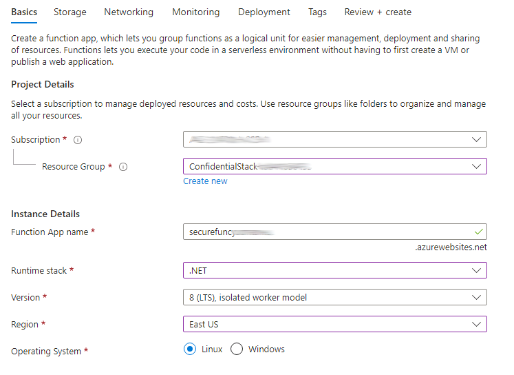

---
lab:
  az204Title: 'Lab 07: Access resource secrets more securely across services'
  az204Module: 'Learning Path 07: Implement secure Azure solutions'
---

# Labo 07 : Accéder aux secrets des ressources de manière plus sécurisée dans différents services

## Interface utilisateur Microsoft Azure

Étant donné la nature dynamique des outils cloud Microsoft, il se peut que vous constatiez des modifications de l’interface utilisateur Azure après le développement du contenu de cette formation. Il se peut donc que certaines instructions et étapes du labo ne s’alignent pas correctement.

Microsoft met cette formation à jour quand la communauté l’alerte sur la nécessité d’y apporter des modifications. Toutefois, compte tenu de la fréquence des mises à jour cloud, il se peut que vous rencontriez des modifications de l’interface utilisateur avant les mises à jour du contenu de cette formation. **Si cela se produit, adaptez-vous aux changements, puis appliquez-les dans les laboratoires si nécessaire.**

## Instructions

### Avant de commencer

#### Se connecter à l’environnement de labo

Connectez-vous à votre machine virtuelle (VM) Windows 11 en utilisant les informations d’identification suivantes :

- Nom d’utilisateur : `Admin`
- Mot de passe : `Pa55w.rd`

> **Remarque** : Votre instructeur vous fournira des instructions pour la connexion à l’environnement de laboratoire virtuel.

#### Passer en revue les applications installées

Recherchez la barre des tâches sur votre bureau Windows 11. La barre des tâches contient les icônes des applications que vous allez utiliser dans ce labo, à savoir :

- Microsoft Edge
- Explorateur de fichiers
- Terminal
- Visual Studio Code

## Scénario de laboratoire

Dans ce labo, vous allez créer un compte de stockage et une application Azure Function qui accéderont au compte de stockage. Pour faire la démonstration du stockage sécurisé d’informations de chaîne de connexion, vous provisionnerez une ressource Key Vault et gérerez les secrets appropriés pour stocker les informations de chaîne de connexion. Vous gérerez également l’identité du service pour obtenir un accès sécurisé aux informations de chaîne de connexion pour le compte de stockage.

## Diagramme de l'architecture


### Exercice 1 : Créer des ressources Azure

#### Tâche 1 : Ouvrir le portail Azure

1. Dans la barre des tâches, sélectionnez l’icône **Microsoft Edge**.

1. Dans la fenêtre de navigateur ouverte, accédez au portail Azure à l’adresse `https://portal.azure.com`, puis connectez-vous avec le compte que vous allez utiliser pour ce labo.

   > **Remarque** : Si vous vous connectez au portail Azure la première fois, une visite guidée du portail vous sera proposée. Sélectionnez **Prise en main** pour faire l’impasse sur la visite guidée et commencer à utiliser le portail.

#### Tâche 2 : Créer un compte de stockage

1. Dans le portail Azure, utilisez la zone de texte **Rechercher des ressources, des services et des documents** pour rechercher **Comptes de stockage**, puis, dans la liste des résultats, sélectionnez **Comptes de stockage**.

1. Dans le volet **Comptes de stockage**, sélectionnez **+ Créer**.

1. Dans le volet **Créer un compte de stockage**, sous l’onglet **Informations de base**, effectuez les actions suivantes et sélectionnez **Vérifier** :

    | Paramètre | Action |
    |--|--|
    | Liste déroulante  **Abonnement** | Conservez les valeurs par défaut. |
    | Section **Groupe de ressources** | Sélectionnez **Créer**, entrez **ConfidentialStack,** , puis sélectionnez **OK**. |
    | Zone de texte **Nom de compte de stockage** | Entrez **securestor** _[votrenom]_. |
    | Liste déroulante **Région** | Sélectionnez **(États-Unis) USA Est** |
    | Section **Performance** | Sélectionnez l’option **Standard**. |
    | Liste déroulante **Redondance** | Sélectionner **Stockage localement redondant (LRS)** |

   La capture d’écran suivante affiche les paramètres configurés dans le volet **Créer un compte de stockage**.

   

1. Sous l’onglet **Vérifier**, passez en revue les options que vous avez sélectionnées dans les étapes précédentes.

1. Sélectionnez **Créer** pour créer le compte de stockage à l’aide de votre configuration spécifiée.

   > **Remarque** : Attendez que la tâche de création soit terminée avant de poursuivre ce labo.

1. Dans la page **Vue d’ensemble du déploiement**, sélectionnez **Accéder à la ressource**.

1. Dans le volet **Compte de stockage**, dans la section **Sécurité + réseau**, sélectionnez le lien **Clés d’accès**.

1. Dans la section **Clés d’accès**, sélectionnez **Afficher les clés**.

1. Sur le panneau  **Clés d’accès** , passez en revue toute **Chaîne de connexion** (en utilisant le bouton **Afficher**), puis enregistrez la valeur des cases **Chaîne de connexion**  dans le Bloc-notes. Le terme **Clé** correspond aux clés de chiffrement gérées par la plateforme et elles ne sont **pas** utilisées pour ce labo.

   > **Remarque** : peu importe la chaîne de connexion que vous choisissez. Ils sont interchangeables.

#### Tâche 3: Créer un Azure Key Vault

1. Dans le portail Azure, utilisez la zone de texte **Rechercher des ressources, des services et des documents** pour rechercher **Coffres de clés**, puis, dans la liste des résultats, sélectionnez **Coffres de clés**.

1. Dans le volet **Coffres de clés**, sélectionnez **Créer**.

1. Dans le volet **Créer un coffre de clés**, sous l’onglet **Options de base**, effectuez les actions suivantes, puis sélectionnez **Suivant** pour accéder à l’onglet **Configuration de l’accès** :

   | Setting                           | Action                                   |
   | --------------------------------- | ---------------------------------------- |
   | Liste déroulante  **Abonnement**   | Conservez les valeurs par défaut.                 |
   | Liste déroulante **Groupe de ressources** | Sélectionnez **ConfidentialStack** dans la liste |
   | Zone de texte **Nom du coffre de clés**        | Entrez **securevault** _[votrenom]_        |
   | Liste déroulante **Région**         | Sélectionnez **USA Est**.                       |
   | Liste déroulante **Niveau tarifaire**   | sélectionnez **Standard**.                      |

   La capture d’écran suivante affiche les paramètres configurés dans le volet **Créer un coffre de clés**.

   

1. Sous l’onglet **Configuration de l’accès**, modifiez le modèle d’autorisation en **Stratégie d’accès du coffre**, puis sélectionnez **Vérifier + créer**.

1. Sous l’onglet **Vérifier + créer**, passez en revue les options que vous avez sélectionnées lors des étapes précédentes.

1. Sélectionnez **Créer** pour créer le coffre de clés à l’aide de votre configuration spécifiée.

   > **Remarque** : Attendez que la tâche de création soit terminée avant de poursuivre ce labo.

#### Tâche 4: Créer une application de fonction

1. Dans le portail Azure, utilisez la zone de texte **Rechercher des ressources, des services et des documents** pour rechercher **Application de fonction**, puis, dans la liste des résultats, sélectionnez **Application de fonction**.

1. Dans le panneau **Application Function**, sélectionnez **+ Créer**.

1. Dans le panneau **Créer une application de fonction**, sous l’onglet **Options de base**, effectuez les actions suivantes, puis sélectionnez **Suivant : Stockage** :

   | Paramètre                           | Action                              |
   | --------------------------------- | ----------------------------------- |
   | Liste déroulante  **Abonnement**   | Conservez les valeurs par défaut.            |
   | Liste déroulante **Groupe de ressources** | Sélectionnez **ConfidentialStack**.        |
   | Zone de texte **Nom de l’application de fonction**    | Entrez **securefunc** _[votrenom]_.    |
   | Section **Publier**               | Sélectionner **Code**                     |
   | Liste déroulante **Pile d’exécution**  | Sélectionnez **.NET**.                     |
   | Liste déroulante **Version**        | Sélectionner **8 (LTS), modèle Worker isolé**                        |
   | Liste déroulante **Région**         | Sélectionnez la région **USA Est**       |
   | Section **Système d’exploitation**      | Sélectionnez **Linux**                    |
   | Liste déroulante **Hébergement**        | Sélectionnez **Consommation (serverless)** . |

   La capture d’écran suivante affiche les paramètres configurés dans le volet **Créer une application de fonction**.

   

1. Sous l’onglet **Stockage**, effectuez les actions suivantes, puis sélectionnez **Vérifier + créer** :

    | Paramètre | Action |
    |--|--|
    | Liste déroulante **Compte de stockage**. | Sélectionnez le compte de stockage **securestor** _[votrenom]_. |

1. Sous l’onglet **Vérifier + créer**, passez en revue les options que vous avez sélectionnées lors des étapes précédentes.

1. Sélectionnez **Créer** pour créer l’application de fonction à l’aide de votre configuration spécifiée.

   > **Remarque** : Attendez que la tâche de création soit terminée avant de poursuivre ce labo.

#### Révision

Dans cet exercice, vous avez créé toutes les ressources que vous allez utiliser dans ce labo.

### Exercice 2 : Configurer des secrets et identités

#### Tâche 1 : Configurer une identité de service managée affectée par le système

1. Dans le volet de navigation du portail Azure, sélectionnez le lien **Groupes de ressources**.

1. Dans le volet **Groupes de ressources**, sélectionnez le groupe de ressources **ConfidentialStack**.

1. Dans le volet **ConfidentialStack**, sélectionnez l’application de fonction **securefunc** _[votrenom]_.

   > **Remarque** : il y aura deux ressources, une ressource application de fonction et une ressource Application Insights, portant le même nom. Veillez à sélectionner la ressource application de fonction.

1. Dans le volet **Application de fonction**, dans la section **Paramètres**, sélectionnez l’option **Identité**.

1. Dans le volet **Identité**, sous l’onglet **Affecté par le système**, définissez l’**État** sur **Activé**, puis sélectionnez **Enregistrer**.

1. Sélectionnez **Oui** pour confirmer le paramètre.

   > **Remarque** : attendez que l’identité managée affectée par le système soit créée avant de poursuivre ce labo.

#### Tâche 2 : Créer un secret Key Vault

1. Dans le volet de **navigation** du portail Azure, sélectionnez le lien **Groupes de ressources**.

1. Dans le volet **Groupes de ressources**, sélectionnez le groupe de ressources **ConfidentialStack**.

1. Dans le volet **ConfidentialStack**, sélectionnez le coffre de clés **securevault** _[votrenom]_.

1. Dans le volet **Coffre de clés**, sélectionnez le lien **Secrets** dans la section **Objets**.

1. Dans le volet **Secrets**, sélectionnez **+ Générer/Importer**.

1. Dans le volet **Créer un secret**, effectuez les actions suivantes, puis sélectionnez **Créer**:

    | Paramètre | Action |
    |--|--|
    | Liste déroulante **Options de chargement** | Sélectionnez **Manuel** |
    | Zone de texte **Nom** | Entres **stockagecredentials**. |
    | Zone de texte **Valeur secrète** | Entrez la chaîne de connexion de compte de stockage que vous avez enregistrée précédemment dans ce labo |
    | Zone de texte **Type de contenu** | Laisser vide |
    | Case à cocher **Définir la date d’activation** | Non sélectionnée |
    | Case à cocher **Définir la date d’expiration** | Non sélectionnée |
    | Option **Activé** | Sélectionnez **Oui** |

   La capture d’écran suivante affiche les paramètres configurés dans le volet **Créer un secret**.

   

   > **Remarque** : attendez que le secret soit créé avant de poursuivre avec ce labo.

1. Revenez au volet **Secrets**, puis sélectionnez l’élément **storagecredentials** dans la liste.

1. Dans le volet **Versions**, sélectionnez la dernière version du secret **storagecredentials**.

1. Dans le volet **Version du secret**, effectuez les actions suivantes:

   1. Sélectionnez **Afficher la valeur du secret** pour trouver la valeur du secret.

   1. Enregistrez la valeur de la zone de texte **Identificateur de secret**, car vous l’utiliserez plus tard dans le labo.

   > **Remarque** : vous enregistrez la valeur de la zone de texte **Identificateur de secret**, non celle de la zone de texte **Valeur du secret**.

#### Tâche 3: Configurer la stratégie d’accès au Coffre de clés

1. Dans le volet de navigation du portail Azure, sélectionnez le lien **Groupes de ressources**.

1. Dans le volet **Groupes de ressources**, sélectionnez le groupe de ressources **ConfidentialStack**.

1. Dans le volet **ConfidentialStack**, sélectionnez le coffre de clés **securevault[votrenom]**.

1. Dans le volet **Coffre de clés**, sélectionnez le lien **Stratégies d’accès** dans la section **Vue d’ensemble**.

1. Dans le volet **Stratégies d’accès**, sélectionnez **+ Créer**.

1. Dans le panneau **Créer une stratégie d’accès**, sous la section **Autorisations**, procédez aux sélections suivantes :

    | Setting | Action |
    |--|--|
    | Liste déroulante **Configurer à partir d’un modèle** | Laisser vide |
    | Cases à cocher **Autorisations de clé** | 0 sélectionné |
    | Cases à cocher **Autorisations de secret** | Sélectionnez l’autorisation **GET**. |
    | Cases à cocher **Autorisations de certificat** | 0 sélectionné |

1. Sélectionnez la section **Principal** et effectuez les sélections suivantes :

    | Setting | Action |
    |--|--|
    | Lien **Sélectionner le principal** | Recherchez et sélectionnez le principal de service nommé **securefunc** _[votrenom]_. L’identité managée affectée par le système que vous avez créée précédemment dans ce labo a le même nom que la ressource de fonction Azure |

1. Sélectionnez **Vérifier + créer**, puis **Créer**.

   > **Remarque** : attendez que les modifications que vous avez apportées aux stratégies d’accès soient enregistrées avant de continuer ce labo.

#### Tâche 4: Créer un paramètre d’application dérivé du Coffre de clés

1. Dans le volet de navigation du portail Azure, sélectionnez le lien **Groupes de ressources**.

1. Dans le volet **Groupes de ressources**, sélectionnez le groupe de ressources **ConfidentialStack**.

1. Dans le volet **ConfidentialStack**, sélectionnez l’application de fonction **securefunc[votrenom]**.

1. Dans le panneau **Application de fonction**, dans la section **Paramètres**, sélectionnez le lien **Variables d’environnement**.

1. Dans l’onglet **Paramètres de l’application**, sélectionnez **+ Ajouter**. Entrez les informations suivantes dans la boîte de dialogue contextuelle **Ajouter/modifier le paramètre d’application** :

    | Setting | Action |
    |--|--|
    | Zone de texte **Nom** | Entrez **StorageConnectionString** |
    | Zone de texte **Valeur** | Construisez une valeur en utilisant la syntaxe suivante : `@Microsoft.KeyVault(SecretUri=<Secret Identifier>)`, où l’espace réservé `<Secret Identifier>` représente l’identificateur de secret que vous avez enregistré précédemment dans cet exercice. |
    | Case à cocher **Paramètre d’emplacement de déploiement** | Conservez les valeurs par défaut. |

    >**Remarque** : Par exemple, si votre identificateur de secret est `https://securevaultstudent.vault.azure.net/secrets/storagecredentials/17b41386df3e4191b92f089f5efb4cbf`, votre valeur est `@Microsoft.KeyVault(SecretUri=https://securevaultstudent.vault.azure.net/secrets/storagecredentials/17b41386df3e4191b92f089f5efb4cbf)`.

1. Sélectionnez **Appliquer** pour fermer la boîte de dialogue contextuelle et retourner à la section **Paramètres de l’application**.

1. Au bas de la section **Paramètres de l’application**, sélectionnez **Appliquer**.

    >**Remarque :** Vous recevrez peut-être un avertissement indiquant que votre application peut redémarrer au moment de la mise à jour de ses paramètres. Cliquez sur **Confirmer**. Attendez que les paramètres de votre application soient enregistrés avant de poursuivre le labo.

#### Révision

Dans cet exercice, vous avez créé une identité de service managée affectée par le système pour votre application de fonction, puis lui avez donné les autorisations appropriées pour obtenir la valeur d’un secret dans votre coffre de clés. Enfin, vous avez créé un secret que vous avez référencé dans les paramètres de configuration de votre application de fonction.

### Exercice 3 : Générer une application Azure Functions

#### Tâche 1 : Initialiser un projet de fonction

1. Dans la barre des tâches, sélectionnez l’icône **Terminal**.

1. Exécutez la commande suivante pour modifier le répertoire actuel en le définissant sur le répertoire vide **Allfiles (F):\\Allfiles\\Labs\\07\\Starter\\func**:

   ```powershell
   cd F:\Allfiles\Labs\07\Starter\func
   ```

   > **Remarque** : dans l’Explorateur Windows, supprimez l’attribut en lecture seule du fichier F:\Allfiles\Labs\07\Starter\func\.gitignore.

1. Exécutez la commande suivante afin d’utiliser **Azure Functions Core Tools** pour créer un projet Functions local dans le répertoire actuel à l’aide du runtime **dotnet**:

   ```powershell
   func init --worker-runtime dotnet-isolated --target-framework net8.0 --force
   ```

   > **Remarque** : vous pouvez consultez la documentation pour [créer un projet][azure-functions-core-tools-new-project] à l’aide d’**Azure Functions Core Tools**.

1. Exécutez la commande suivante pour **générer** le projet .NET 8 :

   ```powershell
   dotnet build
   ```

#### Tâche 2 : Créer une fonction déclenchée par HTTP

1. Exécutez la commande suivante afin d’utiliser **Azure Functions Core Tools** pour créer une fonction nommée **FileParser** à l’aide du modèle **Déclencheur HTTP**:

   ```powershell
   func new --template "HTTP trigger" --name "FileParser"
   ```

   > **Remarque** : vous pouvez consultez la documentation pour [créer une fonction][azure-functions-core-tools-new-function] à l’aide d’**Azure Functions Core Tools**.

1. Fermez l’application **Terminal** en cours d’exécution.

#### Tâche 3: Configurer et lire un paramètre d’application

1. Dans l’écran **Démarrage**, sélectionnez la vignette **Visual Studio Code**.

1. Dans le menu **Fichier**, sélectionnez **Ouvrir le dossier**.

1. Dans la fenêtre **Explorateur de fichiers** qui s’ouvre, accédez à **Allfiles (F):\\Allfiles\\Labs\\07\\Starter\\func**, puis choisissez **Sélectionner un dossier**.

1. Dans le volet **Explorateur** de la fenêtre **Visual Studio Code**, ouvrez le fichier **local.settings.json**.

1. Notez la valeur actuelle de l’objet **Values** :

   ```json
   "Values": {
       "AzureWebJobsStorage": "UseDevelopmentStorage=true",
       "FUNCTIONS_WORKER_RUNTIME": "dotnet-isolated"
   }
   ```

1. Mettez à jour la valeur de l’objet **Values** en ajoutant un paramètre nommé **StorageConnectionString**, puis en lui affectant la valeur de chaîne **[TEST VALUE]**:

   ```json
   "Values": {
       "AzureWebJobsStorage": "UseDevelopmentStorage=true",
       "FUNCTIONS_WORKER_RUNTIME": "dotnet-isolated",
       "StorageConnectionString": "[TEST VALUE]"
   }
   ```

1. Le fichier **local.settings.json** devrait maintenant inclure:

   ```json
   {
     "IsEncrypted": false,
     "Values": {
       "AzureWebJobsStorage": "UseDevelopmentStorage=true",
       "FUNCTIONS_WORKER_RUNTIME": "dotnet-isolated",
       "StorageConnectionString": "[TEST VALUE]"
     }
   }
   ```

1. Sélectionnez **Enregistrer** pour enregistrer vos modifications dans le fichier **local.settings.json**.

1. Dans le volet **Explorateur** de la fenêtre **Visual Studio Code**, ouvrez le fichier **FileParser.cs**.

1. Dans l’éditeur de code, remplacez le contenu du code généré automatiquement de la fonction **FileParser** à partir de la ligne 18 par le code suivant :

    ```csharp
           [Function("FileParser")]
            public HttpResponseData Run([HttpTrigger(AuthorizationLevel.Function, "get", "post")] HttpRequestData req)
            {
                _logger.LogInformation("C# HTTP trigger function processed a request.");

                var response = req.CreateResponse(HttpStatusCode.OK);
                response.Headers.Add("Content-Type", "text/plain; charset=utf-8");

                string connectionString = Environment.GetEnvironmentVariable("StorageConnectionString");
                response.WriteString(connectionString);

                return response;
            }
    ``` 

1. Ignorez les avertissements concernant les valeurs nulles. 

1. Passez en revue le code résultant. Celui-ci doit se composer du contenu suivant (ce code retourne la valeur de la variable d’environnement StorageConnectionString) :

   ```csharp
   using System.Net;
   using Microsoft.Azure.Functions.Worker;
   using Microsoft.Azure.Functions.Worker.Http;
   using Microsoft.Extensions.Logging;

   namespace func
   {
       public class FileParser
       {
           private readonly ILogger _logger;

           public FileParser(ILoggerFactory loggerFactory)
           {
               _logger = loggerFactory.CreateLogger<FileParser>();
           }

           [Function("FileParser")]
           public HttpResponseData Run([HttpTrigger(AuthorizationLevel.Function, "get", "post")] HttpRequestData req)
           {
               _logger.LogInformation("C# HTTP trigger function processed a request.");

               var response = req.CreateResponse(HttpStatusCode.OK);
               response.Headers.Add("Content-Type", "text/plain; charset=utf-8");

               string connectionString = Environment.GetEnvironmentVariable("StorageConnectionString");
               response.WriteString(connectionString);

               return response;
           }
       }
   }
   ```

1. Sélectionnez **Enregistrer** pour enregistrer vos modifications dans le fichier **FileParser.cs**.

#### Tâche 4: Valider la fonction locale

1. Dans la barre des tâches, sélectionnez l’icône **Terminal**.

1. Exécutez la commande suivante pour modifier le répertoire actuel en le définissant sur le répertoire vide **Allfiles (F):\\Allfiles\\Labs\\07\\Starter\\func**:

   ```powershell
   cd F:\Allfiles\Labs\07\Starter\func
   ```

1. Exécutez la commande suivante pour exécuter le projet d’application de fonction :

   ```powershell
   func start --build
   ```

   > **Remarque** : vous pouvez consultez la documentation pour [démarrer le projet d’application de fonction localement][azure-functions-core-tools-start-function] à l’aide d’**Azure Functions Core Tools**.

1. Sur l’ordinateur lab, démarrez l’**invite de commandes**.

1. Exécutez la commande suivante pour tester l’exécution de l’appel d’API REST **GET** contre `http://localhost:7071/api/FileParser` :

   ```cmd
   curl -X GET -i http://localhost:7071/api/FileParser
   ```

1. Observez la valeur **[TEST VALUE]** de la **StorageConnectionString** retournée par la requête HTTP:

   ```cmd
   HTTP/1.1 200 OK
   Content-Type: text/plain; charset=utf-8
   Date: Tue, 01 Sep 2020 23:35:39 GMT
   Server: Kestrel
   Transfer-Encoding: chunked

   [TEST VALUE]
   ```

1. Fermez toutes les instances en cours d’exécution de l’application **Terminal** et l’application **Invite de commandes**.

#### Tâche 5: Déployer la fonction à l’aide d’Azure Functions Core Tools

1. Dans la barre des tâches, sélectionnez l’icône **Terminal**.

1. Exécutez la commande suivante pour modifier le répertoire actuel en le définissant sur le répertoire vide **Allfiles (F):\\Allfiles\\Labs\\07\\Starter\\func**:

   ```powershell
   cd F:\Allfiles\Labs\07\Starter\func
   ```

1. Utilisez la commande suivante pour vous connecter à l’interface de ligne de commande Azure (CLI):

   ```powershell
   az login
   ```

1. Dans la fenêtre du navigateur **Microsoft Edge**, entrez les informations d’identification du compte que vous utilisez pour accéder à votre abonnement Azure, puis sélectionnez **Se connecter**.

1. Revenez à la fenêtre **Terminal** actuellement ouverte. Attendez la fin du processus de connexion.

1. Exécutez la commande suivante pour publier le projet d’application de fonction (remplacez l’espace réservé `<function-app-name>` par le nom de l’application de fonction que vous avez créée précédemment dans ce labo) :

   ```powershell
   func azure functionapp publish <function-app-name> --dotnet-version 8.0
   ```

   > **Remarque** : par exemple, si votre **Nom d’application de fonction** est **securefuncstudent**, votre commande sera `func azure functionapp publish securefuncstudent --force`. Vous pouvez consulter la documentation pour [publier le projet d’application de fonction local][azure-functions-core-tools-publish-azure] à l’aide d’**Azure Functions Core Tools**.

1. Attendez que le déploiement soit finalisé avant de poursuivre le labo.

1. Fermez l’application **Terminal** en cours d’exécution.

#### Tâche 6 : Tester le paramètre d’application dérivé du Coffre de clés

1. Dans la barre des tâches, sélectionnez l’icône **Microsoft Edge**, puis l’onglet contenant le portail Azure.

1. Dans le volet de navigation du portail Azure, sélectionnez le lien **Groupes de ressources**.

1. Dans le volet **Groupes de ressources**, sélectionnez le groupe de ressources **ConfidentialStack**.

1. Dans le volet **ConfidentialStack**, sélectionnez l’application de fonction **securefunc[votrenom]**.

1. Dans le volet **Application de fonction**, sélectionnez l’option **Vue d’ensemble**.

1. Sous l’onglet **Fonctions** en bas de la page Vue d’ensemble, sélectionnez la fonction **FileParser** existante.

1. Dans le volet **Fonction**, dans la section **Développeur**, sélectionnez l’option **Code + Test**.

1. Dans l’éditeur de fonction, sélectionnez **Tester/Exécuter**.

1. Dans le volet affiché automatiquement, dans la liste **Méthode HTTP**, sélectionnez **GET**.

1. Sélectionnez **Exécuter** pour tester la fonction.

1. Passez en revue les résultats de la série de tests. Le résultat devrait être votre chaîne de connexion au Stockage Azure.

#### Révision

Dans cet exercice, vous avez utilisé une identité de service pour lire la valeur d’un secret stocké dans Key Vault, et retourné cette valeur en tant que résultat d’une application de fonction.

### Exercice 4 : Accéder au données du Stockage Blob Azure

#### Tâche 1 : Charger un exemple de blob de stockage

1. Dans le volet de navigation du portail Azure, sélectionnez le lien **Groupes de ressources**.

1. Dans le volet **Groupes de ressources**, sélectionnez le groupe de ressources **ConfidentialStack**.

1. Dans le volet **ConfidentialStack**, sélectionnez le compte de stockage **securestor** _[votrenom]_.

1. Dans le volet **Compte de stockage**, dans la section **Conteneurs**, sélectionnez le lien **Stockage de données**.

1. Dans la section **Conteneurs**, sélectionnez **+ Conteneur**.

1. Dans la fenêtre contextuelle **Nouveau conteneur**, effectuez les actions suivantes, puis sélectionnez **Créer**:

    | Paramètre | Action |
    |--|--|
    | Zone de texte **Nom** | Entrez **drop**. |

1. Revenez à la section **Conteneurs**, puis accédez au conteneur **drop** nouvellement créé.

1. Dans le volet **Conteneur**, sélectionnez **Charger**.

1. Dans la fenêtre **Charger l’objet blob**, effectuez les actions suivantes, puis sélectionnez **Charger** :

    | Paramètre | Action |
    |--|--|
    | Section **Fichiers** | Sélectionnez **Parcourir les fichiers** ou utilisez la fonctionnalité glisser-déplacer. |
    | Fenêtre **Explorateur de fichiers** | Accédez à **Allfiles (F):\\Allfiles\\Labs\\07\\Starter**, sélectionnez le fichier **records.json**, puis **Ouvrir** |
    | Case à cocher **Remplacer si les fichiers existent déjà** | Vérifiez que cette case est cochée |

    > **Remarque** : Attendez que le chargement du blob soit terminé avant de poursuivre ce labo.

1. Revenez au volet **Conteneur**, puis sélectionnez le blob **records.json** dans la liste de blobs.

1. Dans le volet **Blob**, recherchez les métadonnées du blob, puis copiez l’URL du blob.

1. Dans la barre des tâches, activez le menu contextuel pour l’icône **Microsoft Edge**, puis sélectionnez **Nouvelle fenêtre**.

1. Dans la nouvelle fenêtre du navigateur, faites référence à l’URL que vous avez copiée pour le blob.

1. Un message d’erreur indiquant que la ressource est introuvable devrait maintenant s’afficher.

   > **Remarque** : Ceci est normal, car l’accès anonyme n’est pas activé pour nos blobs.

#### Tâche 2 : Extraire et configurer le Kit de développement logiciel (SDK) Azure pour .NET

1. Dans la barre des tâches, sélectionnez l’icône **Terminal**.

1. Exécutez la commande suivante pour modifier le répertoire actuel en le définissant sur le répertoire vide **Allfiles (F):\\Allfiles\\Labs\\07\\Starter\\func**:

   ```powershell
   cd F:\Allfiles\Labs\07\Starter\func
   ```

1. Exécutez la commande suivante pour ajouter la version **12.18.0** du package **Azure.Storage.Blobs** à partir de NuGet :

   ```powershell
   dotnet add package Azure.Storage.Blobs --version 12.18.0
   ```

   > **Remarque** : le package NuGet [Azure.Stockage.Blobs](https://www.nuget.org/packages/Azure.Storage.Blobs) fait référence au sous-ensemble du Kit de développement logiciel (SDK) Azure pour .NET requis pour écrire du code pour Stockage Blob Azure.

1. Fermez l’application **Terminal** en cours d’exécution.

1. Dans l’écran **Démarrage**, sélectionnez la vignette **Visual Studio Code**.

1. Dans le menu **Fichier**, sélectionnez **Ouvrir le dossier**.

1. Dans la fenêtre **Explorateur de fichiers** qui s’ouvre, accédez à **Allfiles (F):\\Allfiles\\Labs\\07\\Starter\\func**, puis choisissez **Sélectionner un dossier**.

1. Dans le volet **Explorateur** de la fenêtre **Visual Studio Code**, ouvrez le fichier **FileParser.cs**.

1. Ajoutez des **directives using** pour les espaces de noms **Azure.Storage.Blobs** et **Azure.Storage.Blobs.Models** :

   ```csharp
   using Azure.Storage.Blobs;
   using Azure.Storage.Blobs.Models;
   ```

1. Remplacez le contenu de la méthode **FileParser** actuelle à partir de la ligne 19 par le code suivant :

    ```csharp
            [Function("FileParser")]
            public HttpResponseData Run([HttpTrigger(AuthorizationLevel.Function, "get", "post")] HttpRequestData req)
            {
                _logger.LogInformation("C# HTTP trigger function processed a request.");

                var response = req.CreateResponse(HttpStatusCode.OK);

                string connectionString = Environment.GetEnvironmentVariable("StorageConnectionString");

                /* Create a new instance of the BlobClient class by passing in your
                   connectionString variable, a  "drop" string value, and a
                   "records.json" string value to the constructor */
                BlobClient blob = new BlobClient(connectionString, "drop", "records.json");

                // Download the content of the referenced blob 
                BlobDownloadResult downloadResult = blob.DownloadContent();

                 // Retrieve the value of the downloaded blob and convert it to string
                response.WriteString(downloadResult.Content.ToString());
            
                //return the response
                return response;
            }
    ``` 

1. Ignorez l’avertissement concernant les valeurs nulles.

1. Passez en revue le code résultant. Celui-ci doit se composer du contenu suivant (ce code retourne le contenu du blob téléchargé à partir du compte de stockage désigné par la variable d’environnement StorageConnectionString) :

   ```csharp
   namespace func
   {
       public class FileParser
       {
           private readonly ILogger _logger;

           public FileParser(ILoggerFactory loggerFactory)
           {
               _logger = loggerFactory.CreateLogger<FileParser>();
           }

           [Function("FileParser")]
           public HttpResponseData Run([HttpTrigger(AuthorizationLevel.Function, "get", "post")] HttpRequestData req)
           {
               _logger.LogInformation("C# HTTP trigger function processed a request.");

               var response = req.CreateResponse(HttpStatusCode.OK);

               string connectionString = Environment.GetEnvironmentVariable("StorageConnectionString");

               /* Create a new instance of the BlobClient class by passing in your
                  connectionString variable, a  "drop" string value, and a
                  "records.json" string value to the constructor */
               BlobClient blob = new BlobClient(connectionString, "drop", "records.json");

               // Download the content of the referenced blob 
               BlobDownloadResult downloadResult = blob.DownloadContent();

                // Retrieve the value of the downloaded blob and convert it to string
               response.WriteString(downloadResult.Content.ToString());
            
               //return the response
               return response;
           }
       }
   }
   ```

1. Sélectionnez **Enregistrer** pour enregistrer vos modifications dans le fichier **FileParser.cs**.

#### Tâche 3 : Déployer et valider l’application Azure Functions

1. Dans la barre des tâches, sélectionnez l’icône **Terminal**.

1. Exécutez la commande suivante pour modifier le répertoire actuel en le définissant sur le répertoire vide **Allfiles (F):\\Allfiles\\Labs\\07\\Starter\\func**:

   ```powershell
   cd F:\Allfiles\Labs\07\Starter\func
   ```

1. Exécutez la commande suivante pour vous connecter à Azure CLI :

   ```powershell
   az login
   ```

1. Dans la fenêtre du navigateur **Microsoft Edge**, entrez l’adresse e-mail et le mot de passe de votre compte Microsoft, puis sélectionnez **Se connecter**.

1. Revenez à la fenêtre **Terminal** actuellement ouverte. Attendez la fin du processus de connexion.

1. Exécutez la commande suivante pour republier le projet d’application de fonction (remplacez l’espace réservé `<function-app-name>` par le nom de l’application de fonction que vous avez utilisée précédemment dans ce labo) :

   ```powershell
   func azure functionapp publish <function-app-name> --dotnet-version 8.0
   ```

   > **Remarque** : par exemple, si votre **Nom d’application de fonction** est **securefuncstudent**, votre commande sera `func azure functionapp publish securefuncstudent`. Vous pouvez consulter la documentation pour [publier le projet d’application de fonction local][azure-functions-core-tools-publish-azure] à l’aide d’**Azure Functions Core Tools**.

1. Attendez que le déploiement soit finalisé avant de poursuivre le labo.

1. Fermez l’application **Terminal** en cours d’exécution.

1. Dans la barre des tâches, sélectionnez l’icône **Microsoft Edge**, puis reportez-vous au portail Azure.

1. Dans le volet de navigation du portail Azure, sélectionnez le lien **Groupes de ressources**.

1. Dans le volet **Groupes de ressources**, sélectionnez le groupe de ressources **ConfidentialStack**.

1. Dans le volet **ConfidentialStack**, sélectionnez l’application de fonction **securefunc[votrenom]**.

1. Dans le volet **Application de fonction**, sélectionnez l’option **Vue d’ensemble**.

1. Sous l’onglet **Fonctions** de la page Vue d’ensemble, sélectionnez la fonction **FileParser** existante.

1. Dans le volet **Fonction**, dans la section **Développeur**, sélectionnez l’option **Code + Test**.

1. Dans l’éditeur de fonction, sélectionnez **Tester/Exécuter**.

1. Dans le volet affiché automatiquement, dans la liste **Méthode HTTP**, sélectionnez **GET**.

1. Sélectionnez **Exécuter** pour tester la fonction.

1. Passez en revue les résultats de la série de tests. La sortie contient le contenu du blob **$/drop/records.json** stocké dans votre compte stockage Azure.

#### Révision

Dans cet exercice, vous avez utilisé du code C\# pour accéder à un compte de stockage, puis téléchargé le contenu d’un blob.
