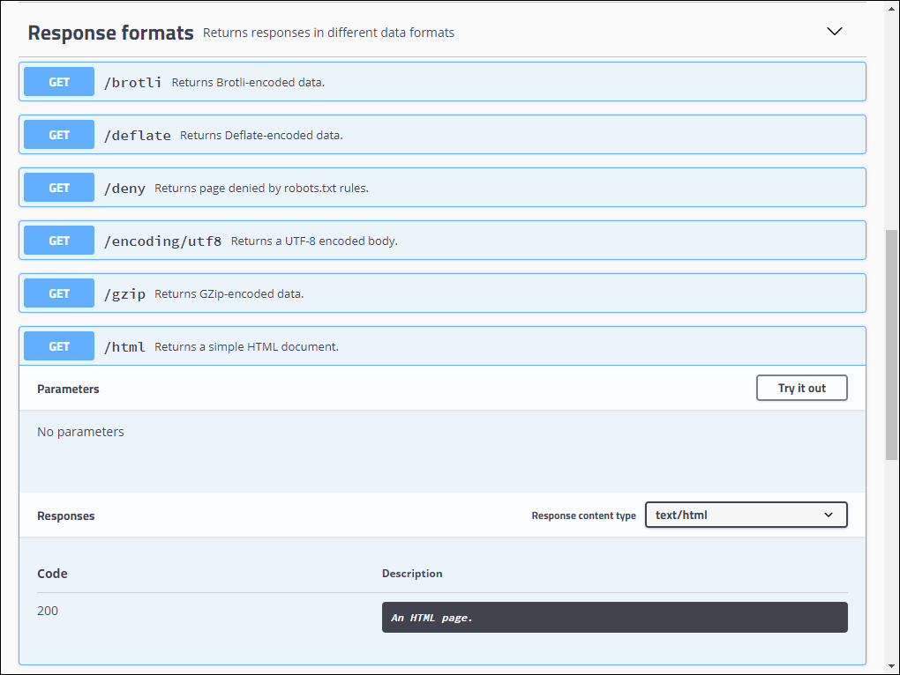

---
lab:
  az204Title: 'Lab 08: Create a multi-tier solution by using Azure services'
  az020Title: 'Lab 08: Create a multi-tier solution by using Azure services'
  az204Module: 'Module 08: Implement API Management'
  az020Module: 'Module 08: Implement API Management'
ms.openlocfilehash: b613922babbf2f7cf5dacbcd7fef8f3b7193500e
ms.sourcegitcommit: 9abfe3b5a1c9ccd2f0610348052d04169573f81a
ms.translationtype: HT
ms.contentlocale: fr-FR
ms.lasthandoff: 06/01/2022
ms.locfileid: "145995019"
---
# <a name="lab-08-create-a-multi-tier-solution-by-using-azure-services"></a>Labo 08 : Créer une solution multiniveau à l’aide de services Azure

## <a name="microsoft-azure-user-interface"></a>interface utilisateur Microsoft Azure

Étant donné la nature dynamique des outils cloud Microsoft, il se peut que vous constatiez des modifications de l’interface utilisateur Azure après le développement du contenu de cette formation. Il se peut donc que certaines instructions et étapes du labo ne s’alignent pas correctement.

Microsoft met ce cours à jour quand la communauté l’alerte sur la nécessité d’y apporter des modifications. Toutefois, compte tenu de la fréquence des mises à jour cloud, il se peut que vous rencontriez des modifications de l’interface utilisateur avant les mises à jour du contenu de cette formation. **Si cela se produit, adaptez-vous aux changements, puis appliquez-les dans les laboratoires si nécessaire.**


## <a name="instructions"></a>Instructions

### <a name="before-you-start"></a>Avant de commencer

#### <a name="sign-in-to-the-lab-environment"></a>Se connecter à l’environnement de labo

Connectez-vous à votre machine virtuelle Windows 10 en utilisant les informations d’identification suivantes :
    
-   Nom d’utilisateur : **Administrateur**

-   Mot de passe : **Pa55w.rd**

> **Remarque** : votre instructeur vous fournira des instructions pour la connexion à l’environnement de laboratoire virtuel.

#### <a name="review-the-installed-applications"></a>Passer en revue les applications installées

Localisez la barre des tâches sur votre bureau Windows 10. La barre des tâches contient les icônes des applications que vous allez utiliser dans ce labo :
    
-   Microsoft Edge

## <a name="architecture-diagram"></a>Diagramme de l'architecture


### <a name="exercise-1-create-an-azure-app-service-resource-by-using-a-docker-container-image"></a>Exercice 1 : Créer une ressource Azure App Service en utilisant une image conteneur Docker

#### <a name="task-1-open-the-azure-portal"></a>Tâche 1 : Ouvrez le portail Azure

1.  Dans la barre des tâches, sélectionnez l’icône **Microsoft Edge**.

1.  Dans la fenêtre de navigateur qui s’ouvre, accédez au portail Azure ([portal.azure.com](https://portal.azure.com)), puis connectez-vous à l’aide du compte que vous allez utiliser pour ce labo.

    > **Remarque** : Si vous vous connectez au portail Azure la première fois, une visite guidée du portail vous sera proposée. Sélectionnez **Prise en main** pour faire l’impasse sur la visite guidée et commencer à utiliser le portail.

#### <a name="task-2-create-a-web-app-by-using-azure-app-service-resource-by-using-an-httpbin-container-image"></a>Tâche 2 : Créer une application web en utilisant une ressource Azure App Service à l’aide d’une image conteneur httpbin

1.  Dans le portail Azure, utilisez la zone de texte **Rechercher des ressources, des services et des documents** pour rechercher **App Services**, puis, dans la liste des résultats, sélectionnez **App Services**.

1.  Dans le volet **App Services**, sélectionnez **+ Créer**.

1.  Dans le volet **Créer un application web**, sous l’onglet **Options de base**, effectuez les actions suivantes :
    
    | Paramètre | Action |
    | -- | -- |
    | Liste déroulante  **Abonnement** | Conservez les valeurs par défaut. |
    | Section **Groupe de ressources** | Sélectionnez **Créer**, entrez **ApiService,** , puis sélectionnez **OK**. |
    | Zone de texte **Nom** | Entrez **httpapi** *[votrenom]* . |
    | Section **Publier** | Sélectionnez **Conteneur Docker**. |
    | Section **Système d’exploitation** | Sélectionnez **Linux** |
    | Liste déroulante **Région** | Sélectionnez n’importe quelle région Azure dans laquelle vous pouvez déployer une application web Azure. |
    | Section **Plan App Service** | Sélectionnez **Créer**, entrez la valeur **ApiPlan** dans la zone de texte **Nom**, puis sélectionnez **OK**. |
    | Section **Référence SKU et taille** | Sélectionnez **Modifier la taille**. Dans le volet **Sélecteur de spécifications**, sélectionnez **Afficher d’autres options**, **S1**, puis **Appliquer** |

1.  Sélectionnez **Suivant : Docker >** .

1.  Sous l’onglet **Docker**, effectuez les actions suivantes, puis sélectionnez **Vérifier + créer** :

    | Paramètre | Action |
    | -- | -- |
    | Liste déroulante **Options** | Sélectionnez **Conteneur unique**. |
    | Liste déroulante **Source d’image** | Sélectionnez **Docker Hub**. |
    | Liste déroulante **Type d’accès** | Sélectionnez **Public** |
    | Zone de texte **Image et étiquette** | Entrez **kennethreitz/httpbin:latest**. |

1.  Sous l’onglet **Vérifier + créer**, passez en revue les options que vous avez sélectionnées lors des étapes précédentes.

1.  Sélectionnez **Créer** pour créer l’application web à l’aide de votre configuration spécifiée.

    > **Remarque** : Attendez que la tâche soit créée avant de poursuivre ce labo.

#### <a name="task-3-test-the-httpbin-web-application"></a>Tâche 3 : Tester l’application web httpbin

1.  Dans le portail Azure, utilisez la zone de texte **Rechercher des ressources, des services et des documents** pour rechercher **App Services**, puis, dans la liste des résultats, sélectionnez **App Services**.

1.  Dans le volet **App Services**, sélectionnez l’application web nouvellement créée.

1.  Dans le volet affichant les propriétés de l’application nouvellement créées, sélectionnez **Parcourir**.

1.  Dans l’application web, effectuez les actions suivantes :

    a.  Sélectionnez **Formats de réponse**.

    b.  Sélectionnez **GET /html**.

    c.  Sélectionnez **Essayer**.

    La capture d’écran suivante affiche la section **Essayer** de l’application web.

    

    d.  Sélectionnez **Exécuter**.

    e.  Passez en revue la valeur des zones de texte **Corps de réponse** et **En-têtes de réponse**.

    f.  Examinez la valeur de la zone de texte **URL de demande**.

1.  Dans l’application web, effectuez les actions suivantes :

    a.  Sélectionnez **Données dynamiques**.

    b.  Sélectionnez **GET /bytes/{n}** .

    c.  Sélectionnez **Essayer**.

    d.  Dans la zone de texte **n**, entrez .**25**

    e.  Sélectionnez **Exécuter**.

    f.  Passez en revue la valeur des zones de texte **Corps de réponse** et **En-têtes de réponse**.

    g.  Sélectionnez **Télécharger le fichier**, puis, une fois le fichier téléchargé, ouvrez-le dans Bloc-notes, examinez son contenu, puis fermez-le.

    > **Remarque** : le fichier contient une séquence d’octets générés de manière aléatoire.

    La capture d’écran suivante affiche la section de données dynamiques de l’application web.
  
    

1.  Dans l’application web, effectuez les actions suivantes :

    a.  Sélectionnez **Codes d’état**.

    b.  Sélectionnez **GET /status/{codes}** .

    c.  Sélectionnez **Essayer**.

    d.  Dans la zone de texte **Codes**, entrez **404**.

    e.  Sélectionnez **Exécuter**.

    f.  Examinez la **Réponse du serveur** et notez qu’elle contient l’entrée **Erreur : INTROUVABLE**.
     
1.  Fermez le fenêtre de navigateur qui affiche l’application web.

1.  Revenez à la fenêtre de navigateur qui affiche l’application web **httpapi** _[votrenom]_ .

1.  Dans la section **Paramètres**, sélectionnez le lien **Propriétés**.

1.  Dans la section **Propriétés**, enregistrez la valeur du lien **URL**. Vous allez utiliser cette valeur plus tard dans le labo pour envoyer des demandes à l’API correspondante.

#### <a name="review"></a>Révision

Dans cet exercice, vous avez créé une application web Azure en utilisant une image conteneur provenant de Docker Hub.

### <a name="exercise-2-build-an-api-proxy-tier-by-using-azure-api-management"></a>Exercice 2 : Créer un niveau de proxy d’API à l’aide de Gestion des API

#### <a name="task-1-create-an-api-management-resource"></a>Tâche 1 : Créer une ressource de Gestion des API

1.  Dans le portail Azure, utilisez la zone de texte **Rechercher des ressources, des services et des documents** pour rechercher **Services Gestion des API**, puis, dans la liste des résultats, sélectionnez **Services Gestion des API**.

1.  Dans le volet **Services Gestion des API**, sélectionnez **+ Créer**.

1.  Dans le volet **Installer la passerelle Gestion des API**, effectuez les actions suivantes, puis sélectionnez **Vérifier + créer** :

    
    | Paramètre | Action |
    | -- | -- |
    | Liste déroulante  **Abonnement** | Conservez la valeur par défaut. |
    | Section **Groupe de ressources** | Sélectionnez le groupe **ApiService** que vous avez créé précédemment dans le labo |
    | Liste **Région** | Sélectionnez la région que vous avez choisie dans l’exercice précédent. |
    | Zone de texte **Nom de la ressource** | Entrez **proapi** *[votrenom]* |
    | Zone de texte **Nom de l’organisation** | Entrez **Contoso**. |
    | Zone de texte **E-mail de l’administrateur** | Entrez `admin@contoso.com` |
    | Liste déroulante **Niveau tarifaire** | **Consommation (SLA à 99,95 %)** |

    La capture d’écran suivante affiche les paramètres configurés du volet **Créer Gestion des API** de l’application web.
    
    

1.  Sous l’onglet **Vérifier + créer**, révisez l’option que vous avez spécifiée à l’étape précédente, puis sélectionnez **Créer**.

    > **Remarque** : Attendez que la tâche de création soit terminée avant de poursuivre ce labo.

1. Dans la page **Vue d’ensemble du déploiement**, sélectionnez **Accéder à la ressource**.

#### <a name="task-2-define-a-new-api"></a>Tâche 2 : Définir une nouvelle API

1.  Dans le volet **Service Gestion des API**, dans la section **API**, sélectionnez **API**.

1.  Dans la section **Définir une nouvelle API**, sélectionnez **HTTP**.

1.  Dans la fenêtre **Créer une API HTTP**, effectuez les actions suivantes, puis sélectionnez **Créer** :
    
    | Paramètre | Action |
    | --------------------------------- | ------------------------------------------------------------ |
    | Zone de texte **Nom d’affichage** | Entrer **API HTTPBin**. |
    | Zone de texte **Nom** | Entrez **httpbin-api**. |
    | Zone de texte **URL du service web** | Entrez l’URL de l’application web que vous avez copiée précédemment dans ce laboratoire. **Remarque** : assurez-vous que l’URL commence par le préfixe `https://`. |
    | Zone de texte **suffixe de l’URL de l’API** | Laissez cette zone de texte vide. |
 
    La capture d’écran suivante affiche les paramètres configurés dans la fenêtre **Créer une API vide** de l’application web.

    

    > **Remarque** : Attendez que la création de la nouvelle API soit terminée.

1.  Sous l’onglet **Création**, sélectionnez **+ Ajouter une opération**.

1.  Dans la section **Ajouter une opération**, effectuez les actions suivantes, puis sélectionnez **Enregistrer** :


    | Paramètre | Action |
    | -- | -- |
    | Zone de texte **Nom d’affichage** | Entrez **En-têtes d’écho**. |
    | Zone de texte **Nom** | Vérifiez que la valeur est définie sur **echo-headers**. |
    | Liste **URL** | Sélectionnez **GET**. |
    | Zone de texte **URL** | Entrez **/** |

    La capture d’écran suivante affiche les paramètres configurés dans la section **Ajouter une opération**.
    
    

    
1.  De retour sous l’onglet **Création**, dans la liste d’opérations, sélectionnez **En-têtes d’écho**.

1.  Dans la section **Création**, dans la vignette **Traitement entrant**, sélectionnez **+ Ajouter une stratégie**.

1.  Dans la section **Ajouter une stratégie de trafic entrant**, sélectionnez la vignette **Définir des en-têtes**.

1.  Dans la section **Définir des en-têtes**, effectuez les actions suivantes, puis sélectionnez **Enregistrer** :
    
    | Paramètre | Action  |
    | --- | --- |
    | Zone de texte **Nom**    | Entrez **Source**.|
    | Zone de texte **Valeur** | Sélectionnez la liste, sélectionnez **Ajouter une valeur**, puis entrez **azure-api-mgmt**.|
    | Liste **Action**        | Sélectionner **Ajouter**.|

    La capture d’écran suivante affiche les paramètres configurés dans la section **Création**.

    

1.  De retour sous l’onglet **Création**, dans la liste d’opérations, sélectionnez **En-têtes d’écho**.

1.  Dans la section **Création** pour **En-têtes d’écho**, dans la vignette **Backend**, sélectionnez l’icône Crayon.

1.  Dans la section **Backend**, effectuez les actions suivantes, puis sélectionnez **Enregistrer** :

    | Paramètre | Action |
    | -- | -- |
    | Section **URL du service** | Activez la case à cocher **Remplacer**. |
    | Zone de texte **URL du service** | Ajoutez la valeur **/headers** à sa valeur actuelle. **Remarque** : Par exemple, si la valeur actuelle est `http://httpapi[yourname].azurewebsites.net`, la nouvelle valeur sera `http://httpapi[yourname].azurewebsites.net/headers`. |
    
1.  De retour sous l’onglet **Création**, dans la liste des opérations, sélectionnez **En-têtes d’écho**, puis l’onglet **Test**.

1.  Dans la section **En-têtes d’écho**, sélectionnez **Envoyer**.

    La capture d’écran suivante affiche les paramètres configurés dans la section **En-têtes d’écho**.

    
    
1.  Examinez les résultats de la demande d’API.

    > **Remarque** : vérifiez qu’il existe de nombreux en-têtes envoyés dans le cadre de votre demande qui trouvent un écho dans la réponse. Ils devraient inclure le nouvel en-tête **Source** que vous avez créé dans le cadre de cette tâche.
     
    La capture d’écran suivante affiche la réponse à la demande **En-têtes d’écho**.

    
     
1.  Sélectionnez l’onglet **Création** pour revenir à la liste d’opérations.

#### <a name="task-3-manipulate-an-api-response"></a>Tâche 3 : Manipuler une réponse d’API

1.  Sous l’onglet **Création**, sélectionnez **+ Ajouter une opération**.

1.  Dans la section **Ajouter une opération**, effectuez les actions suivantes, puis sélectionnez **Enregistrer** :

    | Paramètre | Action |
    | -- | -- |
    | Zone de texte **Nom d’affichage** | Entrez **Obtenir les données héritées**. |
    | Zone de texte **Nom** | Vérifiez que la valeur est définie sur **get-legacy-data**. |
    | Liste **URL** | Vérifiez que la valeur est définie sur **GET**. |
    | Zone de texte **URL** | Entrez **/xml**. |

1.  De retour sous l’onglet **Création**, dans la liste d’opérations, sélectionnez **Obtenir les données héritées**.

1.  Sélectionnez l’onglet **Test**, puis **Envoyer**.

1.  Examinez les résultats de la demande d’API.

    > **Remarque** : à ce stade, les résultats devraient être au format XML.

    La capture d’écran suivante affiche les résultats de la demande d’API.
    
    

    
1.  Sélectionnez l’onglet **Création**, puis **Obtenir les données héritées**.

1.  Dans le volet **Création**, dans la section **Traitement sortant** , sélectionnez **Ajouter une stratégie**.
    
    La capture d’écran suivante affiche la section **Traitement sortant**.
    
    
    
1.  Dans la section **Ajouter une stratégie de trafic sortant**, sélectionnez la vignette **Autres stratégies**.

1.  Dans l’éditeur de code de stratégie, recherchez le bloc de contenu XML suivant :

    ```
    <outbound>
        <base />
    </outbound>
    ```

1.  Remplacez ce bloc de XML par le code XML suivant :

    ```
    <outbound>
        <base />
        <xml-to-json kind="direct" apply="always" consider-accept-header="false" />
    </outbound>
    ```

1.  Dans l’éditeur de code de stratégie, sélectionnez **Enregistrer**.

1.  De retour sous l’onglet **Création**, dans la liste d’opérations, sélectionnez **Obtenir les données héritées**, puis **Test**.

1.  Dans la section **Obtenir les données héritées**, sélectionnez **Envoyer**.

1.  Examinez les résultats de la demande d’API.

    > **Remarque** : Les nouveaux résultats sont stockés au format JSON (JavaScript Object Notation).

1.  Dans la section **Réponse HTTP**, effectuez les actions suivantes :

    1.  Sélectionnez **Trace**.

    1.  Examinez le contenu des zones de texte **Backend** et **Sortant**, et notez qu’elles incluent des détails des opérations d’API correspondantes avec leurs informations de minutage.

#### <a name="task-4-manipulate-an-api-request"></a>Tâche 4 : Manipuler une demande d’API

1.  Sous l’onglet **Création**, sélectionnez **+ Ajouter une opération**.

1.  Dans la section **Ajouter une opération**, effectuez les actions suivantes, puis sélectionnez **Enregistrer** :

    | Paramètre  | Action |
    | -- | -- |
    | Zone de texte **Nom d’affichage** | Entrez **Modifier le code d’état**. |
    | Zone de texte **Nom** | Vérifiez que la valeur est définie pour **modify-status-code**. |
    | Liste **URL** | Sélectionnez **GET**. |
    | Zone de texte **URL** | Entrez **/status/404**. |

1.  De retour sous l’onglet **Création**, dans la liste d’opérations, sélectionnez **Modifier le code d’état**.

1.  Dans la section **Création**, dans la vignette **Traitement entrant**, sélectionnez **+ Ajouter une stratégie**.

1.  Dans la section **Ajouter une stratégie de trafic entrant**, sélectionnez la vignette **Réécrire l’URL**.

1.  Dans la section **Réécrire l’URL**, effectuez les actions suivantes :
       
    a.  Dans la zone de texte **Backend**, entrez **/status/200**.
    
    b.  Sélectionnez **Enregistrer**.

1.  De retour sous l’onglet **Création**, dans la liste des opérations, sélectionnez **Modifier le code d’état**, puis l’onglet **Test**.
    
1.  Dans la section **Modifier le code d’état**, sélectionnez **Envoyer**.

1.  Examinez les résultats de la demande d’API.

    > **Remarque** : vérifiez que la demande a retourné la réponse **HTTP/1.1 200 OK**.
   
#### <a name="review"></a>Révision

Dans cet exercice, vous avez créé un niveau de proxy entre votre ressource App Service et tous les développeurs qui souhaitent effectuer des requêtes sur son API.

### <a name="exercise-3-clean-up-your-subscription"></a>Exercice 3 : Nettoyer votre abonnement

#### <a name="task-1-open-azure-cloud-shell"></a>Tâche 1 : Ouvrir Azure Cloud Shell

1.  Dans le portail Azure, sélectionnez l’icône **Cloud Shell**  pour ouvrir une nouvelle session Bash. Si Cloud Shell est défini par défaut sur une session PowerShell, sélectionnez **PowerShell**, puis, dans le menu déroulant, sélectionnez **Bash**.

      > **Remarque** : Si vous démarrez **Cloud Shell** pour la première fois, lorsque vous êtes invité à sélectionner **Bash** ou **PowerShell**, sélectionnez **PowerShell**. Lorsque vous voyez le message **Vous n’avez aucun stockage monté**, sélectionnez l’abonnement que vous utilisez dans ce labo, puis choisissez **Créer un stockage**.

#### <a name="task-2-delete-resource-groups"></a>Tâche 2 : Supprimer des groupes de ressources

1.  Dans le volet **Cloud Shell**, exécutez la commande suivante pour supprimer le groupe de ressources **ApiService** :

    ```
    az group delete --name ApiService --no-wait --yes
    ```
    
     > **Remarque** : La commande s’exécute de façon asynchrone (comme déterminé par le paramètre *--no-wait*). Par conséquent, vous êtes en mesure d’exécuter une autre commande Azure CLI immédiatement après au cours de la même session Bash, mais la suppression réelle du groupe de ressources prendra quelques minutes.
  
1.  Fermez le volet **Cloud Shell** dans le portail.

#### <a name="task-3-close-the-active-applications"></a>Tâche 3 : Fermer les applications actives

1.  Fermez l’application Microsoft Edge en cours d’exécution.

#### <a name="review"></a>Révision

Dans cet exercice, vous avez nettoyé votre abonnement en supprimant les groupes de ressources utilisés dans ce labo.