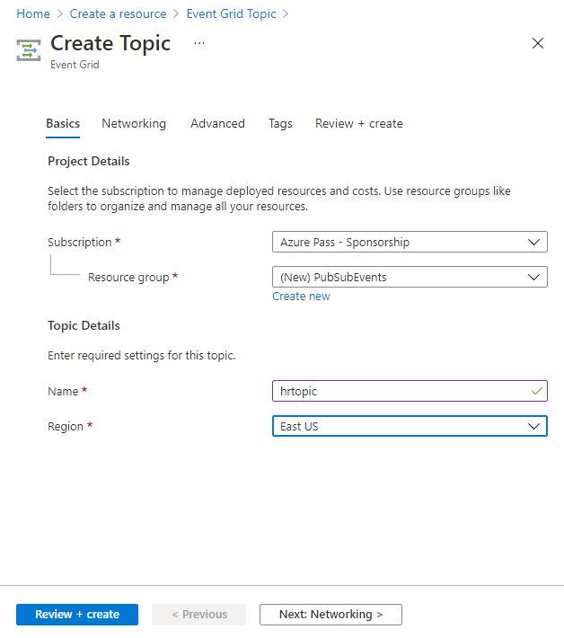
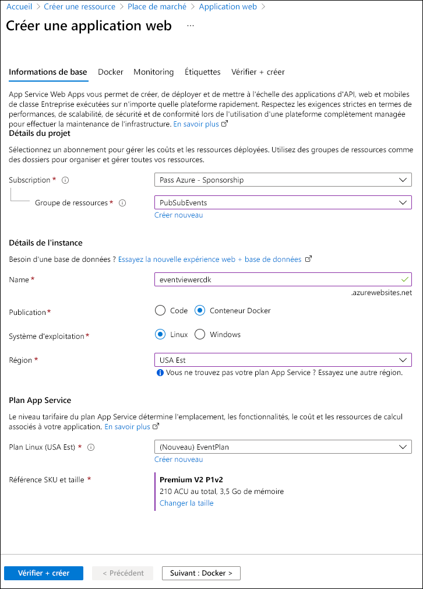
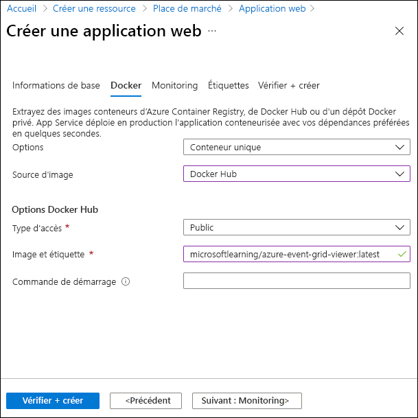
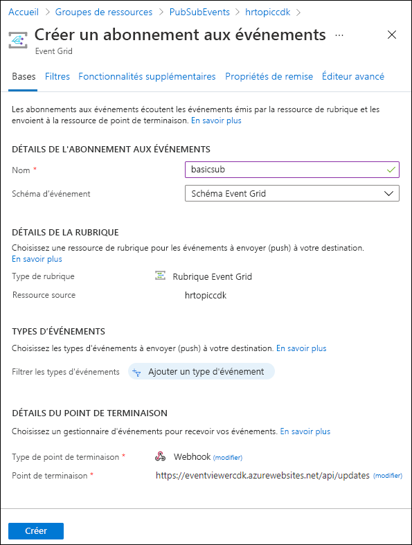

---
lab:
  az204Title: 'Lab 09: Publish and subscribe to Event Grid events'
  az020Title: 'Lab 09: Publish and subscribe to Event Grid events'
  az204Module: 'Module 09: Develop event-based solutions'
  az020Module: 'Module 09: Develop event-based solutions'
ms.openlocfilehash: f019c4154ae7de4c0c0db2a1686688625b0bc196
ms.sourcegitcommit: ddc44a8b5edc7ce2d93849bcab6c6a83dee1c99b
ms.translationtype: HT
ms.contentlocale: fr-FR
ms.lasthandoff: 04/29/2022
ms.locfileid: "145196131"
---
# <a name="lab-09-publish-and-subscribe-to-event-grid-events"></a>Labo 09 : Publier des événements Event Grid et s’y abonner

## <a name="microsoft-azure-user-interface"></a>Interface utilisateur Microsoft Azure

Étant donné la nature dynamique des outils cloud Microsoft, il se peut que vous constatiez des modifications de l’interface utilisateur Azure après le développement du contenu de cette formation. Il se peut donc que certaines instructions et étapes du labo ne s’alignent pas correctement.

Microsoft met ce cours à jour quand la communauté l’alerte sur la nécessité d’y apporter des modifications. Toutefois, compte tenu de la fréquence des mises à jour cloud, il se peut que vous rencontriez des modifications de l’interface utilisateur avant les mises à jour du contenu de cette formation. **Si cela se produit, adaptez-vous aux changements, puis appliquez-les dans les laboratoires si nécessaire.**

## <a name="instructions"></a>Instructions

### <a name="before-you-start"></a>Avant de commencer

#### <a name="sign-in-to-the-lab-environment"></a>Se connecter à l’environnement de labo

Connectez-vous à votre machine virtuelle Windows 10 en utilisant les informations d’identification suivantes :

- Nom d’utilisateur : **Administrateur**

- Mot de passe : **Pa55w.rd**

> **Remarque** : votre instructeur vous fournira des instructions pour la connexion à l’environnement de laboratoire virtuel.

#### <a name="review-the-installed-applications"></a>Passer en revue les applications installées

Localisez la barre des tâches sur votre bureau Windows 10. La barre des tâches contient les icônes des applications que vous allez utiliser dans ce labo, à savoir :

- Microsoft Edge

- Microsoft Visual Studio Code

## <a name="architecture-diagram"></a>Diagramme de l'architecture


### <a name="exercise-1-create-azure-resources"></a>Exercice 1 : Créer des ressources Azure

#### <a name="task-1-open-the-azure-portal"></a>Tâche 1 : Ouvrez le portail Azure

1. Dans la barre des tâches, sélectionnez l’icône **Microsoft Edge**.

1. Dans la fenêtre de navigateur ouverte, accédez au portail Azure (<https://portal.azure.com>), puis connectez-vous au compte que vous allez utiliser pour ce laboratoire.

    > **Remarque** : Si vous vous connectez au portail Azure la première fois, une visite guidée du portail vous sera proposée. Sélectionnez **Prise en main** pour faire l’impasse sur la visite guidée et commencer à utiliser le portail.

#### <a name="task-2-open-azure-cloud-shell"></a>Tâche 2 : Ouvrir Azure Cloud Shell

1. Dans le portail Azure, sélectionnez l’icône **Cloud Shell**  pour ouvrir une nouvelle session Bash. Si Cloud Shell est défini par défaut sur une session PowerShell, sélectionnez **PowerShell**, puis, dans le menu déroulant, sélectionnez **Bash**.

    > **Remarque** : Si vous démarrez **Cloud Shell** pour la première fois, lorsque vous êtes invité à sélectionner **Bash** ou **PowerShell**, sélectionnez **Bash**. Lorsque vous voyez le message **Vous n’avez aucun stockage monté**, sélectionnez l’abonnement que vous utilisez dans ce labo, puis choisissez **Créer un stockage**.

1. Dans le portail Azure, à l’invite de commandes **Cloud Shell**, exécutez la commande suivante pour obtenir la version de l’outil interface de ligne de commande Azure (Azure CLI) :

    ```bash
    az --version
    ```

#### <a name="task-3-review-the-microsofteventgrid-provider-registration"></a>Tâche 3 : Examiner l’inscription du fournisseur Microsoft.EventGrid

1. Dans le **volet Shell CLoud**, exécutez la commande suivante pour répertorier les sous-groupes et commandes au niveau racine d’Azure CLI :

```bash
az --help
```

1. Dans le **volet CLoud Shell**, exécutez la commande suivante pour répertorier les commandes disponibles pour les fournisseurs de ressources :

```bash
az provider --help
```

1. Dans le **volet Shell CLoud**, exécutez la commande suivante pour répertorier tous les fournisseurs actuellement inscrits :

```bash
az provider list
```

1. Dans le **volet Shell CLoud**, exécutez la commande suivante pour répertorier uniquement les espaces de noms des fournisseurs actuellement inscrits :

```bash
az provider list --query "[].namespace"
```

1. Dans le **volet CLoud Shell**, examinez la liste des fournisseurs actuellement inscrits. Notez que le fournisseur **Microsoft.EventGrid** est actuellement inclus dans la liste des fournisseurs.

1. Fermez le volet **Cloud Shell**.

#### <a name="task-4-create-a-custom-event-grid-topic"></a>Tâche 4 : Créer une rubrique Event Grid personnalisée

1. Dans le volet de navigation du portail Azure, sélectionnez **Créer une ressource**.

1. Dans le volet **Créer une ressource**, dans la zone de texte **Rechercher dans les services et la Place de marché**, entrez **Rubrique Event Grid**, puis sélectionnez Entrée.

1. Dans le volet des résultats de la recherche dans la **Place de marché**, sélectionnez le résultat **Rubrique Event Grid**, puis sélectionnez **Créer**.

1. Dans le volet **Créer une rubrique**, sous l’onglet **Options de base**, effectuez les actions suivantes, puis sélectionnez l’onglet **Avancé** :

    | Paramètre                           | Action                                                       |
    | --------------------------------- | ------------------------------------------------------------ |
    | Liste déroulante **Abonnement**   | Conservez la valeur par défaut.                                    |
    | Liste déroulante **Groupe de ressources** | Sélectionnez **Créer**, entrez **PubSubEvents,** , puis sélectionnez **OK**. |
    | Zone de texte **Nom**                 | Entrez **hrtopic** _[votrenom]_ .                               |
    | Liste déroulante **Région**         | Sélectionnez **USA Est**.                                          |

   La capture d’écran suivante affiche les paramètres configurés sous l’onglet **Options de base**.

   

1. Sous l’onglet **Avancé**, dans la liste déroulante **Schéma d’événement**, sélectionnez **Schéma Event Grid**, puis **Vérifier + créer**.

1. Sous l’onglet **Vérifier + créer**, passez en revue les options que vous avez sélectionnées lors des étapes précédentes.

1. Sélectionnez **Créer** pour créer la rubrique Event Grid à l’aide de votre configuration spécifiée.

    > **Remarque** : attendez qu’Azure termine la création de la rubrique avant de poursuivre le labo. Vous allez recevoir une notification une fois la rubrique créée.

#### <a name="task-5-deploy-the-azure-event-grid-viewer-to-a-web-app"></a>Tâche 5 : Déployer la visionneuse Azure Event Grid sur une application web

1. Dans le volet de navigation du portail Azure, sélectionnez **Créer une ressource**.

1. Dans le volet **Créer une ressource**, dans la zone de texte **Rechercher dans les services et la Place de marché**, entrez **Application web**, puis sélectionnez Entrée.

1. Dans le volet des résultats de la recherche dans la **Place de marché**, sélectionnez le résultat **Application web**, puis sélectionnez **Créer**.

1. Dans le volet **Créer un application web**, sous l’onglet **Options de base**, effectuez les actions suivantes, puis sélectionnez **Suivant : Docker** :

    | Paramètre                           | Action                                                       |
    | --------------------------------- | ------------------------------------------------------------ |
    | Liste déroulante **Abonnement**   | Conservez la valeur par défaut.                                    |
    | Liste déroulante **Groupe de ressources** | Sélectionnez **PubSubEvents** dans la liste.                         |
    | Zone de texte **Nom**                 | Entrez **eventviewer** _[votrenom]_ .                           |
    | Section **Publier**               | Sélectionnez **Conteneur Docker**.                                 |
    | Section **Système d’exploitation**      | Sélectionnez **Linux**.                                            |
    | Liste déroulante **Région**         | Sélectionnez **USA Est**.                                          |
    | Section **Plan Linux (USA Est)**  | Sélectionnez **Créer**. Dans la zone de texte **Nom**, entrez **EventPlan**, puis sélectionnez **OK**. |
    | Section **Référence SKU et taille**          | Conservez la valeur par défaut.                                    |

    La capture d’écran suivante affiche les paramètres configurés dans le volet **Créer une application web**.

    

1. Sous l’onglet **Docker**, effectuez les actions suivantes, puis sélectionnez **Vérifier + créer** :

    | Paramètre                         | Action                                                      |
    | ------------------------------- | ----------------------------------------------------------- |
    | Liste déroulante **Options**      | Sélectionnez **Conteneur unique**.                                |
    | Liste déroulante **Source d’image** | Sélectionnez **Docker Hub**.                                      |
    | Liste déroulante **Type d’accès**  | Sélectionnez **Public**.                                          |
    | Zone de texte **Image et étiquette**      | Entrez **microsoftlearning/azure-event-grid-viewer:latest**. |

    La capture d’écran suivante affiche les paramètres configurés sous l’onglet **Docker**.

    

1. Sous l’onglet **Vérifier + créer**, passez en revue les options que vous avez sélectionnées lors des étapes précédentes.

1. Sélectionnez **Créer** pour créer l’application web à l’aide de votre configuration spécifiée.

    > **Remarque** : attendez qu’Azure termine la création de l’application web avant de poursuivre le labo. Vous allez recevoir une notification une fois l’application créée.

#### <a name="review"></a>Révision

Dans cet exercice, vous avez créé la rubrique Event Grid et une application web que vous allez utiliser tout au long du labo.

### <a name="exercise-2-create-an-event-grid-subscription"></a>Exercice 2 : Créer un abonnement Event Grid

#### <a name="task-1-access-the-event-grid-viewer-web-application"></a>Tâche 1 : Accéder à l’application web Visionneuse Event Grid

1. Dans le volet Navigation du portail Azure, sélectionnez **Groupes de ressources**.

1. Dans le volet **Groupes de ressources**, sélectionnez le groupe de ressources **PubSubEvents**.

1. Dans le volet **PubSubEvents**, sélectionnez l’application web **eventviewer** _[votrenom]_ .

1. Dans le volet **App Service**, dans la catégorie **Paramètres**, sélectionnez le lien **Propriétés**.

1. Dans la section **Propriétés**, enregistrez la valeur du lien **URL**. Vous allez utiliser cette valeur plus tard dans ce labo.

1. Sélectionnez **Vue d’ensemble**, puis **Parcourir**.

1. Observez l’application web **Visionneuse Azure Event Grid** en cours d’exécution. Laissez cette application web s’exécuter jusqu’à la fin du labo.

    > **Remarque** : cette application web va se mettre à jour en temps réel au fur et à mesure de l’envoi d’événements à son point de terminaison. Vous allez utiliser cette application pour surveiller des événements tout au long du laboratoire.

1. Revenez à votre fenêtre de navigateur actuellement ouverte qui affiche le portail Azure.

#### <a name="task-2-create-a-new-subscription"></a>Tâche 2 : Créer un abonnement

1. Dans le volet Navigation du portail Azure, sélectionnez **Groupes de ressources**.

1. Dans le volet **Groupes de ressources**, sélectionnez le groupe de ressources **PubSubEvents** que vous avez créé précédemment dans ce labo.

1. Dans le volet **PubSubEvents**, sélectionnez la rubrique Event Grid **hrtopic** _[votrenom]_ que vous avez créée précédemment dans ce labo.

1. Dans le volet **Rubrique Event Grid**, sélectionnez **+ Abonnement à un événement**.

1. Dans le volet **Créer un abonnement à un événement**, effectuez les actions suivantes, puis sélectionnez **Créer** :

    | Paramètre                          | Action                                                       |
    | -------------------------------- | ------------------------------------------------------------ |
    | Zone de texte **Nom**                | Entrez **basicsub**.                                          |
    | Liste déroulante **Schéma d’événement**  | Sélectionner **Schéma Event Grid**.                                |
    | Liste déroulante **Type de point de terminaison** | Sélectionnez **Webhook**.                                         |
    | **Point de terminaison**                     | Choisissez **Sélectionner un point de terminaison**. Dans la zone de texte **Point de terminaison de l’abonné**, entrez la valeur **URL d’application web** que vous avez enregistrée précédemment, vérifiez qu’elle utilise un préfixe **https://** , ajoutez le suffixe **/api/updates**, puis sélectionnez **Confirmer la sélection**. Par exemple, si votre valeur **URL d’application web** est ``http://eventviewerstudent.azurewebsites.net/``, votre **Point de terminaison de l’abonné** est ``https://eventviewerstudent.azurewebsites.net/api/updates``. |

    La capture d’écran suivante affiche les paramètres configurés dans le volet **Créer un abonnement à un événement**.

    

    > **Remarque** : Attendez qu’Azure termine la création de l’abonnement avant de poursuivre le labo. Vous allez recevoir une notification une fois l’abonnement créé.

#### <a name="task-3-observe-the-subscription-validation-event"></a>Tâche 3 : Observer l’événement de validation d’abonnement

1. Revenez à la fenêtre de navigateur affichant l’application web **Visionneuse Azure Event Grid**.

1. Examinez l’événement **Microsoft.EventGrid.SubscriptionValidationEvent** créé dans le cadre du processus de création d’abonnement.

1. Sélectionnez l’événement et examinez son contenu JSON.

1. Revenez à votre fenêtre de navigateur actuellement ouverte qui affiche le portail Azure.

#### <a name="task-4-record-subscription-credentials"></a>Tâche 4 : Enregistrer les informations d’identification d’abonnement

1. Dans le volet Navigation du portail Azure, sélectionnez **Groupes de ressources**.

1. Dans le volet **Groupes de ressources**, sélectionnez le groupe de ressources **PubSubEvents** que vous avez créé précédemment dans ce labo.

1. Dans le volet **PubSubEvents**, sélectionnez la rubrique Event Grid **hrtopic** _[votrenom]_ que vous avez créée précédemment dans ce labo.

1. Dans le volet **Rubrique Event Grid**, enregistrez la valeur du champ **Point de terminaison de la rubrique**. Vous allez utiliser cette valeur plus tard dans ce labo.

1. Dans la catégorie **Paramètres**, sélectionnez le lien **Clés d’accès**.

1. Dans la section **Clés d’accès**, enregistrez la valeur de la zone de texte **Clé 1** . Vous allez utiliser cette valeur plus tard dans ce labo.

#### <a name="review"></a>Révision

Dans cet exercice, vous avez créé un abonnement, validé son inscription, puis enregistré les informations d’identification requises pour publier un nouvel événement dans la rubrique.

### <a name="exercise-3-publish-event-grid-events-from-net"></a>Exercice 3 : Publier des événements Event Grid à partir de .NET

#### <a name="task-1-create-a-net-project"></a>Tâche 1 : Créer un projet .NET

1. Dans l’écran **Démarrage**, sélectionnez la vignette **Visual Studio Code**.

1. Dans le menu **Fichier**, sélectionnez **Ouvrir le dossier**.

1. Dans la fenêtre **Explorateur de fichiers** qui s’ouvre, accédez à **Allfiles (F):\\Allfiles\\Labs\\09\\Starter\\EventPublisher**, puis choisissez **Sélectionner un dossier**.

1. Dans la fenêtre **Visual Studio Code**, activez le menu contextuel pour le volet **Explorateur**, puis sélectionnez **Ouvrir dans le terminal intégré**.

1. Exécutez la commande suivante pour créer un projet .NET nommé **EventPublisher** dans le dossier actuel :

    ```powershell
    dotnet new console --name EventPublisher --output .
    ```

    > **Remarque** : La commande **dotnet new** crée un projet de **console** dans un dossier du même nom que le projet.

1. Exécutez la commande suivante pour importer la version 4.1.0 d’**Azure.Messaging.EventGrid** à partir de NuGet :

    ```powershell
    dotnet add package Azure.Messaging.EventGrid --version 4.1.0
    ```

    > **Remarque** : la commande **dotnet add package** ajoute le package **Microsoft.Azure.EventGrid** à partir de NuGet. Pour plus d’informations, accédez à [Azure.Messaging.EventGrid](https://www.nuget.org/packages/Azure.Messaging.EventGrid/4.1.0).

1. Exécutez la commande suivante pour générer l’application web .NET :

    ```powershell
    dotnet build
    ```

1. Sélectionnez **Tuer le terminal** ou l’icône **Corbeille** pour fermer le terminal actuellement ouvert et tous les processus associés.

#### <a name="task-2-modify-the-program-class-to-connect-to-event-grid"></a>Tâche 2 : Modifier la classe Program pour la connexion à Event Grid

1. Dans le volet **Explorateur** de la fenêtre **Visual Studio Code**, ouvrez le fichier **Program.cs**.

1. Sous l’onglet de l’éditeur de code du fichier **Program.cs**, supprimez tout le code du fichier existant.

1. Ajoutez la ligne de code suivante pour importer les espaces de noms **Azure** et **Azure.Messaging.EventGrid** à partir du package **Azure.Messaging.EventGrid** importé à partir de NuGet :

    ```csharp
    using Azure;
    using Azure.Messaging.EventGrid;
    ```

1. Ajoutez les lignes de code suivantes afin d’ajouter des directives **using** pour les espaces de noms intégrés qui seront utilisées dans ce fichier :

    ```csharp
    using System;
    using System.Threading.Tasks;
    ```

1. Entrez le code suivant pour créer une classe **Program** :

    ```csharp
    public class Program
    {
    }
    ```

1. Dans la classe **Program**, entrez la ligne de code suivante pour créer une constante de chaîne nommée **topicEndpoint** :

    ```csharp
    private const string topicEndpoint = "";
    ```

1. Mettez à jour la constante de chaîne **topicEndpoint** en définissant sa valeur sur le **Point de terminaison de la rubrique** Event Grid que vous avez enregistrée précédemment dans ce labo.

1. Dans la classe **Program**, entrez la ligne de code suivante pour créer une constante de chaîne nommée **topicKey** :

    ```csharp
    private const string topicKey = "";
    ```

1. Mettez à jour la constante de chaîne **topicKey** en définissant sa valeur sur la **Clé** de la rubrique Event Grid que vous avez enregistrée précédemment dans ce labo.

1. Dans la classe **Program**, entrez le code suivant pour créer une méthode **Main** asynchrone :

    ```csharp
    public static async Task Main(string[] args)
    {
    }
    ```

1. Observez le fichier **Program.cs** qui devrait maintenant inclure les lignes de code suivantes.

    ```csharp
    using System;
    using System.Threading.Tasks;
    using Azure;
    using Azure.Messaging.EventGrid;
    public class Program
    {
        private const string topicEndpoint = "<topic-endpoint>";
        private const string topicKey = "<topic-key>";
        public static async Task Main(string[] args)
        {
        }
    }
    ```

#### <a name="task-3-publish-new-events"></a>Tâche 3 : Publier de nouveaux événements

1. Dans la méthode **Main**, effectuez les actions suivantes pour publier une liste d’événements sur votre point de terminaison de rubrique :

    a. Ajoutez la ligne de code suivante pour créer une variable nommée **endpoint** de type **Uri**, en utilisant la constante de chaîne **topicEndpoint** comme paramètre de constructeur :

    ```csharp
    Uri endpoint = new Uri(topicEndpoint); 
    ```

    b. Ajoutez la ligne de code suivante pour créer une variable nommée **credential** de type **[AzureKeyCredential](https://docs.microsoft.com/dotnet/api/azure.azurekeycredential)** , en utilisant la constante de chaîne **topicKey** comme paramètre de constructeur :

    ```csharp
    AzureKeyCredential credential = new AzureKeyCredential(topicKey);
    ```

    c. Ajoutez la ligne de code suivante pour créer une variable nommée **client** de type **[EventGridPublisherClient](https://docs.microsoft.com/dotnet/api/azure.messaging.eventgrid.eventgridpublisherclient)** , en utilisant les variables **point de terminaison** et **informations d’identification** comme paramètres de constructeur :

    ```csharp
    EventGridPublisherClient client = new EventGridPublisherClient(endpoint, credential);
    ```

    d. Ajoutez le bloc de code suivant pour créer une variable nommée **firstEvent** de type **[EventGridEvent](https://docs.microsoft.com/dotnet/api/azure.messaging.eventgrid.eventgridevent)** , et renseignez cette variable avec un échantillon de données :

    ```csharp
    EventGridEvent firstEvent = new EventGridEvent(
        subject: $"New Employee: Alba Sutton",
        eventType: "Employees.Registration.New",
        dataVersion: "1.0",
        data: new
        {
            FullName = "Alba Sutton",
            Address = "4567 Pine Avenue, Edison, WA 97202"
         }
     );
     ```

    e. Ajoutez le bloc de code suivant pour créer une variable nommée **secondEvent** de type **[EventGridEvent](https://docs.microsoft.com/dotnet/api/azure.messaging.eventgrid.eventgridevent)** , et renseignez cette variable avec un échantillon de données :

     ```csharp
        EventGridEvent secondEvent = new EventGridEvent(
            subject: $"New Employee: Alexandre Doyon",
            eventType: "Employees.Registration.New",
            dataVersion: "1.0",
            data: new
            {
                FullName = "Alexandre Doyon",
                Address = "456 College Street, Bow, WA 98107"
            }
        );
     ```

    f. Ajoutez la ligne de code suivante pour appeler de façon asynchrone la méthode **[EventGridPublisherClient.SendEventAsync](https://docs.microsoft.com/dotnet/api/azure.messaging.eventgrid.eventgridpublisherclient.sendeventasync)** en utilisant la variable **firstEvent** comme paramètre :

    ```csharp
    await client.SendEventAsync(firstEvent);
    ```

    g. Ajoutez la ligne de code suivante pour afficher le message **« Premier événement publié »** sur la console :

    ```csharp
    Console.WriteLine("First event published");
    ```

    h. Ajoutez la ligne de code suivante pour appeler de façon asynchrone la méthode **[EventGridPublisherClient.SendEventAsync](https://docs.microsoft.com/dotnet/api/azure.messaging.eventgrid.eventgridpublisherclient.sendeventasync)** en utilisant la variable **secondEvent** comme paramètre :

    ```csharp
    await client.SendEventAsync(secondEvent);
    ```

    i. Ajoutez la ligne de code suivante pour afficher le message **« Deuxième événement publié »** sur la console :

    ```csharp
    Console.WriteLine("Second event published");
    ```

1. Examinez la méthode **Main**, qui devrait maintenant inclure :

    ```csharp
    public static async Task Main(string[] args)
    {
        Uri endpoint = new Uri(topicEndpoint);
        AzureKeyCredential credential = new AzureKeyCredential(topicKey);
        EventGridPublisherClient client = new EventGridPublisherClient(endpoint, credential);
        EventGridEvent firstEvent = new EventGridEvent(
            subject: $"New Employee: Alba Sutton",
            eventType: "Employees.Registration.New",
            dataVersion: "1.0",
            data: new
            {
                FullName = "Alba Sutton",
                Address = "4567 Pine Avenue, Edison, WA 97202"
            }
        );
        EventGridEvent secondEvent = new EventGridEvent(
            subject: $"New Employee: Alexandre Doyon",
            eventType: "Employees.Registration.New",
            dataVersion: "1.0",
            data: new
            {
                FullName = "Alexandre Doyon",
                Address = "456 College Street, Bow, WA 98107"
            }
        );
        await client.SendEventAsync(firstEvent);
        Console.WriteLine("First event published");
        await client.SendEventAsync(secondEvent);
        Console.WriteLine("Second event published");
    }
    ```

1. Enregistrez le fichier **Program.cs**.

1. Dans la fenêtre **Visual Studio Code**, activez le menu contextuel pour le volet **Explorateur**, puis sélectionnez **Ouvrir dans le terminal intégré**.

1. Exécutez la commande suivante pour exécuter l’application web .NET :

    ```powershell
    dotnet run
    ```

    > **Remarque** : s’il existe des erreurs de build, examinez le fichier **Program.cs** dans le dossier **Allfiles (F):\\Allfiles\\Labs\\09\\Solution\\EventPublisher**

1. Observez la sortie du message de réussite de l’application console en cours d’exécution.

1. Sélectionnez **Tuer le terminal** ou l’icône **Corbeille** pour fermer le terminal actuellement ouvert et tous les processus associés.

#### <a name="task-4-observe-published-events"></a>Tâche 4 : Observer les événements publiés

1. Revenez à la fenêtre de navigateur affichant l’application web **Visionneuse Azure Event Grid**.

1. Examinez les événements **Employees.Registration.New** créés par votre application console.

1. Sélectionnez l’un des événements et examinez son contenu JSON.

1. Revenez au portail Azure.

#### <a name="review"></a>Révision

Dans cet exercice, vous avez publié de nouveaux événements dans votre rubrique Event Grid à l’aide d’une application console .NET.

### <a name="exercise-4-clean-up-your-subscription"></a>Exercice 4 : Nettoyer votre abonnement

#### <a name="task-1-open-azure-cloud-shell"></a>Tâche 1 : Ouvrir Azure Cloud Shell

1. Dans le portail Azure, sélectionnez l’icône **Cloud Shell**  pour ouvrir une nouvelle session Bash. Si Cloud Shell est défini par défaut sur une session PowerShell, sélectionnez **PowerShell**, puis, dans le menu déroulant, sélectionnez **Bash**.

    > **Remarque** : Si vous démarrez **Cloud Shell** pour la première fois, lorsque vous êtes invité à sélectionner **Bash** ou **PowerShell**, sélectionnez **PowerShell**. Lorsque vous voyez le message **Vous n’avez aucun stockage monté**, sélectionnez l’abonnement que vous utilisez dans ce labo, puis choisissez **Créer un stockage**.

#### <a name="task-2-delete-a-resource-group"></a>Tâche 2 : Supprimer un groupe de ressources

1. Dans le volet **Cloud Shell**, exécutez la commande suivante pour supprimer le groupe de ressources **PubSubEvents** :

    ```bash
    az group delete --name PubSubEvents --no-wait --yes
    ```

    > **Remarque** : La commande s’exécute de façon asynchrone (comme déterminé par le paramètre *--no-wait*). Par conséquent, vous êtes en mesure d’exécuter une autre commande Azure CLI immédiatement après au cours de la même session Bash, mais la suppression réelle du groupe de ressources prendra quelques minutes.

1. Fermez le volet **Cloud Shell** dans le portail.

#### <a name="task-3-close-the-active-applications"></a>Tâche 3 : Fermer les applications actives

1. Fermez l’application Microsoft Edge en cours d’exécution.

1. Fermez l’application Visual Studio Code en cours d’exécution.

#### <a name="review"></a>Révision

Dans cet exercice, vous avez nettoyé votre abonnement en supprimant les groupes de ressources utilisés dans ce labo.
