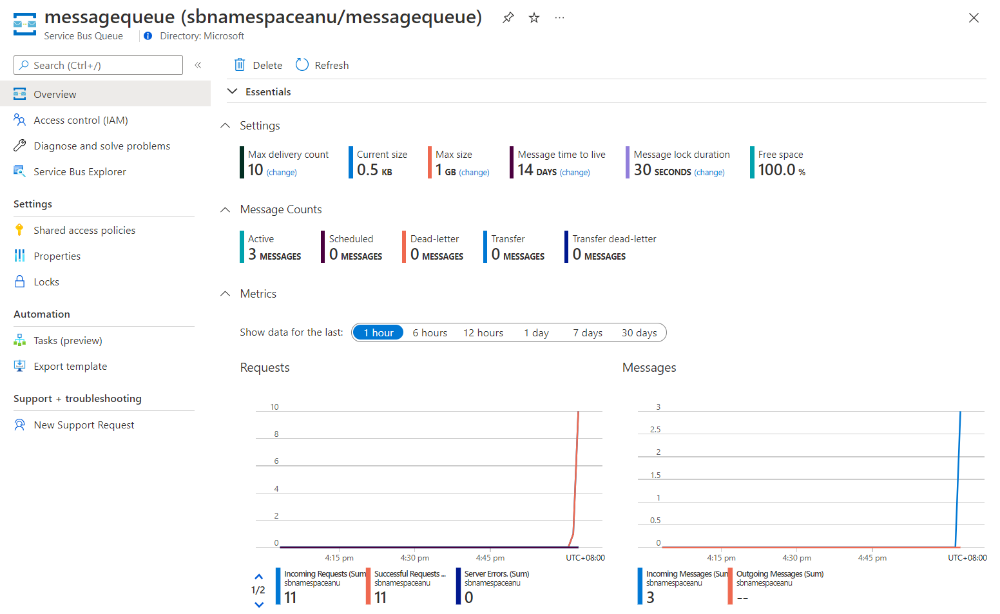

---
lab:
  az204Title: 'Lab 10: Asynchronously process messages by using Azure Service Bus Queues'
  az204Module: 'Learning Path 10: Develop message-based solutions'
---

# Labo 10 : Traiter les messages de façon asynchrone à l’aide de files d’attente Azure Service Bus

## interface utilisateur Microsoft Azure

Étant donné la nature dynamique des outils cloud Microsoft, il se peut que vous constatiez des modifications de l’interface utilisateur Azure après le développement du contenu de cette formation. Il se peut donc que certaines instructions et étapes du labo ne s’alignent pas correctement.

Microsoft met ce cours à jour quand la communauté l’alerte sur la nécessité d’y apporter des modifications. Toutefois, compte tenu de la fréquence des mises à jour cloud, il se peut que vous rencontriez des modifications de l’interface utilisateur avant les mises à jour du contenu de cette formation. **Si cela se produit, adaptez-vous aux changements, puis appliquez-les dans les laboratoires si nécessaire.**

## Instructions


### Avant de commencer

#### Se connecter à l’environnement de labo

Connectez-vous à votre machine virtuelle Windows 10 en utilisant les informations d’identification suivantes:

- Nom d’utilisateur : `Admin`
- Mot de passe : `Pa55w.rd`

> **Remarque** : Votre instructeur vous fournira des instructions pour la connexion à l’environnement de laboratoire virtuel.

#### Passer en revue les applications installées

Localisez la barre des tâches sur votre bureau Windows 10. La barre des tâches contient les icônes des applications que vous allez utiliser dans ce labo, à savoir :
    
-   Microsoft Edge
-   Visual Studio Code

## Scénario de laboratoire

Dans ce labo, vous allez créer une preuve de concept pour ce scénario en utilisant une file d’attente Azure Service Bus. Pour montrer comment fonctionne le système, vous allez créer un projet .NET Core qui publiera des messages sur le système, puis une deuxième application .NET Core qui lira les messages dans la file d’attente. La première application simulera les données provenant d’un capteur, tandis que la deuxième application simulera le système qui lira les messages dans la file d’attente pour traitement.

## Diagramme de l'architecture


### Exercice 1 : Créer des ressources Azure

#### Tâche 1 : Ouvrir le portail Azure

1. Dans la barre des tâches, sélectionnez l’icône **Microsoft Edge**.

1. Dans la fenêtre du navigateur, accédez au portail Azure à l’adresse `https://portal.azure.com`, puis connectez-vous avec le compte que vous allez utiliser pour ce labo.

    > **Remarque** : Si vous vous connectez au portail Azure la première fois, une visite guidée du portail vous sera proposée. Sélectionnez **Prise en main** pour faire l’impasse sur la visite guidée et commencer à utiliser le portail.

#### Tâche 2 : Créer une file d’attente Azure Service Bus

1. Dans le portail Azure, utilisez la zone de texte **Rechercher des ressources, des services et des documents** pour rechercher **Service Bus**, puis, dans la liste des résultats, sélectionnez **Service Bus**.

1. Dans le volet **Service Bus**, sélectionnez **+ Créer**.

1. Dans le volet **Créer un espace de noms**, sous l’onglet **Options de base**, effectuez les actions suivantes, puis sélectionnez **Vérifier + créer** :
        
    | Paramètre | Action |
    | -- | -- |
    | Liste déroulante  **Abonnement** |Conservez les valeurs par défaut. |
    | Section **Groupe de ressources**  | Sélectionnez **Créer**, entrez **AsyncProcessor,** , puis sélectionnez **OK** |
    | Zone de texte **Nom de l’espace de noms**  | Entrez **sbnamespace** _[votrenom]_ |
    | Liste déroulante **Région** | Sélectionnez une région Azure où vous pouvez déployer une instance Azure Service Bus |
    | Liste déroulante **Niveau tarifaire** | Sélectionnez **De base** |

    La capture d’écran suivante affiche les paramètres configurés sous l’onglet **Options de base** dans le volet **Créer un espace de noms**.
    
    
     
1. Sous l’onglet **Vérifier + créer**, passez en revue les options que vous avez sélectionnées lors des étapes précédentes.

1. Sélectionnez **Créer** pour créer l’espace de noms **Service Bus** en utilisant votre configuration spécifiée.

    > **Remarque** : Attendez que la tâche soit créée avant de poursuivre ce labo.

1. Dans le volet **Déploiement**, sélectionnez le bouton **Accéder à la ressource** pour accéder au volet de l’espace de noms **Service Bus** nouvellement créé.

1. Dans le panneau de l’espace de noms **Service Bus**, dans la section **Paramètres**, sélectionnez **Stratégies d’accès partagé**.

1. Dans la liste des stratégies, sélectionnez **RootManageSharedAccessKey**.

1. Dans le volet **Stratégie SAP : RootManageSharedAccessKey**, en regard de l’entrée **Chaîne de connexion principale**, sélectionnez le bouton **Copier dans le presse-papiers**, puis enregistrez la valeur copiée. Vous allez l’utiliser plus tard dans ce labo.

    > **Remarque** : Peu importe celle des deux clés disponibles que vous choisissez. Ils sont interchangeables.

1. Dans le panneau de l’espace de noms **Service Bus**, dans la section **Entités**, sélectionnez **Files d’attente**, puis **+ File d’attente**.

1. Dans le volet **Créer une file d’attente**, passez en revue les paramètres disponibles. Dans la zone de texte **Nom**, entrez **messagequeue**, puis sélectionnez **Créer**.

1. Sélectionnez **messagequeue** pour afficher les propriétés de la file d’attente **Service Bus**.

1. Gardez la fenêtre du navigateur ouverte. Vous allez l’utiliser plus tard dans ce labo.

#### Révision

Dans cet exercice, vous avez créé un espace de noms Azure **Service Bus** et une file d’attente **Service Bus** que vous allez utiliser dans le reste du labo.

### Exercice 2 : Créer un projet .NET Core pour publier des messages dans une file d’attente Service Bus

#### Tâche 1 : Créer un projet .NET Core

1. Sur l’ordinateur de labo, démarrez Visual Studio Code.

1. Dans Visual Studio Code, dans le menu **Fichier**, sélectionnez **Ouvrir un dossier**.

1. Dans la fenêtre **Ouvrir un dossier**, accédez à **Allfiles (F):\\Allfiles\\Labs\\10\\Starter\\MessagePublisher**, puis choisissez **Sélectionner le dossier**.

1. Dans la fenêtre **Visual Studio Code**, dans la barre de menus, sélectionnez **Terminal**, puis **Nouveau terminal**.

1. À l’invite du Terminal, exécutez la commande suivante pour créer un projet .NET nommé **MessagePublisher** dans le dossier actif :

    ```
    dotnet new console --framework net6.0 --name MessagePublisher --output .
    ```

    > **Remarque** : La commande **dotnet new** crée un projet de **console** dans un dossier du même nom que le projet.

1. Exécutez la commande suivante pour importer la version 7.8.1 du package **Azure.Messaging.ServiceBus** à partir de NuGet :

    ```
    dotnet add package Azure.Messaging.ServiceBus --version 7.8.1
    ```

    > **Remarque** : La commande **dotnet add package** ajoute le package **Azure.Messaging.ServiceBus** à partir de NuGet. Pour plus d’informations, accédez à [Azure.Messaging.ServiceBus](https://www.nuget.org/packages/Azure.Messaging.ServiceBus/).

1. À l’invite de Terminal, exécutez la commande suivante pour générer l’application de console .NET Core :

    ```
    dotnet build
    ```

1. Sélectionnez **Tuer le terminal** (icône **Corbeille**) pour fermer le volet du terminal et tous les processus associés.

#### Tâche 2 : Publier des messages dans une file d’attente Azure Service Bus

1. Dans le volet **Explorateur** de la fenêtre **Visual Studio Code**, ouvrez le fichier **Program.cs**.

1. Sous l’onglet de l’éditeur de code du fichier **Program.cs**, supprimez tout le code du fichier existant.

1. Ajoutez le code suivant :

    ```csharp
    using System;
    using System.Threading.Tasks;
    using Azure.Messaging.ServiceBus;
    namespace MessagePublisher
    {
        public class Program
        {
            /* The `<serviceBus-connection-string>` placeholder represents
               the connection string to the target Azure Service Bus namespace */
            private const string serviceBusConnectionString = "<serviceBus-connection-string>";

            /* To create a string constant named "queueName" with a value
               of "messagequeue", matching the name of the Service Bus queue.*/
            private const string queueName = "messagequeue";

            /* Stores the number of messages to be sent to the target queue */
            private const int numOfMessages = 3;

            /* To create a Service Bus client that will own the connection to the target queue */
            static ServiceBusClient client = default!;

            /* To create a Service Bus sender that will be 
               used to publish messages to the target queue */
            static ServiceBusSender sender = default!;

            public static async Task Main(string[] args)
            {   
                /* To initialize "client" of type "ServiceBusClient" that will 
                   provide connectivity to the Service Bus namespace and "sender"
                   that will be responsible for sending messages */
                client = new ServiceBusClient(serviceBusConnectionString);
                sender = client.CreateSender(queueName);

                /* To create a "ServiceBusMessageBatch" object that will allow you to combine
                   multiple messages into a batch by using the "TryAddMessage" method */
                using ServiceBusMessageBatch messageBatch = await sender.CreateMessageBatchAsync();

                /* To add messages to a batch and throw an exception if a message
                   size exceeds the limits supported by the batch */
                for (int i = 1; i <= numOfMessages; i++)
                {
                    if (!messageBatch.TryAddMessage(new ServiceBusMessage($"Message {i}")))
                    {
                        throw new Exception($"The message {i} is too large to fit in the batch.");
                    }
                }
                try
                {
                    /* To create a try block, with "sender" asynchronously 
                       publishing messages in the batch to the target queue */
                    await sender.SendMessagesAsync(messageBatch);
                    Console.WriteLine($"A batch of {numOfMessages} messages has been published to the queue.");
                }
                finally
                {
                    /* To create a finally block that asynchronously disposes of the "sender"
                       and "client" objects, releasing any network and unmanaged resources */
                    await sender.DisposeAsync();
                    await client.DisposeAsync();
                }
            }
        }
    }
    ```
    > **Remarque** : Mettez à jour la constante de chaîne **serviceBusConnectionString** en définissant sa valeur sur la **Chaîne de connexion principale** de l’espace de noms Service Bus et mettez à jour **queueName** avec la valeur de **messagequeue**, de sorte qu’il corresponde au nom de la file d’attente Service Bus que vous avez créée plus tôt dans cet exercice

    > **Remarque** : Le client du Service Bus peut être mis en cache et utilisé en tant que singleton pendant toute la durée de vie de l’application. Il s’agit de l’une des meilleures pratiques lors de la publication et de la lecture régulières de messages.

1. Enregistrez le fichier **Program.cs**.

1. À l’invite de Terminal, exécutez la commande suivante pour lancer l’application de console .NET Core :

    ```
    dotnet run
    ```

    > **Remarque** : Si vous rencontrez des erreurs, examinez le fichier **Program.cs** dans le dossier **Allfiles (F):\\Allfiles\\Labs\\10\\Solution\\MessagePublisher**.

1. Vérifiez que le message de console affiché à l’invite du terminal indique qu’un lot de trois messages a été publié dans la file d’attente.

1. Sélectionnez **Tuer le terminal** (icône **Corbeille**) pour fermer le volet du terminal et tous les processus associés.

1. Basculez vers le navigateur Microsoft Edge affichant la file d’attente Service Bus **messagequeue** dans le portail Azure.

1. Examinez le volet **Essentials** et notez que la file d’attente contient trois messages actifs.

    La capture d’écran suivante affiche les métriques et nombre de messages de la file d’attente Service Bus.
     
    
     
1. Sélectionnez le panneau **Explorateur Service Bus**.

1. Dans l’en-tête de l’onglet **Mode Aperçu** et sous l’onglet **File d’attente**, sélectionnez le bouton **Aperçu depuis le début**.

1. Vérifiez que la file d’attente contient trois messages.

1. Sélectionnez le premier message et examinez son contenu dans le volet **Message**.

    La capture d’écran suivante affiche le contenu du premier message.
         
    

1. Fermez le volet **Message**.

#### Révision

Dans cet exercice, vous avez configuré votre projet .NET qui a publié des messages dans une file d’attente Azure Service Bus.

### Exercice 3 : Créer un projet .NET Core pour lire des messages dans une file d’attente Service Bus

#### Tâche 1 : Créer un projet .NET

1. Sur l’ordinateur de labo, démarrez Visual Studio Code.

1. Dans Visual Studio Code, dans le menu **Fichier**, sélectionnez **Ouvrir un dossier**.

1. Dans la fenêtre **Ouvrir un dossier**, accédez à **Allfiles (F):\\Allfiles\\Labs\\10\\Starter\\MessageReader**, puis choisissez **Sélectionner le dossier**.

1. Dans la fenêtre **Visual Studio Code**, dans la barre de menus, sélectionnez **Terminal**, puis **Nouveau terminal**.

1. À l’invite du Terminal, exécutez la commande suivante pour créer un projet .NET nommé **MessageReader** dans le dossier actif :

    ```
    dotnet new console --framework net6.0 --name MessageReader --output .
    ```

1. Exécutez la commande suivante pour importer la version 7.8.1 du package **Azure.Messaging.ServiceBus** à partir de NuGet :

    ```
    dotnet add package Azure.Messaging.ServiceBus --version 7.8.1
    ```

1. À l’invite de Terminal, exécutez la commande suivante pour générer l’application de console .NET Core :

    ```
    dotnet build
    ```

1. Sélectionnez **Tuer le terminal** (icône **Corbeille**) pour fermer le volet du terminal et tous les processus associés.

#### Tâche 2 : Lire des messages en provenance d’une file d’attente Service Bus

1. Dans le volet **Explorateur** de la fenêtre **Visual Studio Code**, ouvrez le fichier **Program.cs**.

1. Sous l’onglet de l’éditeur de code du fichier **Program.cs**, supprimez tout le code du fichier existant.

1. Ajoutez le code suivant :

    ```csharp
    using System;
    using System.Threading.Tasks;
    using Azure.Messaging.ServiceBus;
    namespace MessageReader
    {
        class Program
        {   
            /* The `<serviceBus-connection-string>` placeholder represents
               the connection string to the target Azure Service Bus namespace */
            static string serviceBusConnectionString = "<serviceBus-connection-string>";
            
            /* To create a string constant named "queueName" with a value
               of "messagequeue", matching the name of the Service Bus queue.*/
            static string queueName = "messagequeue";
            static ServiceBusClient client= default!;

            /* Create a ServiceBusProcessor that will be used to process messages from the queue */
            static ServiceBusProcessor processor = default!;


            static async Task MessageHandler(ProcessMessageEventArgs args)
            {   
                /* To create a static async "MessageHandler" task that displays 
                   the body of messages in the queue as they are being processed 
                   and deletes them after the processing completes */

                string body = args.Message.Body.ToString();
                Console.WriteLine($"Received: {body}");
                await args.CompleteMessageAsync(args.Message);
            }
            static Task ErrorHandler(ProcessErrorEventArgs args)
            {   
                /* To create a static async "ErrorHandler" task that manages 
                   any exceptions encountered during message processing */
                Console.WriteLine(args.Exception.ToString());
                return Task.CompletedTask;
            }

            static async Task Main()
            {   
                /* To initialize "client" of type "ServiceBusClient" that will provide 
                   connectivity to the Service Bus namespace and "processor" that will
                   be responsible for processing of messages */
                client = new ServiceBusClient(serviceBusConnectionString);
                processor = client.CreateProcessor(queueName, new ServiceBusProcessorOptions());
                try
                {   
                    /* To create a try block, which first implements a message and error
                        processing handler, initiates message processing, and stops
                        processing following a user input */
                    processor.ProcessMessageAsync += MessageHandler;
                    processor.ProcessErrorAsync += ErrorHandler;

                    await processor.StartProcessingAsync();
                    Console.WriteLine("Wait for a minute and then press any key to end the processing");
                    Console.ReadKey();

                    Console.WriteLine("\nStopping the receiver...");
                    await processor.StopProcessingAsync();
                    Console.WriteLine("Stopped receiving messages");
                }
                finally
                {
                   /* To create a finally block that asynchronously disposes of the "processor"
                       and "client" objects, releasing any network and unmanaged resources */
                    await processor.DisposeAsync();
                    await client.DisposeAsync();
                }
            }
        }
    }
    ```

    > **Remarque** : Mettez à jour la constante de chaîne **serviceBusConnectionString** en définissant sa valeur sur la **Chaîne de connexion principale** de l’espace de noms **Service Bus** que vous avez inscrite plus tôt dans ce labo.   

1. Enregistrez le fichier **Program.cs**.

1. À l’invite de Terminal, exécutez la commande suivante pour lancer l’application de console .NET Core :

    ```
    dotnet run
    ```

    > **Remarque** : Si vous rencontrez des erreurs, examinez le fichier **Program.cs** dans le dossier **Allfiles (F):\\Allfiles\\Labs\\10\\Solution\\MessageReader**.

1. Vérifiez que le message de console affiché à l’invite du terminal indique que chacun des trois messages dans la file d’attente a été reçu.

1. À l’invite de Terminal, appuyez sur n’importe quelle touche pour arrêter le récepteur et mettre fin à l’exécution de l’application.

1. Sélectionnez **Tuer le terminal** (icône **Corbeille**) pour fermer le volet du terminal et tous les processus associés.

1. Rebasculez vers le navigateur Microsoft Edge affichant la file d’attente Service Bus **messagequeue** dans le portail Azure.

1. Dans le panneau **Service Bus Explorer (préversion),** sélectionnez **Aperçu depuis le début** et notez que le nombre de messages actifs dans la file d’attente est passé à **0**.

#### Révision

Dans cet exercice, vous avez lu supprimé des messages dans la file d’attente Azure Service Bus à l’aide de la bibliothèque .NET.
