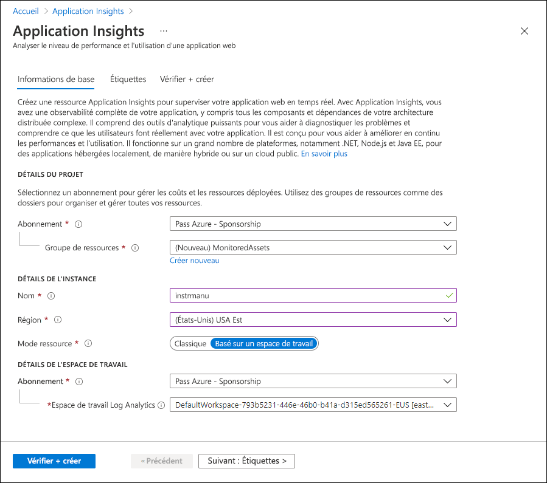
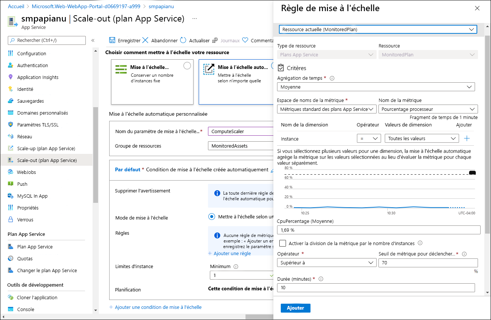
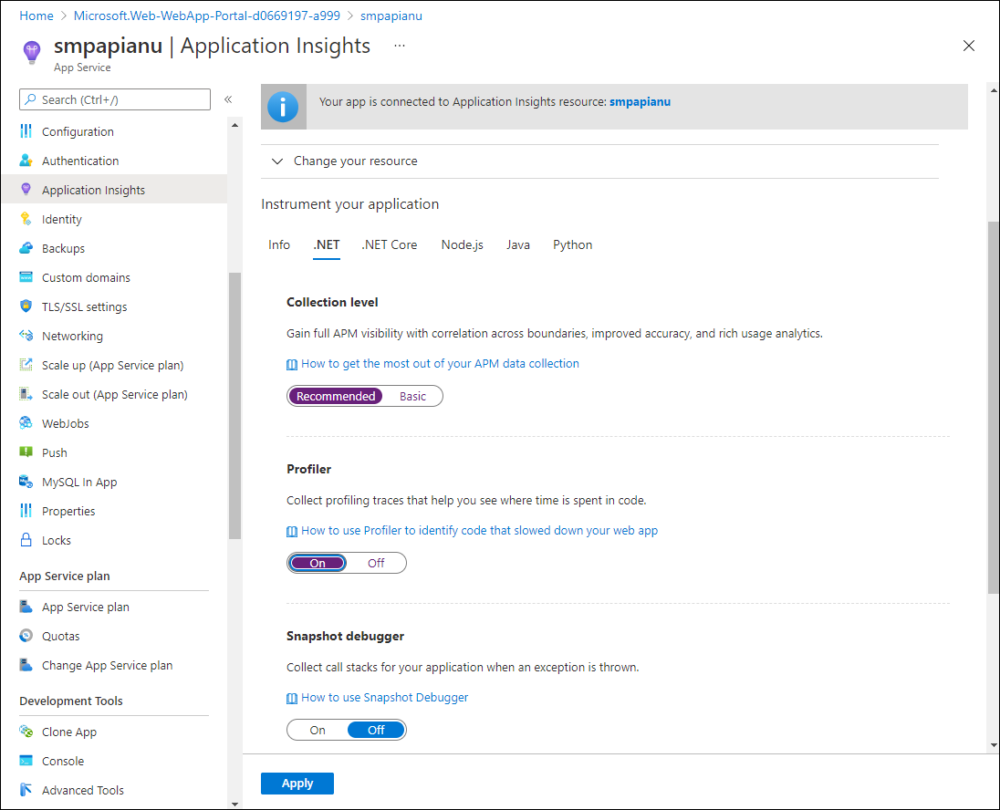
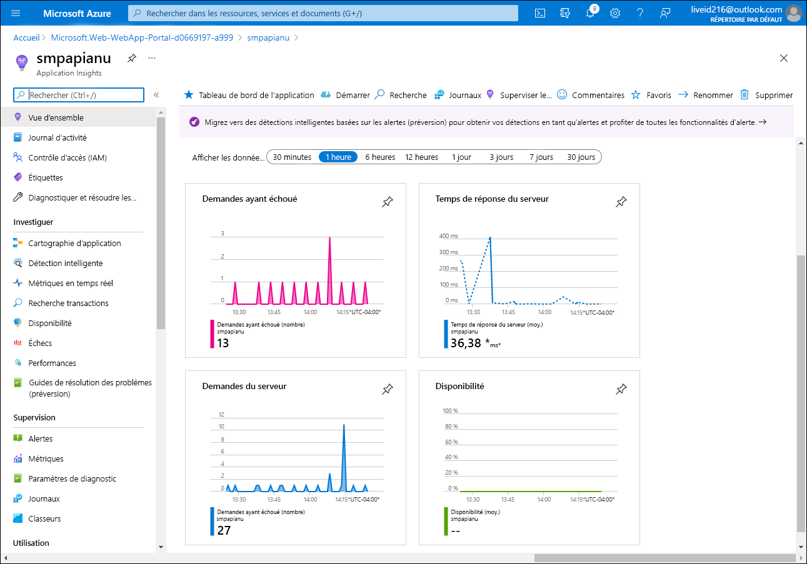

---
lab:
  az204Title: 'Lab 11: Monitor services that are deployed to Azure'
  az204Module: 'Learning Path 11: Troubleshoot solutions by using Application Insights'
---

# Labo 11 : Surveiller les services déployés sur Azure

## interface utilisateur Microsoft Azure

Étant donné la nature dynamique des outils cloud Microsoft, il se peut que vous constatiez des modifications de l’interface utilisateur Azure après le développement du contenu de cette formation. Il se peut donc que certaines instructions et étapes du labo ne s’alignent pas correctement.

Microsoft met ce cours à jour quand la communauté l’alerte sur la nécessité d’y apporter des modifications. Toutefois, compte tenu de la fréquence des mises à jour cloud, il se peut que vous rencontriez des modifications de l’interface utilisateur avant les mises à jour du contenu de cette formation. **Si cela se produit, adaptez-vous aux changements, puis appliquez-les dans les laboratoires si nécessaire.**

## Instructions

### Avant de commencer

#### Se connecter à l’environnement de labo

Connectez-vous à votre machine virtuelle (VM) Windows 11 en utilisant les informations d’identification suivantes :

- Nom d’utilisateur : `Admin`
- Mot de passe : `Pa55w.rd`

> **Remarque** : Votre instructeur vous fournira des instructions pour la connexion à l’environnement de laboratoire virtuel.

#### Passer en revue les applications installées

Recherchez la barre des tâches sur votre bureau Windows 11. La barre des tâches contient les icônes des applications que vous allez utiliser dans ce labo, à savoir :
    
-   Microsoft Edge
-   Explorateur de fichiers
-   Visual Studio Code
-   Azure PowerShell

## Scénario de laboratoire

Dans ce labo, vous allez créer une ressource Application Insights dans Azure qui servira à surveiller et journaliser les données d’insights d’application en vue d’un examen ultérieur. L’API sera définie pour être automatiquement mise à l’échelle si la demande augmente jusqu’à un certain seuil et la journalisation des données aidera à déterminer la façon dont le service est utilisé.

## Diagramme de l'architecture


### Exercice 1 : Créer et configurer un des ressources Azure

#### Tâche 1: Ouvrir le portail Azure

1. Dans la barre des tâches, sélectionnez l’icône **Microsoft Edge**.

1. Dans la fenêtre du navigateur, accédez au portail Azure à l’adresse `https://portal.azure.com`, puis connectez-vous avec le compte que vous allez utiliser pour ce labo.

    > **Remarque** : Si vous vous connectez au portail Azure la première fois, une visite guidée du portail vous sera proposée. Sélectionnez **Prise en main** pour faire l’impasse sur la visite guidée et commencer à utiliser le portail.

#### Tâche 2 : Création d’une ressource Application Insights dans Azure

1. Dans le portail Azure, utilisez la zone de texte **Rechercher des ressources, des services et des documents** en haut de la page pour rechercher **Application Insights**, puis, dans la liste des résultats, sélectionnez **Application Insights**.

1. Dans le volet **Application Insights**, sélectionnez **+ Créer**.

1. Dans le panneau **Application Insights**, sous l’onglet **Options de base**, effectuez les actions suivantes, puis sélectionnez **Vérifier + créer** :
    
    | Paramètre | Action |
    | -- | -- |
    | Liste déroulante  **Abonnement** | Conservez les valeurs par défaut. |
    | Section **Groupe de ressources** | Sélectionnez **Créer**, entrez **MonitoredAssets**, puis sélectionnez **OK** |
    | Zone de texte **Nom** | **instrm** _[votrenom]_ |
    | Liste déroulante **Région** | Sélectionnez une région Azure où vous pouvez déployer une instance Application Insights |
    | Section **Mode de ressources** | Sélectionnez l’option **Basé sur l’espace de travail** |
    | Section **DÉTAILS DE L’ESPACE DE TRAVAIL** | Conservez les valeurs par défaut des listes déroulantes **Abonnement** et **Espace de travail Log Analytics** |
    
    La capture d’écran suivante affiche les paramètres configurés dans le volet **Application Insights**.

    
     
1. Sous l’onglet **Vérifier + créer**, passez en revue les options que vous avez sélectionnées lors des étapes précédentes.

1. Sélectionnez **Créer** pour créer l’instance **Application Insights** à l’aide de votre configuration spécifiée.

    > **Remarque** : attendez que la création de la tâche soit terminée avant de poursuivre ce labo.

1. Dans le volet **Microsoft.AppInsights \| Vue d’ensemble**, sélectionnez le bouton **Accéder à la ressource** pour accéder au volet de la ressource **Application Insights** nouvellement créée.

1. Dans le volet **Application Insights**, dans la section **Configurer**, sélectionnez le lien **Propriétés**.

1. Dans le volet **Propriétés**, en regard de l’entrée **Clé d’instrumentation**, sélectionnez le bouton **Copier dans le Presse-papiers**, puis enregistrez la valeur copiée. Vous allez l’utiliser plus tard dans ce labo.

    > **Remarque** : des applications clientes utilisent la clé pour se connecter à une ressource **Application Insights** spécifique.

### Tâche 3: Créer une ressource d’API web Azure

1. Dans le portail Azure, utilisez la zone de texte **Rechercher des ressources, des services et des documents** en haut de la page pour rechercher **App Services**, puis, dans la liste des résultats, sélectionnez **App Services**.

1. Dans le volet **App Services**, sélectionnez **+Créer**, puis **+Application web**.
    
1. Dans le volet **Créer une application web**, sous l’onglet **Informations de base**, effectuez les actions suivantes et sélectionnez l’onglet **Surveiller et sécuriser** :

    | Setting | Action |
    | -- | -- |
    | Liste déroulante  **Abonnement** | Conservez les valeurs par défaut. |
    | Liste déroulante **Groupe de ressources** |Sélectionnez **MonitoredAssets** |
    | Zone de texte **Nom** | Entrez **smpapi** _[votrenom]_ |
    | Section **Publier** | Sélectionner **Code** |
    | Liste déroulante **Pile d’exécution** | Sélectionner **.NET 8 (LTS)** |
    | Section **Système d’exploitation** |  Sélectionnez **Windows** |
    | Liste déroulante **Région** |  Sélectionnez la région choisie comme emplacement de la ressource **Instance d’application** |
    | Section **Plan Windows (USA Est)** | Sélectionnez **Créer nouveau**, dans la zone de texte **Nom**, entrez **MonitoredPlan**, puis sélectionnez **OK** |
    | Section **Plan tarifaire** |  Conservez les valeurs par défaut. |

1. Dans l’onglet **Surveiller et sécuriser**, effectuez les actions suivantes, puis sélectionnez **Examiner et créer** :
    
    | Setting | Action |
    | -- | -- |
    | Section **Application Insights** | Vérifiez que l’option **Oui** est sélectionnée |
    | Liste déroulante **Application Insights** | Sélectionnez la ressource Application Insights **instrm** _[votrenom]_ que vous avez créée précédemment dans ce labo |
    
1. Dans l’onglet **Créer une application web**, passez en revue les options que vous avez sélectionnées dans les étapes précédentes.

1. Sélectionnez **Créer** pour créer l’API web à l’aide de votre configuration spécifiée.

    > **Remarque** : attendez que la création de la tâche soit terminée avant de poursuivre ce labo.

1. Dans le volet **Vue d’ensemble** du déploiement, sélectionnez le bouton **Accéder à la ressource** pour accéder au volet de l’API web Azure nouvellement créée.

1. Dans le panneau **App Service**, dans la section **Paramètres**, sélectionnez le lien **Variables d’environnement**.

1. Dans la section **Variables d’environnement**, effectuez les actions suivantes :
    
    a.  Dans l’onglet **Paramètres d’application**, sélectionnez **Afficher les valeurs** pour afficher les secrets associés à votre API web.

    b.  Notez la valeur représentant la clé **APPLICATIONINSIGHTS_CONNECTION_STRING**. Cette valeur a été définie automatiquement lorsque vous avez créé la ressource d’API web.

1. Dans le panneau **App Service**, sélectionnez **Vue d’ensemble** en haut du menu de service.

1. Dans le panneau **App Service**, dans la section **Essentials**, enregistrez la valeur du lien **Domaine par défaut**. Vous allez utiliser cette valeur plus tard dans le labo pour envoyer des demandes à l’API web.

#### Tâche 4: Configurer les options de mise à l’échelle automatique de l’API web

1. Dans le volet **App Service**, dans la section **Paramètres**, sélectionnez le lien **Scale-out (plan App Service)**.

1. Faites défiler vers le bas jusqu’à ce que vous voyiez la **méthode par scale-out**. Sélectionnez l’option **Basé sur des règles**, puis **Configurer**.


1. Dans la section **Scale-out**, effectuez les actions suivantes, puis sélectionnez **Enregistrer**:
    
    | Paramètre | Action |
    | -- | -- |
    | Section **Scale-out** | Sélectionner **Mise à l’échelle automatique personnalisée**. |
    | Zone de texte **Nom du paramètre de mise à l’échelle automatique**. | Entrez **ComputeScaler** |
    | Liste déroulante **Groupe de ressources** |Sélectionnez **MonitoredAssets** |
    | Section **Mode de mise à l’échelle** | Sélectionnez **Mettre à l’échelle selon une métrique** |
    | Zone de texte **Minimales** dans la section **Limites d’instance** | Entrez **1** |
    | Zone de texte **Maximales** dans la section **Limites d’instance** | Entrez **8** |
    | Zone de texte **Par défaut** dans la section **Limites d’instance** | Entrez **3** |
   
    La capture d’écran suivante montre les paramètres configurés dans la section **Scale-out** du volet **App Service**.
    
    

    | Paramètre | Action |
    | -- | -- |
    | Section **Règles** | Sélectionnez **Ajouter une règle**. |
    | Volet **Règle de mise à l’échelle** | Conservez les valeurs par défaut pour tous les paramètres, puis sélectionnez **Ajouter** |

    La capture d’écran suivante présente des paramètres supplémentaires dans la section **Scale-out** du volet **App Service**.

   

    > **Remarque** : attendez que l’opération d’enregistrement soit terminée avant de poursuivre ce labo.

#### Révision

Dans cet exercice, vous avez créé les ressources Azure que vous allez utiliser pour le reste du labo.

### Exercice 2 : Surveiller une API web local à l’aide d’Application Insights

#### Tâche 1 : Générer un projet d’API web .NET.

1. Sur l’ordinateur de labo, démarrez **Visual Studio Code**.

1. Dans Visual Studio Code, dans le menu **Fichier**, sélectionnez **Ouvrir un dossier**.

1. Dans la fenêtre **Ouvrir un dossier**, accédez à **Allfiles (F):\\Allfiles\\Labs\\11\\Starter\\Api**, puis choisissez **Sélectionner le dossier**.

1. Dans la fenêtre **Visual Studio Code**, dans la barre de menus, sélectionnez **Terminal**, puis **Nouveau terminal***.

1. À l’invite de Terminal, exécutez la commande suivante pour exécuter l’application API web .NET nommée **SimpleApi** dans le répertoire actuel :

    ```
    dotnet new webapi --output . --name SimpleApi --framework net8.0
    ```

1. Exécutez la commande suivante pour importer la version 2.21.0 de **Microsoft.ApplicationInsights** à partir de NuGet dans le projet actuel :

    ```
    dotnet add package Microsoft.ApplicationInsights --version 2.21.0
    ```

    > **Remarque** : la commande **dotnet add package** ajoutera le package **Microsoft.ApplicationInsights** à partir de NuGet. Pour plus d’informations, consultez [Microsoft.ApplicationInsights](https://www.nuget.org/packages/Microsoft.ApplicationInsights/).

1. Exécutez la commande suivante pour importer la version 2.21.0 de **Microsoft.ApplicationInsights.AspNetCore** à partir de NuGet :

    ```
    dotnet add package Microsoft.ApplicationInsights.AspNetCore --version 2.21.0
    ```

    > **Remarque** : la commande **dotnet add package** ajoutera le package **Microsoft.ApplicationInsights.AspNetCore** à partir de NuGet. Pour plus d’informations, consultez [Microsoft.ApplicationInsights.AspNetCore](https://www.nuget.org/packages/Microsoft.ApplicationInsights.AspNetCore).

1. À l’invite du terminal, exécutez la commande suivante pour importer la version 2.21.0 de **Microsoft.ApplicationInsights.PerfCounterCollector** à partir de NuGet dans le projet actuel :

    ```
    dotnet add package Microsoft.ApplicationInsights.PerfCounterCollector --version 2.21.0
    ```

    > **Remarque** : la commande **dotnet add package** ajoutera le package **Microsoft.ApplicationInsights.PerfCounterCollector** à partir de NuGet. Pour plus d’informations, consultez [Microsoft.ApplicationInsights.PerfCounterCollector](https://www.nuget.org/packages/Microsoft.ApplicationInsights.PerfCounterCollector/).

1. À l’invite du terminal, exécutez la commande suivante pour importer la version 2.4.0 de **Microsoft.ApplicationInsights.Profiler.AspNetCore** à partir de NuGet dans le projet actuel :

    ```
    dotnet add package Microsoft.ApplicationInsights.Profiler.AspNetCore --version 2.4.0
    ```

    > **Remarque** : La commande **dotnet add package** ajoute le package **Microsoft.ApplicationInsights.Profiler.AspNetCore** à partir de NuGet. Pour plus d’informations, consultez [Microsoft.ApplicationInsights.Profiler.AspNetCore](https://www.nuget.org/packages/Microsoft.ApplicationInsights.Profiler.AspNetCore/).

1. À l’invite de Terminal, exécutez la commande suivante pour générer l’API web .NET :

    ```
    dotnet build
    ```
    
#### Tâche 2 : Mettre à jour le code d’application pour désactiver HTTPS et utiliser Application Insights.

1. Dans la fenêtre **Visual Studio Code**, dans le volet **Explorateur**, sélectionnez le fichier **Program.cs** pour l’ouvrir dans le volet de l’**éditeur**.

1. Dans le volet de l’**éditeur**, recherchez et supprimez le code suivant à la ligne 17 :

    ```csharp
    app.UseHttpsRedirection();
    ```

    > **Remarque** : cette ligne de code force l’API web à utiliser HTTPS. Pour ce labo, ce n’est pas nécessaire.

1. Dans le fichier **Program.cs**, ajoutez les deux lignes suivantes à partir de la ligne 7 pour activer Profiler en l’inscrivant avec Application Insights dans la collection Service :

    ```csharp
    builder.Services.AddApplicationInsightsTelemetry();
    builder.Services.AddServiceProfiler();
    ```

1. Enregistrez les changements et fermez le fichier **Program.cs**.

1. Dans la fenêtre **Visual Studio Code**, dans le volet **Explorateur**, sélectionnez le fichier **appsettings.json** pour l’ouvrir dans le volet de l’**éditeur**.

1. Ajoutez au fichier **appsettings.json** l’élément suivant juste après l’élément **Logging**, en remplaçant l’espace réservé `instrumentation-key` par la valeur de la clé d’instrumentation de ressource Application Insights que vous avez enregistrée précédemment dans ce labo :

    ```json
       "ApplicationInsights":
       {
          "InstrumentationKey": "instrumentation-key"
       },
    ```

    > **Remarque** : Si la section que vous ajoutez est le dernier élément du fichier, supprimez la virgule de fin.

1. Votre fichier appsettings.json doit maintenant être semblable en termes de structure à ce qui suit :

    ```json
    {
        "Logging":{
            "LogLevel": {
                "Default": "Information",
                "Microsoft.AspNetCore": "Warning"
            }
        },
       "ApplicationInsights":
       {
          "InstrumentationKey": "instrumentation-key"
       },
       "AllowedHosts": "*"
    }
    ```

    > **Remarque :** assurez-vous d’avoir remplacé l’espace réservé par votre propre clé d’instrumentation que vous avez enregistrée précédemment.

1. Enregistrez les changements du fichier **appsettings.json** et fermez-le.

1. À l’invite de Terminal, exécutez la commande suivante pour générer l’API web .NET :

    ```
    dotnet publish -c Release -r win-x86 --self-contained -p:PublishReadyToRun=true .\SimpleApi.csproj
    ```

#### Tâche 3 : Tester une application API localement

1. À l’invite de Terminal, exécutez la commande suivante pour lancer l’API web .NET :

    ```
    dotnet run
    ```

1. Passez en revue la sortie de la commande et notez l’URL HTTP sur laquelle le site écoute.

1. Dans la barre des tâches, ouvrez le menu contextuel de l’icône **Microsoft Edge**, puis ouvrez une nouvelle fenêtre de navigateur.

1. Dans la fenêtre de navigateur qui s’ouvre, accédez à l’URL `http://localhost` et ajoutez le chemin relatif **/weatherforecast** de votre API web.
    
    > **Remarque** : l’URL complète est `http://localhost:[port-number]/weatherforecast`, où l’espace réservé `[port-number]` identifie le numéro de port auquel l’application web est accessible via le protocole HTTP.

    > **Remarque** : la page devrait contenir une sortie au format suivant. Les valeurs réelles **seront** différentes. 

    ```json
    [
        {
            "date": "2023-10-29",
            "temperatureC": -8,
            "summary": "Sweltering",
            "temperatureF": 18
        },
        {
            "date": "2023-10-30",
            "temperatureC": -12,
            "summary": "Hot",
            "temperatureF": 11
        },
        {
            "date": "2023-10-31",
            "temperatureC": 50,
            "summary": "Chilly",
            "temperatureF": 121
        },
        {
            "date": "2023-11-01",
            "temperatureC": 51,
            "summary": "Chilly",
            "temperatureF": 123
        },
        {
            "date": "2023-11-02",
            "temperatureC": 29,
            "summary": "Balmy",
            "temperatureF": 84
        }
    ]
    ```

1. Actualisez plusieurs fois la page du navigateur pour simuler des réponses.

1. Fermez la fenêtre de navigateur qui affiche la page générée par `http://localhost:[port-number]/weatherforecast`.

1. Dans Visual Studio Code, sélectionnez **Tuer le Terminal** (icône **Corbeille**) pour fermer le volet du **Terminal** et tous les processus associés.

#### Tâche 4: Explorer les métriques dans Application Insights

1. Sur votre ordinateur de labo, basculez vers la fenêtre du navigateur **Microsoft Edge** affichant le portail Azure.

1. Dans le portail Azure, revenez au volet de la ressource Application Insights **instrm** _[votrenom]_ que vous avez créée précédemment dans ce labo.

1. Dans le volet **Application Insights**, dans les vignettes au centre du volet, recherchez les métriques affichées. Plus précisément, recherchez le nombre de requêtes serveur qui ont eu lieu et le temps de réponse moyen du serveur.

    La capture d’écran suivante affiche les métriques **Application Insights** de l’application web locale.

    

    > **Remarque** : jusqu’à cinq minutes peuvent s’écouler avant qu’il soit possible d’observer des demandes dans les graphiques de métriques Application Insights.

#### Révision

Dans cet exercice, vous avez créé une application API à l’aide d’ASP.NET, et l’avez configurée pour diffuser en continu des métriques d’application vers Application Insights. Vous avez ensuite utilisé le tableau de bord Application Insights pour examiner les détails des performances de votre API.

### Exercice 3 : Surveiller une API web à l’aide d’Application Insights

#### Tâche 1 : Déployer une application sur l’API web

1. Sur l’ordinateur du labo, basculez vers Visual Studio Code.

1. Dans la fenêtre **Visual Studio Code**, dans la barre de menus, sélectionnez **Terminal**, puis **Nouveau terminal**.

1. À l’invite du terminal, exécutez la commande suivante pour que le répertoire actuel soit défini sur**Allfiles (F):\\Allfiles\\Labs\\11\\Starter\\Api\\bin\\Release\\net8.0\\net8.0\\win-x86\\publish**, où se trouvent les fichiers du déploiement :

    ```
    cd F:\Allfiles\Labs\11\Starter\Api\bin\Release\net8.0\win-x86\publish\
    ```

1. Exécutez la commande suivante pour créer un fichier zip contenant le projet de démarrage que vous allez déployer en même temps que l’API web Azure:

    ```powershell
    Compress-Archive -Path * -DestinationPath api.zip
    ```

1. À l’invite de Terminal, exécutez la commande suivante pour vous connecter à votre abonnement Azure à l’aide d’Azure PowerShell:

    ```powershell
    Connect-AzAccount
    ```

1. Quand vous y êtes invité, authentifiez-vous en indiquant les informations d’identification pour accéder à l’abonnement Azure utilisé dans ce labo.

    > **Remarque** : attendez la fin du processus de connexion.

1. Exécutez la commande suivante pour afficher la liste de toutes les applications web dans le groupe de ressources **MonitorAssets**:

    ```powershell
    Get-AzWebApp -ResourceGroupName MonitoredAssets
    ```

1. Exécutez la commande suivante pour afficher la liste des applications web dans le groupe de ressources **MonitorAssets**, dont les noms commencent par **smpapi\***:

    ```powershell
    Get-AzWebApp -ResourceGroupName MonitoredAssets | Where-Object {$_.Name -like 'smpapi*'}
    ```

1. Exécutez les commandes suivantes pour afficher le nom de la première des applications web identifiées à l’étape précédente, et stocker celui-ci dans une variable nommée **$webAppName**:

    ```powershell
    Get-AzWebApp -ResourceGroupName MonitoredAssets | Where-Object {$_.Name -like 'smpapi*'} | Select-Object -ExpandProperty Name
    $webAppName = (Get-AzWebApp -ResourceGroupName MonitoredAssets | Where-Object {$_.Name -like 'smpapi*'})[0] | Select-Object -ExpandProperty Name
    ```

1. Exécutez la commande suivante pour déployer le fichier **api.zip** que vous avez créé précédemment dans cette tâche sur l’API web dont vous avez identifié le nom à l’étape précédente :

    ```powershell
    Publish-AzWebApp -ResourceGroupName MonitoredAssets -Name $webAppName -ArchivePath "F:\Allfiles\Labs\11\Starter\Api\bin\Release\net8.0\win-x86\publish\api.zip" -force
    ```

    > **Remarque** : attendez que le déploiement soit terminé avant de poursuivre ce labo.

1. Sur l’ordinateur de labo, lancez une autre fenêtre du navigateur Microsoft Edge.

1. Dans la fenêtre du navigateur, accédez à l’application d’API web Azure dans laquelle vous avez déployé l’application API précédemment dans cette tâche, en ajoutant à son URL (que vous avez enregistrée précédemment dans ce labo) le suffixe **/weatherforecast**.

    > **Remarque** : par exemple, si votre URL est `https://smpapianu.azurewebsites.net`, la nouvelle URL sera `https://smpapianu.azurewebsites.net/weatherforecast`.

1. Vérifiez que la sortie ressemble à celle générée lors de l’exécution de l’application API localement.

    > **Remarque** : la sortie inclura des valeurs différentes, mais elle devrait avoir le même format.

#### Tâche 2 : Configurer une collection de métriques en profondeur pour Web Apps

1. Sur votre ordinateur de labo, basculez vers la fenêtre du navigateur **Microsoft Edge** affichant le portail Azure.

1. Dans le portail Azure, revenez au volet de la ressource d’application web **smpapi** _[votrenom]_ que vous avez créée précédemment dans ce labo.

1. Dans le volet **App Service**, sélectionnez **Application Insights**.

1. Dans le volet **Application Insights**, effectuez les actions suivantes, sélectionnez **Appliquer**, puis, dans la boîte de dialogue de confirmation, sélectionnez **Oui**:

    | Paramètre | Action |
    | -- | -- |
    | Curseur **Application Insights** | Vérifiez qu’il est défini sur **Activer** |
    | Section **Instrumenter votre application** | Sélectionnez l’onglet **.NET** |
    | Section **Niveau de la collection** | Sélectionnez **Recommandé** |
    | Section **Profileur** | Sélectionnez **Activé** |
    | Section **Débogueur de capture instantanée** | Sélectionnez **Désactivé** |
    | Section **Commandes SQL** | Sélectionnez **Désactivé** |

    
    La capture d’écran suivante affiche les paramètres **Application Insights** de l’API web Azure.
    
    

1. Basculez vers l’onglet de navigateur que vous avez ouvert dans la tâche précédente pour afficher les résultats du déploiement de votre application API sur l’application API Azure cible (y compris le chemin d’accès relatif **/weatherforecast** dans l’URL cible), puis actualisez plusieurs fois la page du navigateur.

1. Examinez la sortie au format JSON générée par l’API.

1. Enregistrez l’URL que vous avez utilisée pour accéder à la sortie au format JSON.

    > **Remarque** : l’URL devrait être au format `https://smpapianu.azurewebsites.net/weatherforecast` si **smpapianu** était le nom de site que vous avez créé précédemment.

#### Tâche 3: Obtenir des métriques à jour dans Application Insights

1. Revenez à la fenêtre du navigateur affichant l’application web Azure dans le portail Azure.

1. Dans le volet **Application Insights** de l’application web, sélectionnez le lien **Voir les données Application Insights**.

1. Dans le volet **Application Insights**, examinez les métriques collectées dans les vignettes au centre, notamment le nombre de requêtes serveur qui ont eu lieu et le temps de réponse moyen du serveur.
 
    La capture d’écran suivante affiche les métriques **Application Insights** de l’application web Azure dans le portail Azure.
     
    

    > **Remarque** : jusqu’à cinq minutes peuvent s’écouler avant que les métriques mises à jour apparaissent dans les graphiques de métriques Application Insights.

#### Tâche 4: Afficher les métriques en temps réel dans Application Insights

1. Dans le volet **Application Insights**, dans la section **Examiner**, sélectionnez **Métriques en direct**.

1. Revenez à la fenêtre du navigateur affichant l’application API cible s’exécutant dans l’application web Azure cible (qui cible le chemin relatif **/weatherforecast** dans l’URL cible), puis actualisez plusieurs fois la page du navigateur.

1. Passez à la fenêtre du navigateur affichant le volet **Métriques en temps réel** et examinez son contenu.

    > **Remarque** : la section **Requêtes entrantes** devrait être s’actualiser en quelques secondes, montrant les requêtes que vous avez effectuées sur l’API web.

#### Révision

Dans cet exercice, vous avez configuré et testé la journalisation Application Insights de votre application API web et consulté des informations en direct sur les requêtes effectuées.
