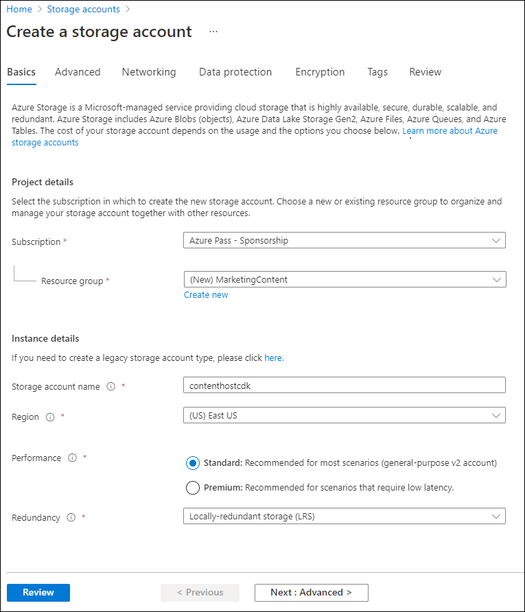
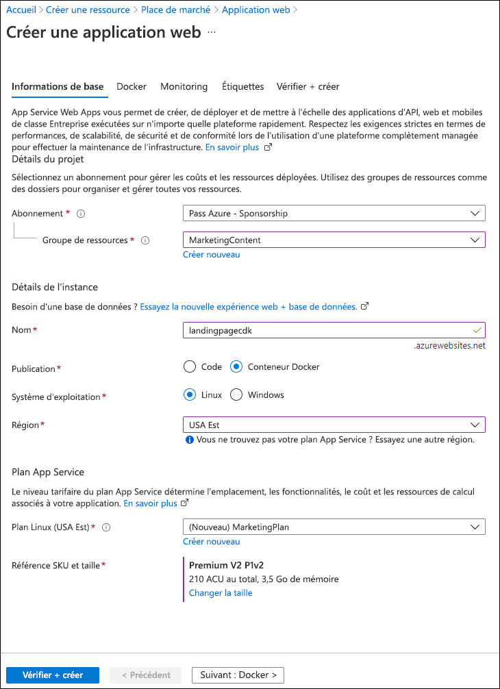
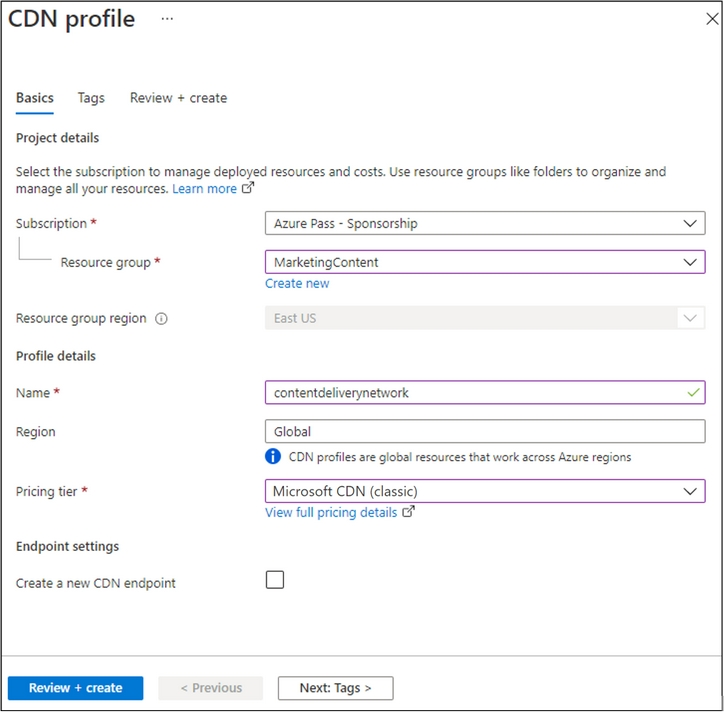
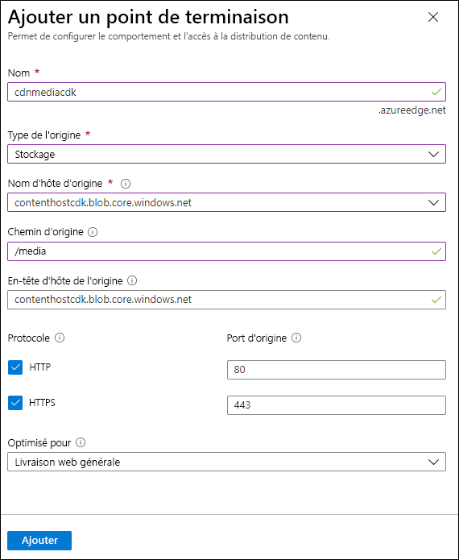
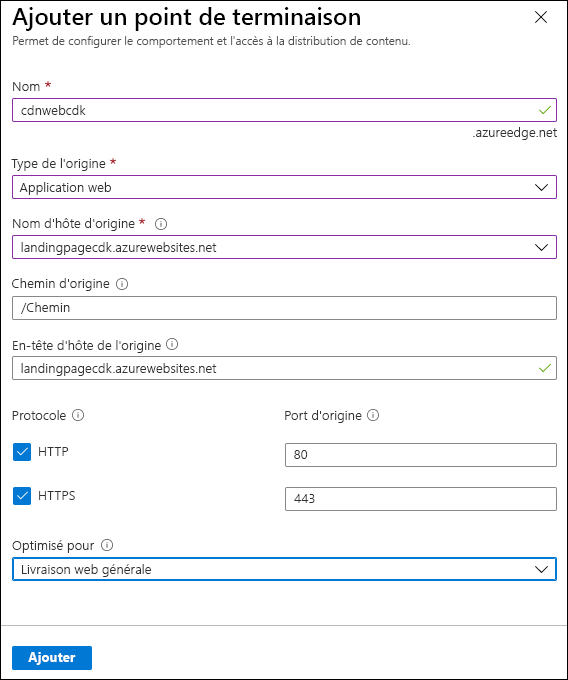

---
lab:
  az204Title: 'Lab 12: Enhance a web application by using the Azure Content Delivery Network'
  az204Module: 'Module 12: Integrate caching and content delivery within solutions'
ms.openlocfilehash: fa497114908887eb2e94d72bbe0c41227b442f31
ms.sourcegitcommit: ddc44a8b5edc7ce2d93849bcab6c6a83dee1c99b
ms.translationtype: HT
ms.contentlocale: fr-FR
ms.lasthandoff: 04/29/2022
ms.locfileid: "145196179"
---
# <a name="lab-12-enhance-a-web-application-by-using-the-azure-content-delivery-network"></a>Labo 12 : Améliorer une application web à l’aide du réseau de distribution de contenu Azure

## <a name="microsoft-azure-user-interface"></a>Interface utilisateur Microsoft Azure

Étant donné la nature dynamique des outils cloud Microsoft, il se peut que vous constatiez des modifications de l’interface utilisateur Azure après le développement du contenu de cette formation. Il se peut donc que certaines instructions et étapes du labo ne s’alignent pas correctement.

Microsoft met ce cours à jour quand la communauté l’alerte sur la nécessité d’y apporter des modifications. Toutefois, compte tenu de la fréquence des mises à jour cloud, il se peut que vous rencontriez des modifications de l’interface utilisateur avant les mises à jour du contenu de cette formation. **Si cela se produit, adaptez-vous aux changements, puis appliquez-les dans les laboratoires si nécessaire.**

## <a name="instructions"></a>Instructions

### <a name="before-you-start"></a>Avant de commencer

#### <a name="sign-in-to-the-lab-environment"></a>Se connecter à l’environnement de labo

Connectez-vous à votre machine virtuelle Windows 10 en utilisant les informations d’identification suivantes :

- Nom d’utilisateur : **Administrateur**

- Mot de passe : **Pa55w.rd**

> **Remarque** : votre instructeur vous fournira des instructions pour la connexion à l’environnement de laboratoire virtuel.

#### <a name="review-the-installed-applications"></a>Passer en revue les applications installées

Localisez la barre des tâches sur votre bureau Windows 10. La barre des tâches contient l’icône de l’application que vous allez utiliser dans ce labo :

- Microsoft Edge

## <a name="architecture-diagram"></a>Diagramme de l'architecture


### <a name="exercise-1-create-azure-resources"></a>Exercice 1 : Créer des ressources Azure

#### <a name="task-1-open-the-azure-portal"></a>Tâche 1 : Ouvrez le portail Azure

1. Dans la barre des tâches, sélectionnez l’icône **Microsoft Edge**.

1. Dans la fenêtre de navigateur ouverte, accédez au portail Azure (<https://portal.azure.com>), puis connectez-vous au compte que vous allez utiliser pour ce laboratoire.

   > **Remarque** : Si vous vous connectez au portail Azure pour la première fois, une visite guidée du portail vous sera proposée. Sélectionnez **Prise en main** pour faire l’impasse sur la visite guidée et commencer à utiliser le portail.

#### <a name="task-2-create-a-storage-account"></a>Tâche 2 : Créer un compte de stockage

1. Dans le portail Azure, utilisez la zone de texte **Rechercher des ressources, des services et des documents** pour rechercher **Compte de stockage**, puis, dans la liste des résultats, sélectionnez **Compte de stockage**.

1. Dans le volet **Compte de stockage**, sélectionnez **+ Créer**.

1. Dans le volet **Créer un compte de stockage**, sous l’onglet **Options de base**, effectuez les actions suivantes, puis sélectionnez **Vérifier + créer**.

   | Paramètre                           | Action                                                       |
   | --------------------------------- | ------------------------------------------------------------ |
   | Liste déroulante **Abonnement**   | Conservez la valeur par défaut.                                    |
   | Section **Groupe de ressources**        | Sélectionnez **Créer**, entrez **MarketingContent**, puis sélectionnez **OK**. |
   | Zone de texte **Nom de compte de stockage** | Entrez **contenthost** _[votrenom]_ .                           |
   | Liste déroulante **Région**         | Sélectionnez **(États-Unis) USA Est**.                                     |
   | Section **Performance**           | Sélectionnez l’option **Standard**.                              |
   | Liste déroulante **Redondance**     | Sélectionnez **Stockage localement redondant (LRS)** .                  |

    La capture d’écran suivante affiche les paramètres configurés dans le volet **Créer un compte de stockage**.

    

1. Sous l’onglet **Vérifier + créer**, passez en revue les options que vous avez sélectionnées lors des étapes précédentes.

1. Sélectionnez **Créer** pour créer le compte de stockage à l’aide de votre configuration spécifiée.

    > **Remarque** : Attendez que la tâche de création soit terminée avant de poursuivre ce labo.

#### <a name="task-3-create-a-web-app-by-using-azure-app-service"></a>Tâche 3 : Créer une application web à l’aide d’Azure App Service

1. Dans le volet de navigation du portail Azure, sélectionnez **Créer une ressource**.

1. Dans le volet **Créer une ressource**, dans la zone de texte **Rechercher dans les services et la Place de marché**, entrez **Application web**, puis sélectionnez Entrée.

1. Dans le volet des résultats de la recherche, sélectionnez le résultat **Application web**, puis sélectionnez **Créer**.

1. Dans le volet **Créer un application web**, sous l’onglet **Options de base**, effectuez les actions suivantes, puis sélectionnez **Suivant : Docker** :

    | Paramètre                           | Action                                                       |
    | --------------------------------- | ------------------------------------------------------------ |
    | Liste déroulante **Abonnement**   | Conservez la valeur par défaut.                                    |
    | Liste déroulante **Groupe de ressources** | Sélectionnez **MarketingContent** dans la liste.                     |
    | Zone de texte **Nom**                 | Entrez **landingpage** _[votre nom]_ .                           |
    | Section **Publier**               | Sélectionnez **Conteneur Docker**.                                 |
    | Section **Système d’exploitation**      | Sélectionnez **Linux**.                                            |
    | Liste déroulante **Région**         | Sélectionnez **USA Est**.                                          |
    | Section **Plan Linux (USA Est)**  | Sélectionnez **Créer nouveau**. Dans la zone de texte **Nom**, entrez **MarketingPlan**, puis sélectionnez **OK**. |
    | Section **Référence SKU et taille**          | Conservez la valeur par défaut.                                    |

    La capture d’écran suivante affiche les paramètres configurés dans le volet **Créer une application web**.

    

1. Sous l’onglet **Docker**, effectuez les actions suivantes, puis sélectionnez **Vérifier + créer** :

    | Paramètre                         | Action                                                    |
    | ------------------------------- | --------------------------------------------------------- |
    | Liste déroulante **Options**      | Sélectionnez **Conteneur unique**.                              |
    | Liste déroulante **Source d’image** | Sélectionnez **Docker Hub**.                                    |
    | Liste déroulante **Type d’accès**  | Sélectionnez **Public**.                                        |
    | Zone de texte **Image et étiquette**      | Entrez **microsoftlearning/edx-html-landing-page:latest**. |

    La capture d’écran suivante affiche les paramètres configurés sous l’onglet **Docker**.

    

1. Sous l’onglet **Vérifier + créer**, passez en revue les options que vous avez sélectionnées lors des étapes précédentes.

1. Sélectionnez **Créer** pour créer l’application web à l’aide de votre configuration spécifiée.

    > **Remarque** : Attendez que la tâche de création soit terminée avant de poursuivre ce labo.

1. Sous le volet **Déploiement**, sélectionnez **Accéder à la ressource**.

1. Dans le volet **Vue d’ensemble d’App Service**, dans **Essentials**, enregistrez la valeur du lien **URL**. Vous allez utiliser cette valeur plus tard dans ce labo.

#### <a name="review"></a>Révision

Dans cet exercice, vous avez créé un compte Stockage Azure et une application web Azure que vous allez utiliser plus tard dans ce labo.

### <a name="exercise-2-configure-content-delivery-network-and-endpoints"></a>Exercice 2 : Configurer un réseau de distribution de contenu et des points de terminaison

#### <a name="task-1-open-azure-cloud-shell"></a>Tâche 1 : Ouvrir Azure Cloud Shell

1. Dans le portail Azure, sélectionnez l’icône **Cloud Shell**  pour ouvrir une nouvelle session Bash. Si Cloud Shell est défini par défaut sur une session PowerShell, sélectionnez **PowerShell**, puis, dans le menu déroulant, sélectionnez **Bash**.

    > **Remarque** : Si vous démarrez **Cloud Shell** pour la première fois, lorsque vous êtes invité à sélectionner **Bash** ou **PowerShell**, sélectionnez **Bash**. Lorsque vous voyez le message **Vous n’avez aucun stockage monté**, sélectionnez l’abonnement que vous utilisez dans ce labo, puis choisissez **Créer un stockage**.

1. Dans le portail Azure, à l’invite de commandes **Cloud Shell**, exécutez la commande suivante pour obtenir la version de l’outil Interface de ligne de commande Azure (Azure CLI) :

    ```bash
    az --version
    ```

#### <a name="task-2-register-the-microsoftcdn-provider"></a>Tâche 2 : Inscrire le fournisseur Microsoft.CDN

1. À l’invite de commandes **Cloud Shell** dans le portail, effectuez les actions suivantes :

    a.  Entre la commande suivante, puis sélectionnez Entrée pour répertorier les sous-groupes et commandes au niveau racine d’Azure CLI :

    ```bash
    az --help
    ```

    b.  Entre la commande suivante, puis sélectionnez Entrée pour répertorier les commandes disponibles pour les fournisseurs de ressources :

    ```bash
    az provider --help
    ```

    c.  Entrez la commande suivante, puis sélectionnez Entrée pour répertorier tous les fournisseurs actuellement inscrits :

     ```bash
     az provider list
     ```

    d.  Entrez la commande suivante, puis sélectionnez Entrée pour répertorier tous les espaces de noms des fournisseurs actuellement inscrits :

     ```bash
     az provider list --query "[?registrationState=='Registered'].namespace"
     ```

    e.  Observez la liste des fournisseurs actuellement inscrits. Le fournisseur **Microsoft.CDN** ne figure pas actuellement dans la liste des fournisseurs.

    f.  Entrez la commande suivante, puis sélectionnez Entrée afin d’obtenir les indicateurs requis pour inscrire un nouveau fournisseur :

     ```bash
     az provider register --help
     ```

    g.  Entrez la commande suivante, puis sélectionnez Entrée pour inscrire l’espace de noms **Microsoft.CDN** avec votre abonnement actuel :

     ```bash
     az provider register --namespace Microsoft.CDN
     ```

1. Fermez le volet **Cloud Shell** dans le portail.

#### <a name="task-3-create-a-content-delivery-network-profile"></a>Tâche 3 : Créer un profil de réseau de distribution de contenu

1. Dans le volet de navigation du portail Azure, sélectionnez **Créer une ressource**.

1. Dans le volet **Créer une ressource**, dans la zone de texte **Rechercher dans les services et la Place de marché**, entrez **CDN**, puis sélectionnez Entrée.

1. Dans le volet des résultats de la recherche dans la **Place de marché**, sélectionnez le résultat **Profils Front Door et CDN**, puis **Créer**.

1. Dans la page **Comparer les offres**, sélectionnez **Explorer d’autres offres**, **Azure CDN Standard par Akamai**, puis **Continuer**.

1. Dans le volet **Profil CDN**, sous l’onglet **Options de base**, effectuez les actions suivantes, puis sélectionnez **Vérifier + créer** :

    | Paramètre                                     | Action                                   |
    | ------------------------------------------- | ---------------------------------------- |
    | Liste déroulante **Abonnement**             | Conservez la valeur par défaut.                |
    | Liste déroulante **Groupe de ressources**           | Sélectionnez **MarketingContent** dans la liste. |
    | Zone de texte **Nom**                           | Entrez **contentdeliverynetwork**.        |
    | Zone de texte **Région**                         | Conservez la valeur par défaut (Globale).       |
    | Liste déroulante **Niveau tarifaire**             | Sélectionnez **Akamai Standard**.              |
    | Case à cocher **Créer un point de terminaison CDN maintenant** | non sélectionnée.                            |

    La capture d’écran suivante affiche les paramètres configurés dans le volet **Profil CDN**.

    

1. Sous l’onglet **Vérifier + créer**, passez en revue les options que vous avez sélectionnées lors des étapes précédentes.

1. Sélectionnez **Créer** pour créer le profil CDN à l’aide de votre configuration spécifiée.

    > **Remarque** : attendez qu’Azure termine la création du profil CDN avant de continuer le labo. Vous allez recevoir une notification une fois l’application créée.

#### <a name="task-4-configure-storage-containers"></a>Tâche 4 : Configurer des conteneurs de stockage

1. Dans le volet Navigation du portail Azure, sélectionnez **Groupes de ressources**.

1. Dans le volet **Groupes de ressources**, sélectionnez le groupe de ressources **MarketingContent** que vous avez créé précédemment dans ce labo.

1. Dans le volet **MarketingContent**, sélectionnez le compte de stockage **contenthost** _[votrenom]_ que vous avez créé précédemment dans ce labo.

1. Dans le volet **Compte de stockage**, dans la section **Conteneurs**, sélectionnez le lien **Stockage de données**.

1. Dans la section **Conteneurs**, sélectionnez **+ Conteneur**.

1. Dans la fenêtre contextuelle **Nouveau conteneur**, effectuez les actions suivantes, puis sélectionnez **Créer** :

    | Paramètre                                | Action                                                  |
    | -------------------------------------- | ------------------------------------------------------- |
    | Zone de texte **Nom**                      | Entrez **media**.                                        |
    | Liste déroulante **Niveau d’accès public** | Sélectionnez **blob (accès en lecture anonyme pour les blobs uniquement)** . |

1. Dans la section **Conteneurs**, sélectionnez à nouveau **+ Conteneur**.

1. Dans la fenêtre contextuelle **Nouveau conteneur**, effectuez les actions suivantes, puis sélectionnez **Créer** :

    | Paramètre                                | Action                                                  |
    | -------------------------------------- | ------------------------------------------------------- |
    | Zone de texte **Nom**                      | Entrez **video**.                                        |
    | Liste déroulante **Niveau d’accès public** | Sélectionnez **blob (accès en lecture anonyme pour les blobs uniquement)** . |

1. Observez la liste mise à jour des conteneurs pour vérifier que les conteneurs **media** et **video** sont répertoriés.

#### <a name="task-5-create-content-delivery-network-endpoints"></a>Tâche 5 : Créer des points de terminaison Content Delivery Network

1. Dans le volet de navigation du portail Azure, sélectionnez le lien **Groupes de ressources**.

1. Dans le volet **Groupes de ressources**, sélectionnez le groupe de ressources **MarketingContent** que vous avez créé précédemment dans ce labo.

1. Dans le volet **MarketingContent**, sélectionnez le profil CDN  **contentdeliverynetwork** que vous avez créé précédemment dans ce labo.

1. Dans le volet **Profil CDN**, sélectionnez **+ Point de terminaison**.

1. Dans la boîte de dialogue **Ajouter un point de terminaison**, effectuez les actions suivantes, puis sélectionnez **Ajouter** :

    | Paramètre | Action |
    | --- | --- |
    | Zone de texte **Nom** | Entrez **cdnmedia** _[votrenom]_ . |
    | Liste déroulante **Type d’origine**            | Sélectionnez **Stockage** |
    | Liste déroulante **nom d’hôte d’origine**        | Sélectionnez l’option **contenthost *[votrenom]* .blob.core.windows.net** pour le compte de stockage que vous avez créé précédemment dans ce labo. |
    | Zone de texte **chemin d’accès d’origine** | Entrez **/media**. |
    | Zone de texte **En-tête de l’hôte d’origine** | Conservez la valeur par défaut. |
    | Sections **Protocole** et **Port d’origine** | Conservez les valeurs par défaut. |
    | Liste déroulante **Optimisé pour** | Sélectionnez **livraison web générale**. |

    La capture d’écran suivante affiche les paramètres configurés dans la boîte de dialogue **Ajouter un point de terminaison**.

    

1. Dans le volet **Profil CDN**, sélectionnez à nouveau **+ Point de terminaison**.

1. Dans la boîte de dialogue **Ajouter un point de terminaison**, effectuez les actions suivantes, puis sélectionnez **Ajouter** :

    | Paramètre | Action |
    | --- | --- |
    | Zone de texte **Nom** | Entrez **cdnvideo** _[votrenom]_|
    | Liste déroulante **Type d’origine** | Sélectionnez **Stockage** |
    | Liste déroulante **nom d’hôte d’origine** | Sélectionnez l’option **contenthost *[votrenom]* .blob.core.windows.net** pour le compte de stockage que vous avez créé précédemment dans ce labo. |
    | Zone de texte **chemin d’accès d’origine** | Entrez **/video**. |
    | Zone de texte **En-tête de l’hôte d’origine** | Conservez la valeur par défaut. |
    | Sections **Protocole** et **Port d’origine** | Conservez les valeurs par défaut. |
    | Liste déroulante **Optimisé pour** | Sélectionnez **Diffusion multimédia en continu de vidéoà la demande** |

    La capture d’écran suivante affiche les paramètres configurés dans la boîte de dialogue **Ajouter un point de terminaison**.

    

1. Dans le volet **Profil CDN**, sélectionnez à nouveau **+ Point de terminaison**.

1. Dans la boîte de dialogue **Ajouter un point de terminaison**, effectuez les actions suivantes, puis sélectionnez **Ajouter** :

    | Paramètre | Action |
    | --- | --- |
    | Zone de texte **Nom** | Entrez **cdnweb** _[votrenom]_ |
    | Liste déroulante **Type d’origine** | Sélectionnez **Application web** |
    | Liste déroulante **nom d’hôte d’origine** | Sélectionnez l’option **landingpage *[votrenom]* .azurewebsites.net** pour l’application web que vous avez créée précédemment dans ce labo. |
    | Zone de texte **chemin d’accès d’origine** | Conservez la valeur par défaut. |
    | Zone de texte **En-tête de l’hôte d’origine** | Conservez la valeur par défaut. |
    | Sections **Protocole** et **Port d’origine** | Conservez les valeurs par défaut. |
    | Liste déroulante **Optimisé pour** | Sélectionnez **Livraison web générale**. |

    La capture d’écran suivante affiche les paramètres configurés dans la boîte de dialogue **Ajouter un point de terminaison**.

    

#### <a name="review"></a>Révision

Dans cet exercice, vous avez inscrit le fournisseur de ressources pour Content Delivery Network (CDN), puis utilisé le fournisseur pour créer à la fois un profil CDN et des ressources de point de terminaison.

### <a name="exercise-3-upload-and-configure-static-web-content"></a>Exercice 3 : Charger et configurer du contenu web statique

#### <a name="task-1-observe-the-landing-page"></a>Tâche 1 : Observer la page de destination

1. Dans le volet Navigation du portail Azure, sélectionnez **Groupes de ressources**.

1. Dans le volet **Groupes de ressources**, sélectionnez le groupe de ressources **MarketingContent** que vous avez créé précédemment dans ce labo.

1. Dans le volet **MarketingContent**, sélectionnez l’application web **landingpage** _[votrenom]_ que vous avez créée précédemment dans ce labo.

1. Dans le volet **App Service**, sélectionnez **Parcourir**. Un nouvel onglet de navigateur s’ouvre et retourne le site web actuel. Observez le message d’erreur affiché sur l’écran. Le site web ne fonctionnera pas tant que vous n’aurez pas configuré les paramètres spécifiés pour référencer le contenu multimédia.

1. Revenez à votre fenêtre de navigateur actuellement ouverte qui affiche le portail Azure.

#### <a name="task-2-upload-storage-blobs"></a>Tâche 2 : Charger des blobs de stockage

1. Dans le volet Navigation du portail Azure, sélectionnez **Groupes de ressources**.

1. Dans le volet **Groupes de ressources**, sélectionnez le groupe de ressources **MarketingContent** que vous avez créé précédemment dans ce labo.

1. Dans le volet **MarketingContent**, sélectionnez le compte de stockage **contenthost** _[votrenom]_ que vous avez créé précédemment dans ce labo.

1. Dans le volet **Compte de stockage**, dans la section **Conteneurs**, sélectionnez le lien **Stockage de données**.

1. Dans la section **Conteneurs**, sélectionnez le conteneur **media**, puis **Charger**.

1. Dans la fenêtre contextuelle **Charger l’objet blob**, effectuez les actions suivantes :

    a.  Dans la section **Fichiers**, sélectionnez l’icône **Dossier**.

    b.  Dans la fenêtre **Explorateur de fichiers**, accédez à **Allfiles (F):\\Allfiles\\Labs\\12\\Starter**, sélectionnez les fichiers suivants, puis **Ouvrir**.

    - **campus.jpg**

    - **conference.jpg**

    - **poster.jpg**

    c.  Vérifiez que l’option **Remplacer si les fichiers existent déjà** est sélectionnée, puis choisissez **Charger**.  

    > **Remarque** : Attendez que le chargement du blob soit terminé avant de poursuivre ce labo.

1. Dans le volet **Conteneur**, dans la section **Paramètres**, sélectionnez **Propriétés**.

1. Enregistrez la valeur dans la zone de texte **URL**. Vous allez utiliser cette valeur plus tard dans ce labo.

1. Fermez le volet **Conteneur**.

1. Dans le volet **Conteneurs**, sélectionnez le conteneur **video**, puis **Charger**.

1. Dans la fenêtre contextuelle **Charger l’objet blob**, effectuez les actions suivantes :

    a.  Dans la section **Fichiers**, sélectionnez l’icône **Dossier**.

    b.  Dans la fenêtre **Explorateur de fichiers**, accédez à **Allfiles (F):\\Allfiles\\Labs\\12\\Starter**, sélectionnez le fichier **welcome.mp4**, puis **Ouvrir**.

    c.  Vérifiez que l’option **Remplacer si les fichiers existent déjà** est sélectionnée, puis choisissez **Charger**.  

    > **Remarque** : Attendez que le chargement du blob soit terminé avant de poursuivre ce labo.

1. Dans le volet **Conteneur**, dans la section **Paramètres**, sélectionnez **Propriétés**.

1. Enregistrez la valeur dans la zone de texte **URL**. Vous allez utiliser cette valeur plus tard dans ce labo.

#### <a name="task-3-configure-web-app-settings"></a>Tâche 3 : Configurer des paramètres d’application web

1. Dans le volet Navigation du portail Azure, sélectionnez **Groupes de ressources**.

1. Dans le volet **Groupes de ressources**, sélectionnez le groupe de ressources **MarketingContent** que vous avez créé précédemment dans ce labo.

1. Dans le volet **MarketingContent**, sélectionnez l’application web **landingpage** _[votrenom]_ que vous avez créée précédemment dans ce labo.

1. Dans le volet **App Service**, dans la section **Paramètres**, sélectionnez le lien **Configuration**.

1. Dans la section **Configuration**, sélectionnez l’onglet **Paramètres d’application**, puis **Nouveau paramètre d’application**.

1. Dans la fenêtre contextuelle **Ajouter/Modifier un paramètre d’application**, configurez les paramètres suivants, puis sélectionnez **OK**.

    | Paramètre                               | Action                                                       |
    | ------------------------------------- | ------------------------------------------------------------ |
    | Zone de texte **Nom**                     | Entrez **CDNMediaEndpoint**.                                  |
    | Zone de texte **Valeur**                    | Entrez la valeur d’**URI** du conteneur **media** dans le compte de stockage **contenthost** _[votrenom]_ que vous avez enregistrée précédemment dans ce labo. |
    | Case à cocher **Paramètre d’emplacement de déploiement** | Ne sélectionnez rien.                                               |

1. Revenez à la section **Configuration**, puis sélectionnez **Nouveau paramètre d’application**.

1. Dans la fenêtre contextuelle **Ajouter/Modifier un paramètre d’application**, configurez les paramètres suivants, puis sélectionnez **OK**.

    | Paramètre                               | Action                                                       |
    | ------------------------------------- | ------------------------------------------------------------ |
    | Zone de texte **Nom**                     | Entrez **CDNVideoEndpoint**.                                  |
    | Zone de texte **Valeur**                    | Entrez la valeur d’**URI** du conteneur **video** dans le compte de stockage **contenthost** _[votrenom]_ que vous avez enregistrée précédemment dans ce labo. |
    | Case à cocher **Paramètre d’emplacement de déploiement** | Ne sélectionnez rien.                                               |

1. Revenez à la section **Configuration**, puis sélectionnez **Enregistrer**. Sélectionnez **Continuer** pour confirmer vos modifications.

    > **Remarque** : Attendez que les paramètres de votre application persistent avant de poursuivre le labo.

#### <a name="task-4-validate-the-corrected-landing-page"></a>Tâche 4 : Valider la page de destination corrigée

1. Dans le volet Navigation du portail Azure, sélectionnez **Groupes de ressources**.

1. Dans le volet **Groupes de ressources**, sélectionnez le groupe de ressources **MarketingContent** que vous avez créé précédemment dans ce labo.

1. Dans le volet **MarketingContent**, sélectionnez l’application web **landingpage** _[votrenom]_ que vous avez créée précédemment dans ce labo.

1. Dans le volet **App Service**, sélectionnez **Redémarrer**, puis **Oui** pour confirmer le processus de redémarrage de l’application.

    > **Remarque** : Attendez que l’opération de redémarrage soit terminée avant de poursuivre ce labo. Vous allez recevoir une notification une fois l’opération terminée.

1. Dans le volet **App Service**, sélectionnez **Parcourir**. Une nouvelle fenêtre ou un nouvel onglet de navigateur s’ouvrent et retournent au site web actuel. Observez le site web mis à jour affichant des contenus multimédias de différents types.

1. Revenez à votre fenêtre de navigateur actuellement ouverte qui affiche le portail Azure.

#### <a name="review"></a>Révision

Dans cet exercice, vous avez chargé des contenus multimédias en tant que blobs dans des conteneurs de stockage, puis mis à jour votre application web pour qu’elle pointe directement vers les blobs de stockage.

### <a name="exercise-4-use-content-delivery-network-endpoints"></a>Exercice 4 : Utiliser des points de terminaison Content Delivery Network

#### <a name="task-1-retrieve-endpoint-uniform-resource-identifiers-uris"></a>Tâche 1 : Récupérer des URI (Uniform Resource Identifiers) de point de terminaison

1. Dans le volet de navigation du portail Azure, sélectionnez le lien **Groupes de ressources**.

1. Dans le volet **Groupes de ressources**, sélectionnez le groupe de ressources **MarketingContent** que vous avez créé précédemment dans ce labo.

1. Dans le volet **MarketingContent**, sélectionnez le profil CDN  **contentdeliverynetwork** que vous avez créé précédemment dans ce labo.

1. Dans le volet **Profil CDN**, sélectionnez le point de terminaison **cdnmedia** _[votrenom]_ .

1. Dans le volet **Point de terminaison**, copiez la valeur du lien **Nom d’hôte du point de terminaison**. Vous allez utiliser cette valeur plus tard dans ce labo.

1. Fermez le volet **Point de terminaison**.

1. Dans le volet **Profil CDN**, sélectionnez le point de terminaison **cdnvideo** _[votrenom]_ .

1. Dans le volet **Point de terminaison**, copiez la valeur du lien **Nom d’hôte du point de terminaison**. Vous allez utiliser cette valeur plus tard dans ce labo.

1. Fermez le volet **Point de terminaison**.

#### <a name="task-2-test-multimedia-content"></a>Tâche 2 : Tester le contenu multimédia

1. Créez une URL pour la ressource **campus.jpg** en combinant l’URL du **Nom d’hôte du point de terminaison** **cdnmedia** _[votrenom]_ que vous avez copiée précédemment dans le labo avec un chemin relatif de **/campus.jpg**.

    > **Remarque** : par exemple, si votre URL de **Nom d’hôte du point de terminaison** est `https://cdnmediastudent.azureedge.net/`, votre URL nouvellement créée est `https://cdnmediastudent.azureedge.net/campus.jpg`.

1. Créez une URL pour la ressource **conference.jpg** en combinant l’URL du **Nom d’hôte du point de terminaison** **cdnmedia** _[votrenom]_ que vous avez copiée précédemment dans le labo avec un chemin relatif de **/conference.jpg**.

    > **Remarque** : par exemple, si votre URL de **Nom d’hôte du point de terminaison** est `https://cdnmediastudent.azureedge.net/`, votre URL nouvellement créée est `https://cdnmediastudent.azureedge.net/conference.jpg`.

1. Créez une URL pour la ressource **poster.jpg** en combinant l’URL du **Nom d’hôte du point de terminaison** **cdnmedia** _[votrenom]_ que vous avez copiée précédemment dans le labo avec un chemin relatif de **/poster.jpg**.

    > **Remarque** : par exemple, si votre URL de **Nom d’hôte du point de terminaison** est `https://cdnmediastudent.azureedge.net/`, votre URL nouvellement créée est `https://cdnmediastudent.azureedge.net/poster.jpg`.

1. Créez une URL pour la ressource **welcome.mp4** en combinant l’URL du **Nom d’hôte du point de terminaison** **cdnmedia** _[votrenom]_ que vous avez copiée précédemment dans le labo avec un chemin relatif de **/welcome.mp4**.

    > **Remarque** : par exemple, si votre URL de **Nom d’hôte du point de terminaison** est `https://cdnvideostudent.azureedge.net/`, votre URL nouvellement créée est `https://cdnvideostudent.azureedge.net/welcome.mp4`.


1. Dans la barre des tâches, activez le menu contextuel pour l’icône **Microsoft Edge**, puis sélectionnez **Nouvelle fenêtre**.

1. Dans la nouvelle fenêtre du navigateur, faites référence à l’URL que vous avez créée pour la ressource multimédia **campus.jpg**, puis vérifiez que la ressource a été trouvée avec succès.

    > **Remarque** : si le contenu n’est pas encore disponible, cela signifie que le point de terminaison CDN est encore en cours d’initialisation. Ce processus d’initialisation peut prendre de 5 à 15 minutes.

1. Faites référence à l’URL que vous avez créée pour la ressource multimédia **conference.jpg**, puis vérifiez que la ressource a été trouvée avec succès.

1. Faites référence à l’URL que vous avez créée pour la ressource multimédia **poster.jpg**, puis vérifiez que la ressource a été trouvée avec succès.

1. Faites référence à l’URL que vous avez créée pour la ressource multimédia **welcome.mp4**, puis vérifiez que la ressource a été trouvée avec succès.

1. Fermez la fenêtre du navigateur que vous avez créée dans cette tâche.

#### <a name="task-3-update-the-web-app-settings"></a>Tâche 3 : Mettre à jour les paramètres d’une application web

1. Dans le volet Navigation du portail Azure, sélectionnez **Groupes de ressources**.

1. Dans le volet **Groupes de ressources**, sélectionnez le groupe de ressources **MarketingContent** que vous avez créé précédemment dans ce labo.

1. Dans le volet **MarketingContent**, sélectionnez l’application web **landingpage** _[votrenom]_ que vous avez créée précédemment dans ce labo.

1. Dans le volet **App Service**, dans la section **Paramètres**, sélectionnez le lien **Configuration**.

1. Dans la section **Configuration**, sélectionnez l’onglet **Paramètres d’application**.

1. Sélectionnez le paramètre d’application **CDNMediaEndpoint** existant.

1. Dans la boîte de dialogue contextuelle **Ajouter/modifier un paramètre d’application**, mettez à jour la zone de texte **Valeur** en entrant l’URL du **Nom d’hôte du point de terminaison** à partir du point de terminaison **cdnmedia** _[votrenom]_ que vous avez copié précédemment dans le labo, puis sélectionnez **OK**.

1. Sélectionnez le paramètre d’application **CDNVideoEndpoint** existant.

1. Dans la boîte de dialogue contextuelle **Ajouter/modifier un paramètre d’application**, mettez à jour la zone de texte **Valeur** en entrant l’URL du **Nom d’hôte du point de terminaison** à partir du point de terminaison **cdnvideo** _[votrenom]_ que vous avez copié précédemment dans le labo, puis sélectionnez **OK**.

1. Sélectionnez **Enregistrer**, puis **Continuez** pour confirmer vos modifications.  

    > **Remarque** : Attendez que les paramètres de votre application persistent avant de poursuivre le labo.

1. Dans la section **Configuration**, sélectionnez **Vue d’ensemble**.

1. Dans la section **Vue d’ensemble**, sélectionnez **Redémarrer**, puis **Oui** pour confirmer le processus de redémarrage de l’application.

    > **Remarque** : Attendez que l’opération de redémarrage soit terminée avant de poursuivre ce labo. Vous allez recevoir une notification une fois l’opération terminée.

#### <a name="task-4-test-the-web-content"></a>Tâche 4 : Tester le contenu web

1. Dans le volet de navigation du portail Azure, sélectionnez le lien **Groupes de ressources**.

1. Dans le volet **Groupes de ressources**, sélectionnez le groupe de ressources **MarketingContent** que vous avez créé précédemment dans ce labo.

1. Dans le volet **MarketingContent**, sélectionnez le profil CDN  **contentdeliverynetwork** que vous avez créé précédemment dans ce labo.

1. Dans le volet **Profil CDN**, sélectionnez le point de terminaison **cdnweb** _[votrenom]_ .

1. Dans le volet **Point de terminaison**, copiez la valeur du lien **Nom d’hôte du point de terminaison**.

1. Dans la barre des tâches, activez le menu contextuel pour l’icône **Microsoft Edge**, puis sélectionnez **Nouvelle fenêtre**.

1. Dans la nouvelle fenêtre du navigateur, faites référence à l’URL du **Nom d’hôte du point de terminaison** **cdnweb** _[votrenom]_ .

1. Observez le site web et le contenu multimédia qui sont tous servis à l’aide du Content Delivery Network.

#### <a name="review"></a>Révision

Dans cet exercice, vous avez mis à jour votre application web afin d’utiliser Content Delivery Network pour servir du contenu multimédia et l’application web proprement dite.

### <a name="exercise-5-clean-up-your-subscription"></a>Exercice 5 : Nettoyer votre abonnement

#### <a name="task-1-open-azure-cloud-shell"></a>Tâche 1 : Ouvrir Azure Cloud Shell

1. Dans le portail Azure, sélectionnez l’icône **Cloud Shell**  pour ouvrir une nouvelle session Bash. Si Cloud Shell est défini par défaut sur une session PowerShell, sélectionnez **PowerShell**, puis, dans le menu déroulant, sélectionnez **Bash**.

    > **Remarque** : Si vous démarrez **Cloud Shell** pour la première fois, lorsque vous êtes invité à sélectionner **Bash** ou **PowerShell**, sélectionnez **PowerShell**. Lorsque vous voyez le message **Vous n’avez aucun stockage monté**, sélectionnez l’abonnement que vous utilisez dans ce labo, puis choisissez **Créer un stockage**.

#### <a name="task-2-delete-a-resource-group"></a>Tâche 2 : Supprimer un groupe de ressources

1. Dans le volet **Cloud Shell**, exécutez la commande suivante pour supprimer le groupe de ressources **MarketingContent**.

    ```bash
    az group delete --name MarketingContent --no-wait --yes
    ```

    > **Remarque** : La commande s’exécute de façon asynchrone (comme déterminé par le paramètre *--no-wait*). Par conséquent, vous êtes en mesure d’exécuter une autre commande Azure CLI immédiatement après au cours de la même session Bash, mais la suppression réelle du groupe de ressources prendra quelques minutes.

1. Fermez le volet **Cloud Shell** dans le portail.

#### <a name="task-3-close-the-active-application"></a>Tâche 3 : Fermer l’application active

1. Fermez l’application Microsoft Edge en cours d’exécution.

#### <a name="review"></a>Révision

Dans cet exercice, vous avez nettoyé votre abonnement en supprimant le groupe de ressources utilisé dans ce labo.
